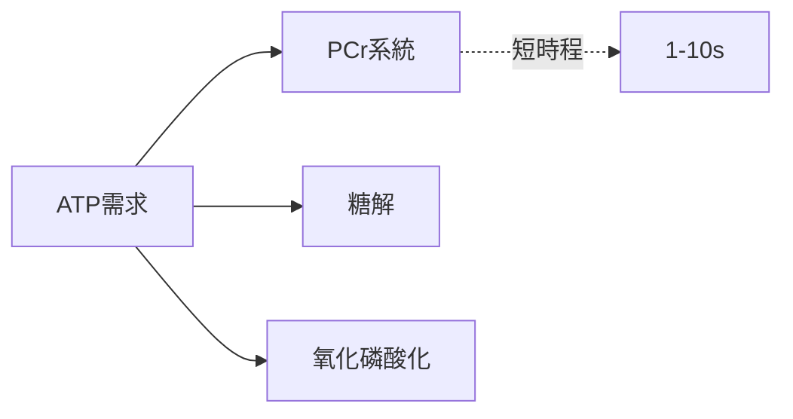

# Chapter Source Summary — Section-by-Section Deep Extract (v2)

Use this prompt template when summarising a single textbook chapter into
a Source page (`KB/Wiki/Sources/Books/{book_id}/ch{n}.md`).

Per **ADR-011 §3.2** (textbook ingest v2), the chapter source page is a
**deep extract for downstream LLM consumption**, not a human-friendly
abstract. The four binding principles:

| # | Principle | Operational meaning |
|---|---|---|
| **P1** | Karpathy aggregator | Concept pages get the merged view; the chapter source page records what *this chapter* said in full fidelity. |
| **P2** | LLM-readable deep extract | **No word limit.** Capture every mechanism, experimental condition, number, and citation. The downstream agent does the abridging at retrieval time. |
| **P3** | Figures first-class | Figures / tables / equations are rendered inline via Obsidian image embeds `![[Attachments/Books/{book_id}/ch{n}/{ref}.{ext}]]` + italic caption (figures), spliced markdown table content + bold caption (tables), or `$$LaTeX$$` (math). Do not summarise away their content. |
| **P4** | Conflict detection mandatory | Concept-level conflicts go into the concept page's `## 文獻分歧 / Discussion` section (handled by `extract_concepts.md`). The chapter source records this chapter's claims verbatim — including the values that may later disagree with other sources. |

Removed from v1: the "每節 300-500 字" word limit (A-4) and the implicit
short-summary framing. v2 explicitly invites long sections when the
underlying chapter is dense.

---

## Inputs

- `book_id` — slug, e.g. `harrison-internal-medicine-21e`
- `book_title` — full title, e.g. `Harrison's Principles of Internal Medicine`
- `chapter_index` — 1-based int
- `chapter_title` — string, e.g. `Cardiovascular Examination`
- `page_range` — string, e.g. `142-187`
- `section_anchors` — list of section headings detected in the chapter
- `chapter_content` — the full chapter text (Opus 1M context fits 30-100 pages)
- `language` — `en` / `zh-TW` / `zh-CN`
- `figures` — list of `{ref, extension, caption, tied_to_section, llm_description}` from
  the parse_book outline + Vision describe pass; the `chapter_content` you
  receive will contain `<<FIG:fig-{ch}-{N}>>` placeholders at the positions
  where the original chapter laid out each figure — **you must swap each
  placeholder for an Obsidian image embed + caption** (see "Placeholder
  swap rules" below). The `llm_description` stays in the page frontmatter
  for retrieval reverse-look-up; do not duplicate it into the body
- `tables` — same structure as `figures` but for `<<TAB:tab-{ch}-{N}>>`
  placeholders; markdown table content lives at
  `Attachments/Books/{book_id}/ch{n}/{ref}.md` and **must be spliced
  directly into the body** at the placeholder position (preceded by a
  bold caption)

---

## Output structure (binding)

```markdown
# Chapter {chapter_index} — {chapter_title}

## {section_anchor_1}

**完整 deep extract — 不限字數**：機制、實驗條件、原書引用的數字 / 範圍 /
單位、引用文獻的 first author + year + journal、相關方程式（用 `$$...$$`
inline LaTeX 保留 figures/tables 占位符在原位）。

> 原書 verbatim 引用 1-2 句（保留關鍵 claim 的原文，方便後續 conflict
> detection 時做 evidence 對照）："{原文逐字}" (p.{page})

### Section concept map

**強制**：每節結尾都要有 concept map，三種等價表達擇一：

(a) Mermaid（推薦複雜關係圖，例如 pathway / hierarchy）：



(b) Nested bullet（推薦線性概念清單）：

- 主軸：{本節核心命題}
- 引入：{被本節介紹進來的新 concept}
- 延伸：{本節對既有 concept 的補充 / 修正}
- 連結：[[concept-slug-1]] [[concept-slug-2]]

(c) Plain bullet（適合 sub-section 較少的章節）：

- {bullet 1：核心 claim + 連結 [[wikilink]]}
- {bullet 2}

## {section_anchor_2}

（同上結構：deep extract → verbatim quote → Section concept map）

…

## 章節重點摘要 / Chapter takeaways

5-10 條 bullet（不限）— 整章最重要的結論 / 臨床啟示 / 跨章關聯。每條
末尾掛相關 wikilink 方便 retrieval。

## 關鍵參考數據 / Key reference values

如有公式、正常範圍、閾值、診斷標準，整理成表格：

| 數據 | 數值 / 範圍 | 單位 | 來源（原書頁碼 / 引用文獻） |
|------|------------|------|---|
| 例：左心室射出分率正常值 | 50-70 | % | 本章 §3.2 / Lang RM 2015 J Am Soc Echocardiogr |

## 跨章 / 跨書 連結建議

LLM 自評：本章內容跟既有 KB 的什麼 concept / source 強相關？列出建議
加入 `mentioned_in:` 的 wiki 頁。
```

---

## Writing guidelines

1. **不限字數** — 每節該寫多深寫多深。教科書一節若是 8 頁機制 + 4 個圖
   + 3 個關鍵數值表，全寫進去。**不要為了「人類讀友善」而摺扣**；下游
   agent 在 retrieval 時自己挑要用什麼。違反此原則直接違反 P2。
2. **Verbatim quote 強制** — 每節 deep extract 結尾必有 1-2 句原書引用，
   用 `>` blockquote。挑「最具 evidence 強度」的句子（含數字、範圍、
   作者結論），方便日後 conflict detection 對照。
3. **Section concept map 強制** — 每節結尾必有 concept map（mermaid /
   nested bullet / plain bullet 三選一）。沒有 concept map 的 section
   會在 acceptance test 被 reject（Acceptance §6 Pipeline 重接線項）。
4. **占位符 swap 強制** — 章內每個 `<<FIG:fig-{ch}-{N}>>` /
   `<<TAB:tab-{ch}-{N}>>` 占位符**必須在原位 swap 成最終 markdown**，
   遵守下方「Placeholder swap rules」。**不可保留占位符** — Obsidian
   render 占位符是純文字、看不到圖；占位符是 parse 階段中介格式，body
   寫入時必須消滅。也不要替換成「（見圖 1-3）」之類的中文化字串。
5. **數學公式 LaTeX inline** — `$$ATP + H_2O \to ADP + P_i + 30.5\ kJ/mol$$`
   而不是「ATP 水解放出能量」這種失去精確度的描述。
6. **保留原文術語並附中文翻譯** — 例如：`Frank-Starling Law（佛朗克–
   史塔林定律）`。retrieval LLM 對 bilingual term 比單語精準。
7. **明確列出概念之間的 parent → child 關係** — 用 `[[concept-slug]]` 內鏈
   範例：`[[cardiovascular-examination]] → [[auscultation]] → [[murmur-grading]]`
8. **保留教科書明確標記的「常見誤解」段落** — 教科書區分 fact vs
   common misconception 是 KB 寶貴的差異化來源。
9. **Emerging evidence 明確標註** — 章內提到 "emerging evidence
   suggests..." 等不確定 claim，明確標註不要當 established knowledge。
   讓下游 conflict detection 看得到這個訊號。
10. **客觀紀錄不主觀評論** — 教科書 ingest 是忠實摘要，不是評論文。

---

## Placeholder swap rules（強制 — 違反此規則 ch1 已踩過 user-facing bug）

**Why this section exists**: PR C ch1 v2 ingest 把占位符直接 leak 到最終
body，Obsidian 開頁面看到 13 處純文字 `<<FIG:fig-1-1>>`、attachment 圖檔
存在但完全不顯示。這是 spec gap × LLM 操作疏漏雙因素 bug，本 section 是
strict 修補。

### Figure placeholder swap

每個 `<<FIG:fig-{ch}-{N}>>` 占位符必須 swap 成兩行 markdown：

```markdown
![[Attachments/Books/{book_id}/ch{n}/{ref}.{extension}]]
*{caption}*
```

- `{ref}` / `{extension}` / `{caption}` 從 input 的 `figures` list 對應 entry 拿
- 若 `caption` 為空，用 `*Figure {ch}.{N} — (no caption)*` fallback
- **不要** 把 `llm_description` 也 splice 進 body — description 已在 frontmatter
  `figures[].llm_description`，body 重複會吵雜且 desync 風險高
- swap 後占位符必須 **完全消失**；如果你看到自己輸出含 `<<FIG:` 字串，
  你違反了這條規則

### Table placeholder swap

每個 `<<TAB:tab-{ch}-{N}>>` 占位符必須 swap 成 caption + spliced markdown
table content：

```markdown
**{caption}**

{markdown table content read from Attachments/Books/{book_id}/ch{n}/{ref}.md}
```

- markdown table 在 `Attachments/Books/{book_id}/ch{n}/{ref}.md`，作為 ingest
  driver input 已預讀傳入（在 `tables[].markdown_content` 欄位 — driver
  fills this field; if missing, request the driver re-read the file）
- 直接 inline 整張 markdown table，不要轉 transclude `![[tab-1-1.md]]`
  （transclude 在 Obsidian 視覺切割感重 + retrieval 端讀不到）

### Equation placeholder swap

`<<EQ:eq-{ch}-{N}>>` 占位符（若有）swap 成 `$$LaTeX$$` inline math。

---

## Avoid

- 把章節壓縮成單一段 abstract（違反 P2）
- 為了「乾淨」刪掉冷僻數字 / 引用 / 機轉細節（違反 P2）
- **保留 `<<FIG:>>` / `<<TAB:>>` / `<<EQ:>>` 占位符在最終 body**（違反 P3 + Obsidian render 顯示純文字 = user-facing bug，PR C ch1 已踩過）
- 把占位符替換成「（見圖 1-3）」之類的中文字串（破壞 retrieval 反查）
- 把 `llm_description` 也 splice 進 body（已在 frontmatter，重複會 desync）
- 用「（細節省略）」「（公式略）」遮蓋內容（違反 P2 + P3）
- 自己加觀點 / 推測超出原文（教科書 ingest 是忠實摘要）

---

## Full prompt（fill-in template）

```
你的任務是閱讀以下教科書章節內容，並產出結構化的 Chapter Source
Summary（v2，依 ADR-011 §3.2）。

書資訊：
- 書名：{book_title}
- 版本：{edition}
- 章節：第 {chapter_index} 章 — {chapter_title}
- 頁碼範圍：{page_range}
- 偵測到的節：{section_anchors}
- 圖表清單：{figures_summary}（chapter_content 內含占位符 <<FIG:...>> / <<TAB:...>>，本 prompt 要求你 swap 成 Obsidian image embed / spliced table — 見下方規則）
- 語言：{language}

請按照以下結構輸出 markdown body（frontmatter 由 ingest pipeline 自動加）：

# Chapter {chapter_index} — {chapter_title}

## {對每個 section_anchor}
深度抽取本節所有 mechanism / 數字 / 實驗條件 / 引用文獻
不限字數，要寫多深就寫多深
**占位符 swap 強制**：
- 每個 <<FIG:fig-{ch}-{N}>> swap 成
  ![[Attachments/Books/{book_id}/ch{n}/{ref}.{extension}]]
  *{caption}*
  （從 figures list metadata 拿 ref/extension/caption；description 留 frontmatter）
- 每個 <<TAB:tab-{ch}-{N}>> swap 成
  **{caption}**
  {直接 inline markdown table content 從 tables[].markdown_content}
- 每個 <<EQ:eq-{ch}-{N}>> swap 成 $$LaTeX$$
最終 body 不可有任何 <<FIG: / <<TAB: / <<EQ: 殘留

> 原書 verbatim："{1-2 句原書關鍵 claim}" (p.{page})

### Section concept map
mermaid / nested bullet / plain bullet 三選一，描述本節 concept 結構

## 章節重點摘要 / Chapter takeaways
5-10 條 bullet 整章重要結論 + 跨章/跨書 wikilink

## 關鍵參考數據 / Key reference values
公式、正常範圍、閾值、診斷標準 → 表格化（含原書頁碼 / 引用文獻）

## 跨章 / 跨書 連結建議
本章跟既有 KB 哪些 concept / source 強相關（給 retrieval 補
mentioned_in 用）

---

寫作鐵則：
- **不限字數** — 為下游 agent 消化深度抽取，不為人類閱讀摺扣
- **每節 verbatim quote 1-2 句強制**
- **每節 ### Section concept map 強制**
- **占位符 swap 強制** — 每個 <<FIG:>> / <<TAB:>> / <<EQ:>> swap 成最終 markdown（image embed / spliced table / LaTeX），最終 body 不可有任何占位符殘留
- **不替換成中文敘述** — 不要把占位符換成「（見圖 1-3）」之類字串
- **數學公式 $$LaTeX$$ inline** — 不要「水解放出能量」這種失去精確度的描述
- 術語雙語：「Frank-Starling Law（佛朗克–史塔林定律）」
- 保留原書「common misconception」段落
- emerging evidence 明確標註，不要當 established knowledge
- 客觀紀錄不主觀評論

章節內容如下：

{chapter_content}
```
