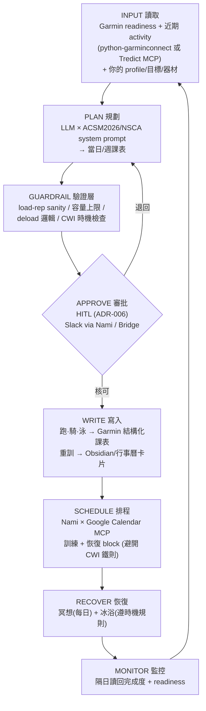

# Garmin 連動 AI 健身教練（Zoro）— 社群做法全景 ＋ 實作藍圖

**Status:** Research / 開發前 prior-art 評估（pre-build，尚未實作）
**Date:** 2026-06-29
**Author:** Claude (Opus 4.8) — deep-research，5 路平行搜尋 + 對抗式查證 + 3 項關鍵主張二次驗證
**Repository:** nakama (E:\nakama)
**目的:** 評估「Zoro = 數位健身教練（Garmin 連動）」的可行性、社群既有做法、可補充功能，與最佳實作路徑。作為動工前的決策依據。
**範圍提醒:** 本文是個人健身領域的能力擴充，與內容七層 pipeline 正交；非醫療建議。

> **🔄 2026-06-29 決策確認：** ① Garmin 寫入走 **Tredict**；② 夏季耐力轉 **室內單車 + 25m 泳池**（一起練）；③ 重訓重點＝「手錶記錄 sets/reps/rest/重量 → 監控訓練量 → 科學加負荷」；④ 行事曆用 **Google Calendar**；⑤ **Bridge 週日晚自動排下週 Weekly Plan**（工作 + 運動）。
>
> **⚠️ 重要修正（深入查證後）：Tredict 只適合耐力（車／泳），不適合重訓**——它沒有動作庫、沒有 sets/reps/重量目標、沒有 1RM／容量模型。重訓改走 **python-garminconnect 讀回 + Garmin 原生 Strength Builder 寫入** 的混合架構。**完整深入結論見 §11**（§1、§8 的「Tredict 包辦所有寫入」已被 §11 取代）。

---

## 0. 執行摘要（TL;DR）

1. **完全可行，且社群已成熟。** 2025–2026 已有一批 GitHub 專案、MCP server、商用 app 在做「LLM 規劃課表 → 推送到 Garmin 手錶」這條閉環。你想做的 5 件事，每一件都有現成 prior-art 可借鏡。

2. **最大的技術決策點 = Garmin「寫入」課表的路線。** 有三條路，取捨差很大（詳見 §1）：
   - **官方 Garmin Connect Developer Program（Training API）** — 唯一「官方合規」能把課表推到手錶的方式，但 **business use only（限法人）**，且申請入口在 ~2026/4 疑似暫停。個人拿不到。
   - **非官方逆向函式庫（`python-garminconnect`）** — 零門檻、能寫入結構化課表，但屬 **ToS 灰色地帶**，且 auth 容易因 Garmin 改版而壞（`garth` 已於 2026/3 停止維護）。
   - **Tredict 官方夥伴 MCP（`tredict-com/mcp-server`）** — **唯一「合規 + LLM 直連 + 推到手錶」都成立**的捷徑：Claude/ChatGPT → Tredict（用官方 Training API）→ Garmin/Coros/Suunto/Wahoo/Apple Watch。**這是耐力項目（室內車／泳池）的首選；但深入查證後，重訓不適合走 Tredict——見 §11 重要修正。**

3. **課表生成必須硬性 anchor 在權威指南**：特別是 **ACSM 2026 年新版阻力訓練 position stand**（17 年來首次大改，已驗證為真），它**推翻了「8–12 下才是肥大區間」的舊教條**——而舊教條正是 LLM 訓練資料裡的主流。Prompt 不寫清楚就會生出過時課表。

4. **「讀數驅動的自動調整」是最值得補的功能**（你沒列）：用 Garmin 的 Training Readiness / Body Battery / HRV Status 決定今天該練重、練輕還是休息。社群最強的 AI coach 專案都這樣做。

5. **恢復行程有一條必須寫進程式的科學鐵則**：**冰水浴不可排在阻力訓練後 ~6–8 小時內**，否則會抑制肌肥大與力量增長（Roberts 2015、Piñero 2024 meta 等多篇實證）。Zoro 排課表時必須做「同日是否有重訓」的時機檢查。

6. **Nami 的行事曆整合已就緒**：connector registry 裡已有 **Google Calendar MCP**（含 `find_free_time`、`create_event`），可直接做「問空檔 → 建任務 → 寫行事曆」。

7. **三條紅線提醒**：社群血淚一致 → **一定要 human-in-the-loop（HITL）審批**再推課表（「別讓你一覺醒來突然要跑馬拉松」），這正好重用你 repo 既有的 ADR-006 審批佇列。

---

## 1. 可行性結論：Garmin 整合的三條路（最關鍵決策）

這是整份報告最重要的一節。你的 requirement #4（「在 Garmin Connect 建立訓練，讓手錶依課表執行」）成敗，取決於選哪條路把**結構化課表（structured workout）寫入並排程到 Garmin 行事曆**。

| 路線 | 能否把結構化課表寫到手錶 | 合規性 (ToS) | 申請/門檻 | 穩定度 | 適合誰 |
|---|---|---|---|---|---|
| **A. 官方 Developer Program（Training API）** | ✅ 能（publish workout/plan 到 Connect calendar → 同步到裝置） | ✅ 完全合規 | ❌ **business use only**，要法人申請；申請入口 ~2026/4 疑似暫停 | 高 | 商用整合、企業 |
| **B. 非官方 `python-garminconnect`** | ✅ 能（`upload_*_workout` / `schedule_workout` / `delete_workout`） | ⚠️ 灰色（程式協議禁逆向工程） | ✅ 零門檻 `pip install` | ⚠️ 脆弱（auth 改版會壞） | DIY 自管、個人自用 |
| **C. Tredict 官方夥伴 MCP** | ✅ 能（經官方 Training API） | ✅ 合規（GDPR） | ⚠️ 需 Tredict 帳號（免費/付費） | 高（官方管道） | **個人 + 要合規 + 要 LLM 直連 → 首選** |

### A. 官方 Garmin Connect Developer Program

- **Training API** 是唯一能「寫」的官方 API：可把 workouts 與 training plans publish 到使用者的 Garmin Connect 行事曆，使用者同步手錶即可下載，手錶上會有逐步指示。（[developer.garmin.com/.../training-api](https://developer.garmin.com/gc-developer-program/training-api/)）
- 但官方 FAQ 明寫 **access「is only for business use」**，使用 OAuth 2.0，典型整合 1–4 週，部分數據還要授權費或最低裝置採購量。（[program-faq](https://developer.garmin.com/gc-developer-program/program-faq/)）
- 多位開發者回報**個人用途申請被拒**；且**申請表單在 ~2026/4 顯示「Under Construction」**，Garmin 官方人員稱「網站維護中」。（是暫時故障還是長期暫停，來源說法不一，**標為不確定**。）（[forums.garmin.com/.../433735](https://forums.garmin.com/apps-software/mobile-apps-web/f/garmin-connect-mobile-andriod/433735/)）
- 程式協議**明文禁止逆向工程** API。（[Developer Program Agreement PDF](https://www8.garmin.com/en-US/GARMINCONNECTDEVELOPERPROGRAMAGREEMENT/GARMINCONNECTDEVELOPERPROGRAMAGREEMENT_EN.pdf)）

> **結論：** 個人專案基本拿不到官方 API。

### B. 非官方 `python-garminconnect`（cyberjunky）

- **目前最能打的逆向函式庫。** 能建立、上傳、排程、取消、刪除結構化課表：`upload_running_workout(workout)`、`schedule_workout(workout_id, "2026-03-20")`、`unschedule_workout(...)`、`delete_workout(...)`。（已二次驗證；[GitHub README](https://github.com/cyberjunky/python-garminconnect)）
- 內建 typed Pydantic 課表模型：`RunningWorkout`、`CyclingWorkout`、`SwimmingWorkout`、`WalkingWorkout`、`HikingWorkout`、`MultiSportWorkout`、`FitnessEquipmentWorkout`，外加 step 輔助函式 `create_warmup_step` / `create_interval_step` / `create_recovery_step` / `create_cooldown_step` / `create_repeat_group`（`pip install garminconnect[workout]`）。
- 底層打的是 Garmin 私有內部端點 `/workout-service`、`/workout-service/schedule`、`/calendar-service`、`/trainingplan-service/trainingplan`——即網頁版用的同一後端。
- **脆弱性是真實風險**：`garth`（多數 Garmin 工具的 auth 底層）已於 **2026/3/28 標為 Final Release / 不再維護**，因 Garmin 改了登入流程。`python-garminconnect` 因為**自建了原生 SSO 登入（不再依賴 garth）**才存活，但這正說明 auth 隨時可能再被打破。（[matin/garth](https://github.com/matin/garth)）
- **⚠️ 阻力訓練是弱點**：跑/騎/泳的結構化課表支援良好，但**重訓的 set-level 欄位（reps / weight / 動作名稱）透過 cloud workout API 寫入並不穩定**。FIT 檔案格式本身支援 strength `set`，但雲端 API 沒乾淨地暴露這些欄位。（[forums.garmin.com/.../270009](https://forums.garmin.com/developer/fit-sdk/f/discussion/270009/)、[FIT workout file type](https://developer.garmin.com/fit/file-types/workout/)）→ 這直接影響你的 requirement #2（阻力訓練），見 §7.5 的 workaround。

### C. Tredict 官方夥伴 MCP（推薦）

- Tredict 是 **Garmin 官方整合夥伴**，用**官方 Training API** 雙向同步：你在 Tredict 排的結構化課表會送進 Garmin 行事曆並載入手錶；手錶完成的訓練自動回傳。（[tredict.com/blog](https://www.tredict.com/blog/from_garmin_to_ai_training_plan_on_your_watch/)）
- 官方 **`tredict-com/mcp-server`**：讓 Claude / ChatGPT / Mistral / Perplexity 讀你的訓練史、算能力值、**建立完整結構化計畫並同步到手錶**。明確標榜「不像非官方 Garmin MCP 用你的帳密，Tredict 走官方 Training API」。（已二次驗證；[GitHub](https://github.com/tredict-com/mcp-server)、[mcpservers.org](https://mcpservers.org/servers/tredict-com/mcp-server)）
- 支援 Garmin、Suunto、Coros、Wahoo、Apple Watch 等多家。
- **取捨**：你多依賴一個第三方（Tredict），但換來合規 + 穩定 + Claude 直接驅動。對「個人自用、想合規、想讓 Zoro 直接動手」的你，這是甜蜜點。

---

## 2. 社群全景：別人怎麼做

整個生態圍繞三種模式打轉，技術底座幾乎都是 `python-garminconnect`（寫入）與讀數函式庫。

**關鍵洞察：多數「AI coach」專案只做「讀 + 推理」，真正能「寫結構化課表到手錶」的是少數。** Zoro 要滿足 requirement #4，必須選會寫入的那一類（下表標 ✍️）。

| 專案 | 類型 | 規模/活躍度 | 做什麼 | 寫入手錶？ |
|---|---|---|---|---|
| [`Taxuspt/garmin_mcp`](https://github.com/Taxuspt/garmin_mcp) | MCP server | ~578★ 很活躍 | 110+ 工具，覆蓋 ~90% python-garminconnect；含高階 `create_strength_workout` / `create_walk_run_workout` / `schedule_week`，已驗證能排到 Forerunner 965 | ✍️ 是 |
| [`st3v/garmin-workouts-mcp`](https://github.com/st3v/garmin-workouts-mcp) | MCP server | ~23★ | 從自然語言（「10min 暖身, 5x(1km @4:30, 2min 恢復)」）生成 + 上傳 + 排程；跑/騎/泳/重訓 | ✍️ 是 |
| [`tredict-com/mcp-server`](https://github.com/tredict-com/mcp-server) | MCP server（**官方**） | 官方維護 | 官方 Training API；Claude→Tredict→手錶；讀深度數據 + 寫結構化計畫 | ✍️ 是（合規） |
| [`brunosantos/garmin-workouts-mcp`](https://github.com/brunosantos/garmin-workouts-mcp) | MCP server | 中 | 讀活動 + 建課表/計畫到 Connect 行事曆 | ✍️ 是 |
| [`eddmann/garmin-connect-mcp`](https://github.com/eddmann/garmin-connect-mcp) | MCP server | ~42★ | 22 工具 + MCP Resources（training readiness、今日健康）+ Prompts；偏讀/分析 | 部分 |
| [`leonzzz435/garmin-ai-coach`](https://github.com/leonzzz435/garmin-ai-coach) | AI coach repo | ~131★ 很活躍 | **LangGraph 多 agent**（summarizer→expert→orchestrator + HITL）；算 ACWR/CTL/ATL/TSB/HRV；輸出 12–24 週策略 + 4 週計畫（HTML） | ❌ 只讀+推理 |
| [`Jack-Abyss/claude-garmin`](https://github.com/Jack-Abyss/claude-garmin) | MCP server | 中 | 把 Garmin 數據餵進 Claude Desktop 做計畫/恢復判讀 | ❌ 讀 |
| [`veelenga/prompt-garmin-workout`](https://github.com/veelenga/prompt-garmin-workout) | Chrome 擴充 | ~14★ 活躍 | GPT 把自然語言轉成 Garmin 課表（含巢狀 step/targets） | ✍️ 是 |
| [`mkuthan/garmin-workouts`](https://github.com/mkuthan/garmin-workouts) | CLI | 成熟 | 課表存 JSON，常作為 LLM 產出的匯入目標 | ✍️ 是 |

**商用 app（拿來對標、學同步機制）：**

- **Runna** — Garmin 同步最成熟：付費用戶每週一自動把未來 2 週課表推到 Garmin Connect，完整 interval/配速載入手錶，完成後回傳並自動調整。（[runna.com/integrations/garmin](https://www.runna.com/integrations/garmin)）
- **Athletica / Humango / AI Endurance** — AI 生成、依 load/HRV/恢復自動調整的耐力計畫，皆能同步 Garmin。
- **Type to Run** — Garmin Connect IQ app，部分在手錶上跑的對話式自適應計畫。
- **Garmin Coach / Adaptive Plans** — Garmin 原生自適應計畫（你的競品基準線）。

**最佳藍圖文章（強烈建議精讀）：**

- **DZone — "AI-Powered Triathlon Coaching: Building a Modern Training Assistant With Claude and Garmin"**（Malandrino, 2025/09）：最完整的端到端藍圖——Claude Pro + Project Instructions + 兩個 MCP（一個讀、一個寫）的 analyze→adapt→execute 閉環，約 $20/月，並誠實討論 AI 教練的極限。（[dzone.com](https://dzone.com/articles/ai-powered-triathlon-coaching-claude-garmin)）
- **Edd Mann — "Running MCPs Everywhere"**（2025/10）：建 Garmin/Strava MCP 的技術深度好文。關鍵 LLM 工具設計心得：**工具要少而廣**（別切太細）、**明確給時間脈絡**（LLM 會搞錯星期幾）、**配速/心率數學在 server 端算**。（[eddmann.com](https://eddmann.com/posts/running-mcps-everywhere-chatting-with-my-workouts/)）

---

## 3. 課表生成：對標 ACSM / NSCA（requirement #3）

你要求 prompt 對標 ACSM / NSCA。這一節給你**可直接寫進 system prompt 的具體數字**，以及**必須防的 LLM 失效模式**。

### 3.1 ⚠️ ACSM 2026 新版阻力訓練指南（重要，已驗證）

2026/3 ACSM 發布 **17 年來首次**的阻力訓練 position stand（綜合 137 篇系統性回顧、30,000+ 受試者）。這是 prompt 設計的關鍵，因為它**推翻了舊教條**：

| 目標 | 負荷 | 組數/頻率 | 備註 |
|---|---|---|---|
| **力量 (Strength)** | **≥80% 1RM** | 2–3 組/次，**≥2 次/週** | 全 ROM；主要動作排在前面 |
| **肌肥大 (Hypertrophy)** | **30–100% 1RM 皆可**（只要接近力竭） | **≥10 組/肌群/週** | eccentric overload 有利；**不再限 8–12 下** |
| **爆發力 (Power)** | **30–70% 1RM** | 低–中量 | 快速向心 / 奧林匹克舉derivatives |

- **努力程度**：**不必練到力竭**，留 **2–3 RIR（reps in reserve）** 就有同等效果且更省疲勞。
- **安全**：對各年齡健康成人皆安全；彈力帶/自體重/居家訓練同樣有效。
- 來源（已二次驗證）：[ACSM 官方公告](https://acsm.org/resistance-training-guidelines-update-2026/)、[Move Your Bones 深度整理](https://www.moveyourbonespt.com/blog/2026-acsm-resistance-training-guidelines)、position stand 本文 [PMC12965823](https://pmc.ncbi.nlm.nih.gov/articles/PMC12965823/)。

> **Prompt 設計含義**：LLM 訓練資料裡的主流是舊的「低反覆=力量 / 8–12=肥大 / 15+=耐力」分箱。**你必須在 system prompt 明確 override**，改用「容量 + 努力程度（RIR）」框架。

### 3.2 ACSM 有氧 + NSCA 程式設計（可入 prompt 的數字）

- **有氧 (FITT-VP)**：≥150 min/週中強度，或 ≥75 min/週高強度（或等量組合）；3–5 天/週。強度用 %HRR/%VO2R：中強度 40–<60%，高強度 60–<90%。（[ACSM FAQ](https://acsm.org/physical-activity-guidelines-faqs/)）
- **NSCA 程式設計 7 變項**：需求分析 → 動作選擇 → 頻率 → 動作順序 → 負荷與反覆 → 容量 → 組間休息。多關節大肌群動作排前。（[NSCA CSCS Ch.17](https://www.ptpioneer.com/personal-training/certifications/nsca-cscs/cscs-chapter-17/)）
- **週期化**：macrocycle（~年）→ mesocycle（~月）→ microcycle（~週）。Linear（量↓強度↑）vs **DUP（daily undulating，週內變動）**；兩者都有效，DUP 在力量略佔優。（[PMC6351492](https://pmc.ncbi.nlm.nih.gov/articles/PMC6351492/)）
- **2-for-2 進階規則（NSCA）**：連續 2 次訓練、最後一組超出目標反覆 ≥2 下 → 加重 **2.5–10%**（上肢/新手小、下肢/進階大）。這是把「進階」綁在**實測表現**而非日期的好機制。（[nsca.com](https://www.nsca.com/education/articles/kinetic-select/determination-of-resistance-training-frequency/)）

### 3.3 四種模式的具體編排

| 模式 | 強度基準 | 關鍵數字 |
|---|---|---|
| **跑步** | 配速/心率 zone | **80/20 polarized**（80% 輕鬆 Z1-2，20% 高強度 Z4-5）；週量加幅 **≤10%** |
| **室內單車** | **FTP**（功能性閾值功率） | Coggan 7 zones：Z2 耐力 56–75% FTP、Z4 閾值 91–105%、Z5 VO2max 106–120% |
| **游泳** | **CSS（critical swim speed）/ 配速** | 無 %1RM 表；用 pace zone + RPE，set 結構（暖身/技術/主課表/緩和）。**指南最薄弱** |
| **阻力** | %1RM + RIR | 用 §3.1 ACSM 2026 + NSCA 連續體 |

> 注意：單車 FTP zone 邊界、游泳 CSS 屬教練界共識而非 ACSM/NSCA position stand，硬編碼前最好再對一次主來源。

### 3.4 LLM 生成課表的實證與「失效模式」（寫進 guardrails）

學界已經研究過「LLM 開課表」這件事，結論一致：**LLM 能產出結構化、常對齊原則的「草稿」，但不可未經專家審查就直接用。**

- GPT-4.1 對標 NSCA/ACSM 由 7 位 CSCS/PhD 盲評得 **4.14/5**（vs 4o 3.61、3.5 2.37）。（[Genç 2026, BMC](https://link.springer.com/article/10.1186/s13102-025-01409-7)）
- ChatGPT 跑步計畫被評 **sub-optimal**，輸入越細品質越好，但仍建議**經教練回饋再用**。（[Düking 2024, PMC10915606](https://pmc.ncbi.nlm.nih.gov/articles/PMC10915606/)）

**必須在程式層攔截的 6 大失效模式：**

1. **不可能的 load–rep 配對**（如「85% 1RM 做 15 下」）→ 在 system prompt 放一張**驗證過的 load↔rep 對照表**，並加一層程式 sanity check。
2. **進階不綁實測**（憑日期自動加重）→ 強制走 **RIR / 2-for-2 / 測驗-再測** gating。
3. **容量過量、忽略恢復/deload** → 編碼**週容量上限**（肥大 ≥10 但有上界）與**強制 deload 邏輯**。
4. **幻覺/過時科學**（舊 8–12 教條）→ 要求引用 ACSM/NSCA，明確 override 舊框架。
5. **個人化弱**（性別、訓練年資、傷病、慢性病）→ 要求**禁忌篩查 + 替代動作 + 新手簡化**。
6. **同 prompt 輸出不穩**（reproducibility 差）→ 保留 **HITL** 關卡；醫療狀況轉介專業。

**Prompt 設計四原則**（從上述研究萃取）：① **specific**（年齡/性別/目標/限制/可用器材）；② **principle-focused**（明示要 periodization、RIR 進階、deload）；③ **evidence-based**（引用 ACSM 2026 / NSCA）；④ **structured-output**（週表/JSON）。

---

## 4. 讀數驅動的自動調整（最值得補的功能）

社群最強的 AI coach 都做這件事：**讀 Garmin 生理指標 → 決定今天課表強弱**。這正是把 Zoro 從「課表產生器」升級成「教練」的關鍵。

### 4.1 Garmin 指標與如何讀

| 指標 | 意義 | python-garminconnect 讀取 |
|---|---|---|
| **Training Readiness** (0–100) | 晨間綜合分（睡眠/恢復時間/HRV/急性負荷/睡眠史/壓力史）；>73 可上強度，<34 宜休 | `get_training_readiness(cdate)` |
| **Body Battery** (0–100) | 當日能量（HRV 為主 + 壓力/睡眠/活動） | `get_body_battery(start,end)` |
| **HRV Status** | 對比 ~5 週個人 baseline；**需 ~3 週建立** | `get_hrv_data(cdate)` |
| **Training Status** | Productive/Overreaching/Recovery… | `get_training_status(cdate)` |
| **Training Load（acute 7d / chronic 28d）+ Load Ratio** | Load Ratio = Firstbeat 版的 **ACWR** | `get_training_status(...)` / `get_user_summary` |
| **VO2max / Recovery Time** | 體能 / 距下次硬練的小時數 | `get_max_metrics(cdate)` |

（方法名已從原始碼驗證；[cyberjunky/python-garminconnect](https://github.com/cyberjunky/python-garminconnect)）

### 4.2 ⚠️ ACWR 要誠實使用（別當傷害預測器）

- 常被引用：ACWR **0.8–1.3 為 sweet spot**，**≥1.5 危險**（Gabbett 2016、2016 IOC 共識）。
- **但學界強烈質疑**（Impellizzeri 等）：7 天/28 天**時間窗任意**、**training load ≠ mechanical load**、比值本身有**數學耦合/迴歸均值**等統計陷阱；2025 年 meta（22 cohort）結論是「**可能有用，但須謹慎**」。（[Frontiers 2021](https://www.frontiersin.org/articles/10.3389/fphys.2021.669687/full)、[2025 meta PMC12487117](https://pmc.ncbi.nlm.nih.gov/articles/PMC12487117/)）
- **給 Zoro 的原則**：把 Load Ratio 當**軟性護欄/對話起點**，不要當成因果規則或傷害預測引擎。

### 4.3 Autoregulation 與 deload

- 三種方法：**RPE / RIR / VBT**（velocity-based）。Readiness 低 → 自動換較輕 session。
- **Deload**：典型減到平常容量的 **50–60%**；或 HRV 連 3 天壓低 → 觸發非計畫性減量。
- 證據誠實面：主觀 autoregulation（RIR/RPE）在受訓者的效益**證據不明確**，VBT 較佳。（[PMC7810043](https://pmc.ncbi.nlm.nih.gov/articles/PMC7810043/)）
- **Cold-start**：HRV baseline 需 ~3 週、Load Focus ~4 週 → 頭一個月 Zoro 要 graceful degrade，用保守 default。

---

## 5. 恢復行程：冥想 + 冰水浴（requirement #5）

### 5.1 ⚠️ 冰水浴（CWI）：一條必須硬編碼的鐵則

**好處（適度成立）：** 減 DOMS、改善主觀恢復（Cochrane：低品質證據；2025 network meta：**10–15 min、11–15°C** 最利減 DOMS）。耐力訓練後、賽季中求次日表現時很有用。（[Cochrane](https://www.cochrane.org/evidence/CD008262_cold-water-immersion-preventing-and-treating-muscle-soreness-after-exercise)、[Frontiers 2025](https://www.frontiersin.org/journals/physiology/articles/10.3389/fphys.2025.1525726/full)）

**🔴 鐵則：阻力訓練後立刻冰浴會抑制肌肥大與力量增長。**
- Roberts 2015（J Physiol）：12 週、每次重訓後 10 min @10°C 冰浴組，**力量、肌肉量、type II 纖維增長皆顯著少於主動恢復組**；作者結論「應重新考慮把 CWI 當常規恢復」。（[PMID 26174323](https://pubmed.ncbi.nlm.nih.gov/26174323/)）
- Piñero 2024 meta（8 篇）：重訓 + 賽後 CWI，肥大效益降到「small/negligible」。（[PMC11235606](https://pmc.ncbi.nlm.nih.gov/articles/PMC11235606/)）
- Huberman 實務：**肥大/力量訓練後 ~4 小時（理想 6–8 小時）內不要冷浸**（冷水澡較溫和、影響小）。（[hubermanlab.com](https://www.hubermanlab.com/newsletter/the-science-and-use-of-cold-exposure-for-health-and-performance)）

> **Zoro 排程規則（必做）**：冰浴只排在 ① 耐力訓練日之後、② 與當日/前 6–8h 的阻力訓練分開、或 ③ 賽季中為求次日表現。**排課表時必須檢查「同日（及前 6–8h）是否有阻力訓練」**，有就擋掉或改期。

### 5.2 冥想 / 正念

- **好處**：提升運動表現與心理因子（acceptance/flow）、降壓力、改善睡眠；可升 HRV（證據有限）。（[PMID 33766474](https://pubmed.ncbi.nlm.nih.gov/33766474/)、[PMC6833066](https://pmc.ncbi.nlm.nih.gov/articles/PMC6833066/)）
- **劑量**：10–20 min/日，**一致性 > 時長**（劑量-反應研究多無顯著差異）。
- **誠實面**：單次賽後短冥想**不是**可靠的「急性生理恢復」工具。當每日習慣 anchor（晨間或睡前）效果較好。

### 5.3 恢復通則

睡眠是第一恢復工具（7–9h，勝過任何裝置）；hard 日後接 easy/active recovery；deload 3:1（3 週載 + 1 週減）；HRV 連 3 天壓低 → 提前 deload。

---

## 6. 行事曆與 Nami 整合（requirement #4 秘書部分）

- **connector registry 已有 [Google Calendar MCP](https://calendar.google.com)**（工具：`create_event`、`delete_event`、`find_free_time`、`list_events`、`update_event`…）→ **Nami 可直接用，不必自己刻**。也有 **Strava MCP**（讀活動）與 **Todoist MCP**（任務）可選。
- **建議流程**：
  1. Zoro 產出當日/週課表（含恢復行程）。
  2. 用 `find_free_time` 讀你的空檔，或直接問你。
  3. **你確認**（HITL）。
  4. Nami `create_event` 把「訓練 block + 恢復 block」寫進行事曆（事件含運動類型、時長、地點、Obsidian 課表頁連結）。
  5. 同時把結構化課表推進 Garmin（§1 選定的路線）。
- 注意 §5.1 鐵則：Nami 排冰浴 block 時要避開阻力訓練後 6–8h。

---

## 7. 可以補充的功能（超出你列的 5 項）

你問「還有沒有可以補充的」。以下是社群在做、但你沒列的，依價值排序：

1. **Readiness 驅動的當日調整**（§4）— 把今天的 Training Readiness / Body Battery 餵進當日課表決策。**最高價值，建議列為核心而非加分。**
2. **Deload 自動化** — HRV 連 3 天壓低或 Training Status=Overreaching → 自動觸發減量週（50–60% 容量）。
3. **ACWR 軟性護欄** — Load Ratio 飆過 1.3–1.5 → 警告/降量（但 UI/語氣標明這是 heuristic，非鐵律）。
4. **進度追蹤 + 週報** — 讀回完成的 activity，比對「計畫 vs 實際」，產週報寫進 Obsidian `KB/Wiki/`。形成閉環。
5. **阻力訓練寫入的 workaround**（重要）— 因 Garmin cloud API 對重訓 set-level 支援不穩（§1.B），建議：跑/騎/泳走結構化推送；**重訓改用「行事曆/Obsidian 課表卡片 + 手錶內建 strength 計時」或走 Tredict**。別硬鑽 Garmin 重訓 API。
6. **Human-in-the-loop 審批** — 重用你 repo 既有 **ADR-006 審批佇列**；課表/行事曆寫入前先給你核可。社群共識：保留人工關卡。
7. **Cold-start 處理** — 頭 3–4 週指標不足，用保守 default + 收集 baseline，並對使用者說明。
8. **傷病/禁忌篩查 + 安全 disclaimer** — system prompt 內建 contraindication 檢查與替代動作；非醫療建議，有狀況轉介專業。
9. **營養 / 補水**（可選，建議延後）— ACSM 也有 fueling 建議，但會擴大 scope，MVP 先不做。

---

## 8. Zoro 實作藍圖（架構建議）

### 8.1 資料流（閉環）



### 8.2 模組對照（可借鏡的 repo）

| 模組 | 技術建議 | 可借鏡 |
|---|---|---|
| Garmin 讀取 | `python-garminconnect` 或 Tredict MCP | Taxuspt/garmin_mcp |
| Garmin 寫入 | **Tredict MCP（首選）** / python-garminconnect | st3v、Tredict |
| 課表生成 | LLM + ACSM2026/NSCA system prompt + JSON schema | DZone 藍圖、Genç 研究 |
| 驗證層 | 純程式 sanity check（不靠 LLM 自審） | 自建 |
| 審批 HITL | 重用 ADR-006 審批佇列 | 你的 repo |
| 行事曆 | Google Calendar MCP（Nami） | registry 現成 |
| 監控/週報 | 讀回 activity → Obsidian KB/Wiki | leonzzz435 KPI dashboard |

### 8.3 分期建議

- **MVP（~2–3 週）**：選定 Garmin 路線（建議 **Tredict MCP**）→ 只做**跑步**（最成熟）→ 一個 ACSM/NSCA system prompt + 驗證層 → 手動 HITL → Google Calendar MCP 排程。**先不碰重訓寫入。**
- **Phase 2**：加 readiness 自動調整、室內單車/游泳、deload、進度週報（閉環）。
- **Phase 3**：重訓寫入方案（Tredict 或卡片）、ACWR 護欄、多模式週期化、冰浴時機自動檢查。

### 8.4 在 Nakama 內的定位

- Zoro 既有角色見 `docs/decisions/ADR-001-agent-role-assignments.md`；本案是**個人健身領域擴充**，建議獨立 module（如 `agents/zoro_coach`）或新 domain `CONTEXT.md`。
- HITL 重用 ADR-006；輸出寫 Obsidian 須遵守 vault 規則（`KB/Wiki/` 可寫、`Journals/` 禁寫、`KB/index.md` 同步）。
- 若要開發，先依 CLAUDE.md 開 sibling worktree（如 `E:\nakama-zoro-coach`），勿在主倉動工。

---

## 9. 風險與取捨

| 風險 | 緩解 |
|---|---|
| 非官方 API 隨時壞（garth 已死） | 首選 Tredict 官方路；或抽象出 adapter 層 + token 自癒 + 失敗告警 |
| ToS 灰色地帶 | 個人自用風險低但非零；要合規就走官方/Tredict |
| LLM 課表不安全/不穩 | 程式驗證層 + HITL + disclaimer（§3.4） |
| 過度信任 ACWR | 當 heuristic，非傷害預測（§4.2） |
| 重訓寫入不可靠 | 走卡片/Tredict，不硬鑽 Garmin 重訓 API |
| 健康資料隱私 | token/資料本機自管，不外流；Tredict 走官方 + GDPR |
| Cold-start 指標不足 | 前 3–4 週保守 default |

---

## 10. 開工前要你拍板的 5 個決定

1. **Garmin 寫入走哪條？** Tredict 官方 MCP（推薦）／ `python-garminconnect` 自管 ／ 兩者用 adapter 包起來。
2. **MVP 先做哪個模式？** 建議**跑步**先（社群最成熟、寫入最穩）。
3. **重訓堅持寫進手錶，還是接受「行事曆卡片 + 手錶簡單計時」？**（影響很大，因 Garmin 重訓寫入弱）
4. **行事曆平台？** Google Calendar MCP 已就緒；若你用別家要再找 connector。
5. **HITL 在哪審批？** Slack（經 Nami gateway）／ Bridge UI。

---

## 11. 補充深入研究（2026-06-29）：Garmin 重訓寫入與漸進負荷監控

依你拍板的方向（Tredict / 室內車 + 泳 / 重訓量監控 / GCal / Bridge 週日晚計畫）做的第二輪深查。**最大發現：重訓不能走 Tredict，但你最想要的「監控訓練量、科學加負荷」反而是整個系統最可行、價值最高的部分。**

### 11.1 ⚠️ 重要修正：Tredict 適合耐力，不適合重訓

Tredict 本質是**耐力（跑／車／泳）**分析與規劃平台。它能把「Strength training」當成一個 session 同步到 Garmin，但：

- **沒有動作庫、沒有 sets/reps/重量作為結構化目標。** Tredict 的結構化目標只有 **配速／心率／功率／cadence** 四種；重訓只會變成「work 45s／rest 15s（可選 HR 目標）」這種計時／心率 block，**做不到「深蹲 4×5 @100kg、休 3 分」**。
- **Garmin Training API 把重訓歸在「Other activities（weight training）」**，無法推送逐動作的 reps+重量結構。
- **沒有重訓的容量模型**：FTP／FTPa／threshold 自動偵測都是耐力專屬，**沒有 1RM、沒有 volume-load、沒有重訓進階指標**。
- **Tredict MCP 寫入有一個手動關卡**：MCP 只在 Tredict 內建立計畫，**要你手動把計畫套進個人行事曆**才會推到手錶——不是全自動。
- 來源：[Tredict Garmin Training API 整合](https://www.tredict.com/blog/garmin_training_api_integration/)、[supported sports](https://www.tredict.com/faq/supported-sports/)、[MCP server](https://github.com/tredict-com/mcp-server)。

**但耐力兩項它很強：**

| 項目 | Tredict 支援 | 重點 |
|---|---|---|
| **室內單車** | ✅ 強 | power/%FTP 結構化課表，**FTP 自動偵測**（需功率計），推送 Garmin |
| **25m 泳池** | ✅ 好 | pool swim 結構化 set，threshold 用 **FTPa（= CSS 概念）自動偵測**，pace 目標，推送 Garmin |
| **重訓** | ❌ 不適合 | 只能計時／HR block，無動作／組數／重量 |

**費用**：讀／分析**永久免費**；完整寫入 **US$49 一次性 / 12 個月**；新用戶 2 個月免費全功能試用。（[tredict.com/price](https://www.tredict.com/price/)）

### 11.2 重訓「寫入手錶」的三條路（target weight 結論）

先講你可能在意的：**Garmin 重訓課表可以預設 target weight**，手錶會引導動作、自動報數、跑組間休息計時、讓你記錄每組重量——但**沒有原生自動漸進**（變強要自己改重量重傳）。

| 路線 | 引導 sets/reps/rest | target weight | 無線/自動 | 穩定度 |
|---|---|---|---|---|
| **A. Garmin 原生 Strength Builder（建議）** | ✅ | ✅ predefined | ✅ 無線同步 | 高（官方） |
| **B. 逆向 cloud API（sydspost 式）** | ✅ | ✅（DSL 含 `@KGR`） | ✅ 無線+排程 | ⚠️ 要逆向動作整數 ID、易碎 |
| **C. FIT 檔（tylergpeterson／Vitanza 式）** | ✅ | 部分 | ❌ 多需 USB 拷貝 | ⚠️ 破壞行事曆/動畫 |

- **`python-garminconnect` 沒有 strength workout class**（只有 Running/Cycling/Swimming/Walking/Hiking/MultiSport/FitnessEquipment）→ 重訓自動寫入要嘛手刻 JSON、要嘛走 B/C。（[README](https://github.com/cyberjunky/python-garminconnect)）
- **建議**：MVP 階段重訓寫入用 **A（Garmin 原生 Builder，支援 target weight + 引導）**——Zoro 產出精確課表規格，你一鍵在 Garmin Connect 建立即可。把自動化的力氣全押在 11.3 的「讀回 + 漸進負荷」，那才是價值所在，而且穩。
- 來源：[Garmin 官方：手錶引導重訓](https://support.garmin.com/en-US/?faq=LcYGZd4EOZ9PkTY5YRvin5)、[GC 可設 predefined 重量](https://forums.garmin.com/apps-software/mobile-apps-web/f/garmin-connect-mobile-ios/346239/)、[sydspost cloud DSL](https://github.com/sydspost/Garmin-Connect-Workout-and-Schedule-creator)、[tylergpeterson FIT 產生器](https://github.com/tylergpeterson-endurance/garmin-pt-workout-generator)。

### 11.3 重訓「讀回 + 漸進負荷」引擎（核心價值，正中你的需求）

**好消息：你用手錶記錄的每組 reps、重量、組間休息，全都能透過 API 讀回來。** 這正是「監控訓練量、科學加負荷」的技術基礎，而且 Garmin Connect 原生**沒有**每動作的 volume／progression 圖表（社群長年許願中）——所以這就是 Zoro 的差異化價值。

**讀回管線（已驗證於原始碼）：**

```
get_activities_by_date(start, end, "strength_training")   # 列出重訓
   → 逐筆 activityId →
get_activity_exercise_sets(activityId)                     # 每一組的細節
```

`get_activity_exercise_sets` 每組回傳：`exercises`（category + name）、`repetitionCount`、`weight`（公克，需換算）、`duration`、`setType`（**ACTIVE / REST**）、`startTime`。→ **reps、每組重量、組間休息（以 REST set 呈現）都拿得到。** 資料品質取決於你有沒有輸入重量——你本來就有輸入，所以沒問題。（[原始碼 line 2554](https://github.com/cyberjunky/python-garminconnect)）

**Zoro 的科學加負荷邏輯（可直接實作）：**

- **Volume-load** = Σ(sets × reps × weight)，追蹤**每週 tonnage 趨勢**（看 4–6 週，不看單次）。
- **每肌群每週 hard sets**（對肥大比 tonnage 更相關的指標）。
- **估計 1RM**：Epley `1RM = w·(1 + reps/30)`、Brzycki，多公式取平均；2–10 下最準 → 可做 %1RM 處方與「有沒有進步」的客觀判斷。
- **進階規則**：double progression（先把 reps 加到區間上限，再加重、回到下限）＋ NSCA **2-for-2**（連 2 次最後一組超標 ≥2 下 → 加重 2.5–10%）。
- **容量地標 MEV／MAV／MRV**（RP／Israetel）：mesocycle 從 MEV 起，每週往 MAV 加 set，逼近 MRV 前主動 deload。
- **Deload 觸發**：E1RM 在同等或更高 RPE 下掉 ≥5%、或連 2–3 週無進展 → 減量（set 砍 40–50%、強度維持 ~70–80%）。
- 實證背書：rep 進階 ≈ load 進階（[PMC9528903](https://pmc.ncbi.nlm.nih.gov/articles/PMC9528903/)）；量-效正相關（Schoenfeld 2017/2025 meta）；RPE loading 不輸 %1RM（Helms 2018）；1 週 deload 不掉適應（[PMC10809978](https://pmc.ncbi.nlm.nih.gov/articles/PMC10809978/)）。
- 可借鏡：[`McSwaggalot/garmin-strength`](https://github.com/McSwaggalot/garmin-strength)（Garmin→每組 reps/weight/volume CSV）、[`johnson4601/AI_Fitness`](https://github.com/johnson4601/AI_Fitness)。

### 11.4 修訂後的 Zoro 混合架構

| 項目 | 課表來源 | 寫入手錶 | 讀回 + 進階 |
|---|---|---|---|
| **室內單車** | Zoro（%FTP zones） | **Tredict MCP** → Garmin | Tredict（effort／zone 分佈） |
| **25m 泳池** | Zoro（CSS／FTPa pace） | **Tredict MCP** → Garmin | Tredict |
| **重訓** | Zoro（ACSM 2026／NSCA） | **Garmin 原生 Builder**（含 target weight） | **python-garminconnect** `get_activity_exercise_sets` → volume-load／E1RM／漸進負荷 |

共通層：**HITL 審批（Bridge UI）→ Nami 寫 Google Calendar（訓練 + 恢復 block，套用 §5.1 冰浴鐵則）→ 進度週報寫 Obsidian `KB/Wiki/`**。閉環：完成 → 讀回 → 餵下一輪規劃。

### 11.5 Bridge Weekly Plan（週日晚）＋ Google Calendar

- 用 **scheduled task**：每週日晚（建議 20:00，cron `0 20 * * 0`）觸發 Zoro + Nami 產下週計畫。
- 流程：Zoro 讀本週完成度 + readiness → 產下週訓練（耐力 + 重訓 + 恢復）→ **Bridge UI 呈現整合 Weekly Plan（工作 + 運動）** → 你審核／微調 → Nami 用 Google Calendar MCP（`find_free_time` + `create_event`）把訓練／恢復 block 寫進行事曆。
- Google Calendar MCP 已在 connector registry（未連接），含 `find_free_time`、`create_event`、`list_events`，可直接給 Nami 用，不必自建。
- 恢復 block 自動套 §5.1：冰浴避開重訓後 6–8h。

### 11.6 修訂後的開工建議（取代 §10 寫入決策）

1. **耐力（車／泳）**：接 Tredict MCP（先用 2 個月免費試用驗證 FTP/FTPa 偵測與推送），這條最快。
2. **重訓寫入**：MVP 用 Garmin 原生 Strength Builder（Zoro 出規格、你一鍵建）；先**不**碰逆向自動寫入。
3. **重訓監控（最高優先）**：先做 `python-garminconnect` 讀回 + volume-load／E1RM／2-for-2 引擎——這是你最想要、也最穩、最有差異化的部分，建議當 MVP 第一塊。
4. **行事曆**：連 Google Calendar MCP 給 Nami。
5. **Bridge 週日晚**：用 scheduled task（`0 20 * * 0`）串起來。

---

## 12. 來源（Sources）

**Garmin API / 函式庫**
- Garmin Training API（官方）: https://developer.garmin.com/gc-developer-program/training-api/
- Developer Program FAQ（business-only）: https://developer.garmin.com/gc-developer-program/program-faq/
- 申請入口暫停討論: https://forums.garmin.com/apps-software/mobile-apps-web/f/garmin-connect-mobile-andriod/433735/
- python-garminconnect: https://github.com/cyberjunky/python-garminconnect
- garth（已停止維護）: https://github.com/matin/garth
- FIT workout 檔案格式: https://developer.garmin.com/fit/file-types/workout/

**社群專案 / MCP / 藍圖**
- Taxuspt/garmin_mcp: https://github.com/Taxuspt/garmin_mcp
- st3v/garmin-workouts-mcp: https://github.com/st3v/garmin-workouts-mcp
- Tredict 官方 MCP: https://github.com/tredict-com/mcp-server ｜ https://www.tredict.com/blog/from_garmin_to_ai_training_plan_on_your_watch/
- leonzzz435/garmin-ai-coach: https://github.com/leonzzz435/garmin-ai-coach
- veelenga/prompt-garmin-workout: https://github.com/veelenga/prompt-garmin-workout
- DZone 藍圖（Claude + Garmin）: https://dzone.com/articles/ai-powered-triathlon-coaching-claude-garmin
- Edd Mann 技術文: https://eddmann.com/posts/running-mcps-everywhere-chatting-with-my-workouts/
- Runna × Garmin 同步: https://www.runna.com/integrations/garmin

**ACSM / NSCA / LLM 課表**
- ACSM 2026 阻力訓練公告: https://acsm.org/resistance-training-guidelines-update-2026/
- ACSM 2026 position stand: https://pmc.ncbi.nlm.nih.gov/articles/PMC12965823/
- Move Your Bones 整理: https://www.moveyourbonespt.com/blog/2026-acsm-resistance-training-guidelines
- ACSM 身體活動 FAQ: https://acsm.org/physical-activity-guidelines-faqs/
- NSCA CSCS 程式設計: https://www.ptpioneer.com/personal-training/certifications/nsca-cscs/cscs-chapter-17/
- 週期化 mini-review: https://pmc.ncbi.nlm.nih.gov/articles/PMC6351492/
- Genç 2026（GPT vs ACSM/NSCA 盲評）: https://link.springer.com/article/10.1186/s13102-025-01409-7
- Düking 2024（ChatGPT 跑步計畫）: https://pmc.ncbi.nlm.nih.gov/articles/PMC10915606/
- 80/20 polarized: https://marathonhandbook.com/polarized-training/

**讀數 / ACWR / autoregulation**
- Garmin Training Readiness: https://www.garmin.com/en-US/garmin-technology/running-science/physiological-measurements/training-readiness/
- Training Load 說明（Load Ratio = ACWR）: https://www.shoulditrain.com/blog/garmin-training-load-explained
- ACWR 批判（Impellizzeri）: https://www.frontiersin.org/articles/10.3389/fphys.2021.669687/full
- ACWR 2025 meta（謹慎使用）: https://pmc.ncbi.nlm.nih.gov/articles/PMC12487117/
- autoregulation 系統回顧: https://pmc.ncbi.nlm.nih.gov/articles/PMC7810043/

**恢復（CWI / 冥想）**
- Roberts 2015（CWI 抑制肥大）: https://pubmed.ncbi.nlm.nih.gov/26174323/
- Piñero 2024 meta: https://pmc.ncbi.nlm.nih.gov/articles/PMC11235606/
- Fyfe 2019: https://pubmed.ncbi.nlm.nih.gov/31513450/
- Cochrane CWI 減 DOMS: https://www.cochrane.org/evidence/CD008262_cold-water-immersion-preventing-and-treating-muscle-soreness-after-exercise
- CWI 劑量 network meta 2025: https://www.frontiersin.org/journals/physiology/articles/10.3389/fphys.2025.1525726/full
- Huberman 冷暴露協議: https://www.hubermanlab.com/newsletter/the-science-and-use-of-cold-exposure-for-health-and-performance
- 冥想提升表現（RCT 回顧）: https://pubmed.ncbi.nlm.nih.gov/33766474/
- 冥想 × HRV meta: https://pmc.ncbi.nlm.nih.gov/articles/PMC6833066/

**重訓寫入／讀回／漸進負荷／Tredict（2026-06-29 第二輪補充）**
- Garmin 官方：手錶引導重訓（報數/休息/記錄重量）: https://support.garmin.com/en-US/?faq=LcYGZd4EOZ9PkTY5YRvin5
- GC 重訓可設 predefined 目標重量（無自動漸進）: https://forums.garmin.com/apps-software/mobile-apps-web/f/garmin-connect-mobile-ios/346239/
- python-garminconnect `get_activity_exercise_sets`（讀回每組 reps/weight/rest）: https://github.com/cyberjunky/python-garminconnect
- sydspost 逆向 cloud API（重訓 DSL 含 reps/weight）: https://github.com/sydspost/Garmin-Connect-Workout-and-Schedule-creator
- tylergpeterson FIT 重訓產生器（自訂名稱/組/休息）: https://github.com/tylergpeterson-endurance/garmin-pt-workout-generator
- McSwaggalot/garmin-strength（Garmin→每組 CSV）: https://github.com/McSwaggalot/garmin-strength
- E1RM 公式（Epley/Brzycki）: https://arvo.guru/resources/one-rep-max-formulas
- RP 容量地標 MEV/MAV/MRV: https://arvo.guru/resources/methods/rp-training
- rep 進階 ≈ load 進階（RCT）: https://pmc.ncbi.nlm.nih.gov/articles/PMC9528903/
- 1 週 deload 保留適應: https://pmc.ncbi.nlm.nih.gov/articles/PMC10809978/
- Tredict MCP server（工具/scope/prompt）: https://github.com/tredict-com/mcp-server
- Tredict Garmin Training API 整合（強度=Other、目標僅 pace/HR/power/cadence）: https://www.tredict.com/blog/garmin_training_api_integration/
- Tredict 支援運動分類: https://www.tredict.com/faq/supported-sports/
- Tredict 定價（讀免費／寫 US$49/年）: https://www.tredict.com/price/

---

*本報告由兩輪 deep-research 產出（首輪 5 路全景，2026-06-29 第二輪 3 路聚焦 Garmin 寫入與重訓監控）。關鍵主張（ACSM 2026 指南、python-garminconnect 讀回/寫入能力、Tredict 重訓限制、CWI 抑制肥大）皆經二次查證。Garmin 非官方生態變動快（garth 於 2026/3 失效即為例），實作前請再確認函式庫現況。標示「不確定」處（重訓 target weight 經 cloud API 寫入的穩定度、逆向 exercise ID enum）尤需動工前在你的手錶 + 當前 GC 版本親自驗證。*


