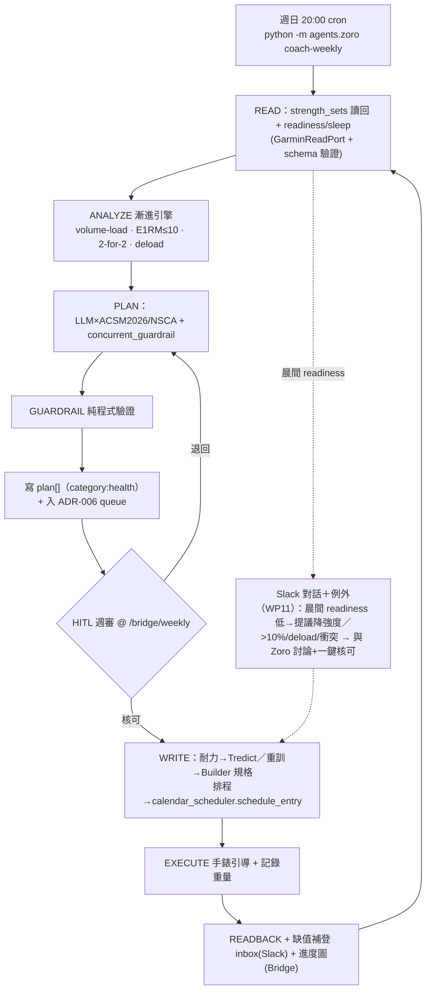

# Zoro 數位健身教練 — 實作計畫 v2（codebase-grounded）

**Status:** Draft v2 — 已納入 4 路 panel review + 4 cluster codebase grounding
**Date:** 2026-06-29
**Author:** Claude (Opus 4.8)
**Repository:** nakama (E:\nakama)
**Supersedes:** [`2026-06-29-zoro-coach-implementation-plan.md`](2026-06-29-zoro-coach-implementation-plan.md) (v0.1)
**Inputs:** [panel review](2026-06-29-zoro-coach-plan-panel-review.md)、[研究底稿](2026-06-29-garmin-fitness-coach-zoro-research.md)、codebase grounding（agent 框架 / 行事曆系統 / HITL / design-system 四路）
**模式:** P9 規劃（輸出計畫 + 六要素 task prompt）
**方法論註記:** 健身教練是 **Owner personal-ops 能力，不在內容七層 pipeline 內**（CONTENT-PIPELINE.md 不適用，但仍受 CLAUDE.md 三紅線、worktree、vault、美學紀律約束）。

---

## 0. v0.1 → v2 變更摘要（含歸因）

| v0.1 | v2 | 依據 |
|---|---|---|
| 自建「Google Calendar MCP / `find_free_time`」 | **復用既有 `shared/google_calendar.find_free_slots` + `calendar_scheduler.schedule_entry`**；運動＝`category:health` 的 TaskNotes task + `plan[]` 投影 | 架構 review + grounding C2 |
| WP7/WP8 自建行事曆與週計畫 | **折進既有 `/bridge/weekly` dashboard（ADR-039/040/041，已 shipped）** | grounding C2/C4 |
| 假設能接 MCP（Tredict/GCal） | Nakama **無 MCP client**；Tredict 落地方式列 **Phase 0 驗證**（HTTP API or 手動 apply） | 架構/API review |
| 「重用 ADR-006 HITL」 | **擴充 ADR-006**：`shared/schemas/approval.py` 加 `WriteGarminWorkoutV1`（含 `compliance_flags` 防呆） | grounding C3 |
| HITL：逐寫入審批 | **週審一次（Bridge）＋ 風險例外（Slack）** | product review + 你的決策 |
| 新 agent `zoro_coach`（未定） | **維持 Zoro**：建 `agents/zoro/coach/` 子套件 + subcommand；同 PR amend ADR-012/ADR-001 | 你的決策 + grounding C1 |
| `db/strength_sets`（虛構路徑） | **`state.py:_init_tables` 內新增 `strength_sets` 表 + `migrations/0XX_*.sql` + `shared/strength_sets_store.py`** | grounding C3 |
| E1RM＝Epley+Brzycki 平均 | **只在 top set ≤8–10 reps 算**；高 rep 改 rep-at-load PR + volume-load | 運動科學 review |
| deload 依 RPE | **客觀代理**（completed-rep 連降／逼近 MRV）＋**時間 fallback（每 4–6 週）** | 運動科學 review |
| 併行干擾＝風險表一行 | **一級排程約束 `concurrent_guardrail`** + `season_priority` + `training_status` | 運動科學 review |
| 重訓 weight 漏輸入＝風險一行 | **缺值補登 inbox（當晚 Slack/Bridge）** + WP2 三態 gating | product review |
| 進度可視化排 Phase 2 | **拉進 Phase 1**（E1RM/volume 趨勢 + PR badge） | product review |
| 「`get_activity_exercise_sets` 已驗證能讀回」 | 實為**裸 passthrough 無 schema 保證** → 加 **schema-validation adapter + 突變偵測**，Phase 0 dump 樣本 | API review + 源碼 |
| VPS auth 怕 garth 死 | garth 已不依賴；真風險＝首登 MFA／refresh revoke／SSO 再改；**沿用 `google_calendar` 的 token pattern（本機登入→搬 VPS）** | API review + grounding |
| CWI 無差別鐵則 | **goal-aware + 部位-aware**；補蛋白質/睡眠監控 | 運動科學 review |
| 車+泳雙上、雙 backend、自動週期化 | **先車後泳**；單 backend；砍自動週期化與 E1RM 多公式平均 | product review |
| 成功指標全技術 | **技術 DoD + 採用/價值 DoD 分列** | product review |

---

## 1. 目標與範圍

**一句話目標：** Zoro（擴充為多領域 agent）依 fitness level 與 Garmin 訓練紀錄，規劃重訓 + 室內單車（夏季先做）+ 恢復行程，**自動監控訓練量並科學化漸進負荷**，把課表寫進手錶與行事曆（復用既有週計畫系統），每週日晚於 Bridge 產出整合「工作 + 運動」Weekly Plan 待你核可。

**In scope（MVP→Phase 2）：** 重訓讀回 + 漸進負荷監控（最高優先）、重訓課表生成（ACSM 2026/NSCA）、室內單車耐力（Tredict）、恢復（冥想 + CWI 時機）、週審（Bridge）+ 例外（Slack）、進度可視化與週報。

**Out of scope（Phase 3+ 或不做）：** 跑步（夏季暫緩）、25m 泳池（**Phase 2 後段，先車後泳**）、逆向自動寫重訓、自動 macrocycle 週期化、營養完整規劃、開放水域。

---

## 2. 鎖定決策（v2）

| # | 決策 | 選定 | codebase 對接 |
|---|---|---|---|
| 1 | 耐力寫入 | **Tredict**（先驗 HTTP/MCP 落地方式） | 無既有 MCP client，Phase 0 驗 |
| 2 | 重訓寫入 | **Garmin 原生 Strength Builder**（Zoro 出規格、你一鍵建） | — |
| 3 | 重訓監控 | **python-garminconnect** `get_activity_exercise_sets` + schema 驗證 | `strength_sets` 表 |
| 4 | 行事曆 | **既有 `calendar_scheduler.schedule_entry`**（運動＝`category:health` task） | ADR-041，vault=SoT |
| 5 | 排程觸發 | **Bridge 週日晚** `python -m agents.zoro coach-weekly`（cron `0 20 * * 0`） | heartbeat `zoro-coach-weekly` |
| 6 | 審批 | **週審 Bridge ＋ 例外 Slack** | 擴 ADR-006 payload |
| 7 | Agent | **維持 Zoro**：`agents/zoro/coach/` 子套件 | amend ADR-012/ADR-001 |
| 8 | 夏季耐力 | **先室內單車，泳池後做** | — |
| 9 | 課表依據 | **ACSM 2026 + NSCA** | — |
| 10 | 本季主目標 `season_priority` | **平衡（balanced）** | 干擾排程不偏袒；耐力與重訓並重 |
| 11 | 訓練年資 `training_status` | **中階（intermediate）** | 用 double progression + 2-for-2；非線性新手、非週期化進階 |

---

## 3. 成功指標（Definition of Done）

**技術 DoD：**

1. 讀回過去 ≥8 週重訓，逐組 exercise/reps/weight/rest 落 `strength_sets`，缺值偵測 + schema 突變告警。
2. 算出每動作 volume-load 趨勢、每肌群每週 hard sets、top-set E1RM（≤10 reps）；缺值時三態 gating。
3. 依 double progression + 2-for-2 出加重建議，100% 通過 load–rep sanity check；deload 由客觀代理或 4–6 週 fallback 觸發。
4. 室內單車結構化課表經 Tredict 上錶並回讀完成度。
5. 運動/恢復 block 經 `calendar_scheduler.schedule_entry` 寫入，0 衝突、0 次違反 CWI「重訓後 6–8h」鐵則。
6. 週日晚自動產出整合 Weekly Plan 於 `/bridge/weekly` 待審；核可後自動落地。

**採用/價值 DoD：**

7. 連續 ≥4 週你每週日真的去 review＋核可。
8. 加重建議採納率、重訓 weight 輸入完整率（≥80%）可量測。
9. 進度可視化（E1RM/volume 趨勢 + PR badge）在 Phase 1 即可見。

---

## 4. 架構（對齊 codebase）

### 4.1 閉環



### 4.2 在 Nakama 的定位（Zoro 多領域）

- **模組**：新建 `agents/zoro/coach/`（`garmin_read.py` / `progression.py` / `planner_strength.py` / `guardrail.py` / `recovery.py` / `tredict.py`）。不污染既有 `brainstorm_scout.py` / `keyword_research.py`。
- **Entrypoint**：`agents/zoro/__main__.py` 加 subcommand（沿用既有 argparse 分發，勿破壞「無 subcommand → exit 2」保護）：`coach-sync`（讀回）、`coach-weekly`（週計畫）。
- **Cron**：`0 20 * * 0 python3 -m agents.zoro coach-weekly`；另可加 `coach-sync` 每日。新 heartbeat job_name 常數（如 `zoro-coach-weekly`、`zoro-coach-sync`），收尾呼叫 `heartbeat.record_success/record_failure`。
- **Lifecycle**：cron 純函式路徑繞過 BaseAgent，需自接 `start_run`/`finish_run`/`alert(...)`（外部 API 失敗要告警）。
- **成本歸因**：coach 模組仍 `set_current_agent("zoro", run_id)`（成本掛 zoro；注意此值同時驅動模型路由）。如要把教練成本與 scout 分開，可比照 SEO→brook 前例用獨立 label，但會造成「目錄≠成本」認知債——MVP 先掛 zoro。
- **ADR 待改（同 PR）**：amend **ADR-012**（把「Zoro=向外」擴成「Zoro 對外情報 + 對內健身教練；對內教練不適用向外/對內 framing」）、更新 **ADR-001** Zoro 列、`ARCHITECTURE.md` agent 清單、重寫過時的 `agents/zoro/README.md`、lazy-create Zoro `CONTEXT.md`。

### 4.3 資料模型（state.py 慣例）

於 `shared/state.py:_init_tables` 的 executescript 新增（並開 `migrations/0XX_strength_sets.sql` canonical DDL，配 `shared/strength_sets_store.py`，`_get_conn()` + `INSERT OR IGNORE` 冪等，仿 `record_score_shadow`）：

```sql
-- ADR-0XX — Zoro coach strength set log. Canonical: migrations/0XX_strength_sets.sql.
-- Owned by shared/strength_sets_store.py; written by agents/zoro/coach.
CREATE TABLE IF NOT EXISTS strength_sets (
  id INTEGER PRIMARY KEY AUTOINCREMENT,
  activity_id   TEXT NOT NULL,
  exercise_key  TEXT NOT NULL,      -- 對映到自管 muscle-group 表
  set_index     INTEGER NOT NULL,
  reps          INTEGER,
  weight_kg     REAL,               -- 來自 Garmin（公克換算），可 null
  rest_sec      INTEGER,
  set_type      TEXT NOT NULL CHECK (set_type IN ('active','rest')),
  performed_at  TEXT NOT NULL,      -- ISO +08:00 aware
  source        TEXT NOT NULL CHECK (source IN ('garmin','manual')),
  operation_id  TEXT NOT NULL,
  created_at    TEXT NOT NULL,
  UNIQUE (activity_id, exercise_key, set_index)   -- re-sync 冪等 upsert
);
```

時間欄位一律 ISO `+08:00`（naive 假設 Asia/Taipei）。另需 `exercise_key → muscle_group` 自管對照表（版本化；未對映→unknown 不計入肌群統計）。

### 4.4 整合既有系統（核心：少自建）

| 需求 | 直接呼叫既有 | 備註 |
|---|---|---|
| 排運動/恢復 block | `calendar_scheduler.schedule_entry(vault_root, task_slug, *, start, pomodoros, title, all_day, reason, force)` | vault=SoT + Google best-effort + rollback；1🍅=30min |
| 找空檔 | `google_calendar.find_free_slots(day, duration_minutes, *, near, max_slots)` | Asia/Taipei、primary calendar |
| 新增運動 task | `project_writer.create_task(..., category="health")` | 自動落 `/bridge/weekly` 身心健康欄；不灌爆 work🍅 |
| 週計畫 UI | 擴 `/bridge/weekly`（`bridge_weekly.py`），勿新造頁 | Jinja + form POST→303；`--sho-*` token；新 CSS/JS 要加進 `_shosho_asset_version()` hash 清單 |
| HITL | 擴 `shared/schemas/approval.py` 加 `WriteGarminWorkoutV1`（`action_type` 新 Literal + `target_platform/title/diff_target_id` property + `target_site` field + **`compliance_flags`**），擴 `ApprovalPayloadV1` union | DB `target_platform/action_type` 無 CHECK，免 migration；Bridge `/bridge/drafts` 已有審批 UI |
| 即時告警 | `alert("error","garmin",msg,dedupe_key=...)` | error→Slack DM |
| 進度週報 | `obsidian_writer.write_page("KB/Wiki/Digests/Training/{YYYY-Www}.md", fm, body)` | **不碰 `Journals/Weekly/` 紅線**；週頁只 computed-on-read；同 PR 更新 VAULT-LAYOUT.md + KB/index.md |

### 4.5 Ports / Adapters（瘦身）

- `GarminReadPort` → python-garminconnect（**單一 backend** + schema-validation 層 + 突變偵測；移除 v0.1 的假備援）。token 沿用 `google_calendar` pattern：本機 MFA 登入 → `data/garmin_token.json`（filelock + gitignore）→ VPS 自動續期；refresh 失效 → `alert` + runbook 本機重產。
- `WorkoutWritePort` → 耐力：Tredict；重訓：原生 Builder 規格產生器。
- 行事曆**不另立 port**，直接用 `calendar_scheduler`。

---

## 5. 元件規格（六要素，codebase-grounded）

### WP1 — Garmin 讀回 adapter + `strength_sets` ★MVP
- **目標**：穩定、冪等地把每組重訓 reps/weight/rest 落地，並對私有 API 形狀做防護。
- **範圍**：`agents/zoro/coach/garmin_read.py`、`shared/strength_sets_store.py`、`shared/state.py`（加表）、`migrations/0XX_strength_sets.sql`、`data/garmin_token.json`（token）。
- **輸入**：python-garminconnect `get_activities_by_date(start,end,"strength_training")` → `get_activity_exercise_sets(activityId)`（**裸 passthrough**）。
- **輸出**：`StrengthSet` upsert（自然鍵 `(activity_id,exercise_key,set_index)`）；schema-validation adapter（未知結構→拒寫 + `alert`）；CLI `python -m agents.zoro coach-sync --since 8w`。
- **驗收**：近 8 週逐組正確落地；REST set 正確解析；公克→公斤換算與缺值（weight=null）測試；schema 突變被攔。
- **邊界**：不寫 Garmin；token 只本地；不算分析（交 WP2）。

### WP2 — 漸進負荷引擎 ★MVP（最高價值）
- **目標**：把讀回數據變成「有沒有進步 + 下次怎麼加」的可執行建議。
- **範圍**：`agents/zoro/coach/progression.py`（純函式）。
- **輸入**：`strength_sets` 歷史 + `Profile`（目標、`training_status`、每肌群 MEV/MAV/MRV、可加重最小增量）。
- **輸出**：每動作 volume-load 趨勢（**不跨動作加總**）、每肌群每週 hard sets（定義：估計 RIR≤3、排除暖身組）、**top-set E1RM 僅 ≤8–10 reps**（高 rep 改 rep-at-load PR）、加重建議（double progression + 2-for-2，依動作/年資對映實際增量 2.5–10%）、deload 旗標（**completed-rep 連 2–3 週下滑／逼近 MRV／4–6 週時間 fallback**；RIR 有則加權、非必要條件）。
- **驗收**：合成資料下 2-for-2、double progression、deload 觸發、E1RM 區間限制皆有單元測；建議 100% 過 sanity check；4–6 週移動趨勢 + 最小有意義變化閾值。
- **邊界**：只算與建議；不寫課表；不下醫療判斷。

### WP3 — 重訓課表生成 + Guardrail（含併行干擾）★MVP
- **目標**：依 ACSM 2026/NSCA + WP2 建議生成課表，並硬擋不安全/不可執行/被干擾抵銷的安排。
- **範圍**：`agents/zoro/coach/planner_strength.py` + system prompt（`prompts/zoro/coach_*.md`）+ `guardrail.py`（純程式，含 `concurrent_guardrail`）。
- **輸入**：Profile（含 `season_priority`、`training_status`、`injury_flags`）、WP2 建議、ACSM 2026 規則（力量 ≥80%1RM/2–3組/≥2×週；肥大 ≥10 組/肌群/週、30–100%1RM 近力竭；2–3 RIR）。
- **輸出**：結構化重訓課表（動作/組/reps/休息/目標重量）+ Builder 規格（交 WP4）；guardrail 報告。
- **驗收**：guardrail 攔下不可能 load–rep（**雙向：≥85%1RM 還做 ≥12 reps 才擋，低負荷高 rep 在肥大 context 放行**）、過量容量、缺 deload；**新手/有傷史 → 禁 1RM max 測試**；`concurrent_guardrail`：同 session 重訓在前耐力在後、腿部重訓 vs 室內單車同肌群間隔 ≥6h、優先把泳配腿日/車配上肢或休息日、依 `season_priority` 設耐力劑量上限；reproducibility 檢查。
- **邊界**：不自動上錶（交 HITL + WP4）；醫療禁忌標記轉介。

### WP4 — 重訓寫入（原生 Builder 規格）
- **目標**：把 WP3 課表轉成 Garmin Connect Strength Builder 可一鍵建立的精確規格（含 target weight）。
- **範圍**：`agents/zoro/coach/builder_spec.py` + Bridge 呈現。
- **輸入**：WP3 課表。
- **輸出**：步驟化建立規格（動作/組/reps/休息/目標重量）；Phase 0 若證實手錶支援預載 target weight 則照走，否則退化成「課表卡片 + 手錶純記錄」。
- **驗收**：依規格在 GC 建立後手錶能引導；缺 target weight 支援時有 fallback。
- **邊界**：MVP 不做逆向自動寫入。

### WP5 — HITL：擴 ADR-006 + 週審Bridge/例外Slack ★MVP
- **目標**：寫入前審批，顆粒度符合單人自用。
- **範圍**：`shared/schemas/approval.py`（加 `WriteGarminWorkoutV1`/`ScheduleTrainingBlockV1`）、`shared/approval_queue.py`（claim 端 compliance 防呆）、Bridge `/bridge/drafts` 渲染分支、Slack（Nami）例外卡。
- **輸入**：WP3/WP4/排程產物。
- **輸出**：**週審＝整週一次於 `/bridge/weekly`**；**例外（負荷跳幅 >10%／deload／醫療旗標／行事曆衝突）→ Slack 一鍵核可**；其餘核可後自動執行 + 事後可 undo。
- **驗收**：無「未審即寫」路徑；新 payload 帶 `compliance_flags`（或 claim 端 `getattr` 防呆，避免 `AttributeError`）；FSM 沿用既有 8 狀態。
- **邊界**：不繞過；不自動核可高風險。

### WP6 — 進度可視化 + 缺值補登 inbox ★MVP
- **目標**：讓你「看到自己變強」並把漏輸入的重量補回。
- **範圍**：`/bridge/weekly` 擴充（`--sho-*` token、`.wk-*` 詞彙、form POST→303；CSS/JS 加進 `_shosho_asset_version()` hash 清單）。
- **輸入**：WP2 輸出、`strength_sets` 缺值偵測。
- **輸出**：主要動作 E1RM/volume-load 趨勢 + PR badge；缺值補登卡（sync 後當晚 Slack/Bridge 推，列動作+上次重量）。
- **驗收**：缺值 session 會主動提醒補登；補登後趨勢更新；states（empty/loading/error）設計過。
- **邊界**：不改週檔紅線；只擴既有頁。

### WP7 — Tredict 室內單車整合（Phase 2）
- **目標/範圍/輸入/輸出/驗收/邊界**：`agents/zoro/coach/tredict.py`；輸入＝Zoro %FTP 課表；輸出＝Tredict 計畫 + 上錶（**含「需手動 apply 到行事曆」此關卡，明示於 Bridge checklist**）；驗收＝課表上錶 + 回讀；邊界＝不處理重訓、泳延後。

### WP8 — 恢復規劃（冥想 + CWI 時機）（Phase 2）
- 範圍：`agents/zoro/coach/recovery.py`（輕量，一個時機檢查函式 + 排程，不做成獨立大引擎）。輸入：當週訓練排程 + 目標。輸出：冥想每日 anchor block；CWI block。驗收：CWI **goal-aware（肥大 block 禁區、純力量放寬為警告）+ 部位-aware**，0 次違反重訓後 6–8h；補蛋白質(1.6–2.2g/kg)/睡眠提示與「沒進步先排除恢復/營養」診斷閘。邊界：非醫療；補水屬安全非營養可納入。

### WP9 — 排程整合 + Bridge 週計畫擴充（Phase 2，部分 MVP）
- 範圍：呼叫 `calendar_scheduler.schedule_entry`（運動＝`category:health` task + plan[]）、`find_free_slots` 找空檔；`/bridge/weekly` 顯示運動於身心健康欄。輸入：核可後的課表/恢復 block。輸出：行事曆 event（idempotency `{slug}@{date}`）。驗收：0 衝突、週末帶 reason、時區 +08:00。邊界：vault=SoT、Google best-effort；不刪非運動事件。

### WP10 — Bridge 週日晚自動化（Phase 2/3）
- 範圍：`coach-weekly` subcommand 串 WP1→WP2→WP3→WP7→WP8→WP9，產整合週計畫入 HITL queue；cron `0 20 * * 0` + heartbeat。輸入：本週完成度 + readiness。輸出：待審 Weekly Plan。驗收：自動觸發、idempotent（重跑不重複）、失敗 `alert`；**cold-start 前 3–4 週走保守 default + onboarding 第 0 週基線**；漏訓承認/補救、工作衝突降頻。邊界：不自動寫入（待審）。

### WP11 — Slack 對話式教練 + 晨間 readiness 自動調整（Phase 2）★你新增
- **目標**：在 Slack 直接跟 Zoro 討論課表與執行現況，並在 readiness 偏低時主動提議降強度（autoregulation 的對話化落地）。
- **範圍**：擴 `gateway/handlers/zoro.py`（新 `coach` intent + tool use：讀 `strength_sets`/readiness/今日 plan[]）；`agents/zoro/coach/autoregulate.py`（調整規則）；晨間 cron `coach-readiness`（如 `0 7 * * *`，新 heartbeat job）。
- **輸入**：當日 `get_training_readiness` / `get_hrv_data` / `get_sleep_data` / `get_body_battery` + 今日 plan[] + 你的對話。
- **輸出**：(a) **對話**——回答「今天練什麼／這週量夠嗎／這動作該加重嗎／我昨天的深蹲如何」；(b) **主動**——readiness 低（如 Training Readiness <34、HRV Status=Low、或睡眠明顯不足）→ Slack 提議「降強度／換較輕 session／改恢復日」，你一鍵核可後改今日 plan[]（走 `calendar_scheduler` 更新 event）。
- **驗收**：任何調整經你核可（HITL 例外路徑）；**cold-start 前 ~3 週 HRV baseline 未建時只給保守提醒、不自動改**；調整有 `operation_id` 紀錄；對話回應引用真實讀回數據（不幻覺）。
- **邊界**：不自動執行高風險變更；不取代每週大審；不下醫療判斷；readiness 僅作軟性訊號（ACWR/HRV 當 heuristic，非鐵律）。

---

## 6. 路線圖

| 階段 | 內容 | 估時 |
|---|---|---|
| **Phase 0 spike**（驗契約+失效行為，非「跑通一次」） | ① Tredict headless 落地方式（HTTP vs 手動 apply）② dump `exerciseSets` 真實 JSON 存樣本、確認 weight/rest 欄位與 null ③ 你的錶款是否支援預載 target weight ④ VPS token 無互動續期能撐多久 ⑤ Garmin 同步延遲（週日 20:00 當天訓練是否已上雲） | ~3–5 天 |
| **Phase 1 MVP** | WP1 + WP2（監控引擎）+ WP3（含 concurrent_guardrail）+ WP4 + WP5（HITL）+ WP6（可視化+補登） | ~3 週 |
| **Phase 2** | WP7 Tredict 單車 + WP8 恢復 + WP9 排程整合 + WP10 週日晚自動化 + WP11 Slack 對話/readiness 調整 + 進度週報→KB/Wiki | ~3–4 週（WP11 需 ~3 週 HRV baseline 才全效） |
| **Phase 3** | 25m 泳池 + readiness 自動調整 +（如需）週期化 | 視需要 |

---

## 7. 風險與緩解（v2）

| 風險 | 等級 | 緩解 |
|---|---|---|
| `exerciseSets` 私有 API schema 漂移→靜默算錯 | 高 | schema-validation adapter + volume-load 突變偵測。**Phase 0 已驗（real sample）**：top-level `{activityId, exerciseSets[]}`；weight=**公克**（÷1000）、REST set 的 reps/weight=`null`、`exercises:[]`（空陣列非 null）、ACTIVE 無重量時 weight=`null`（非 0）、category/name=大寫 FIT enum（auto-detect 給 probability 候選，name 常 null）。passthrough 源碼行**已從 v2 引用的 2554 漂移到 `__init__.py:2597-2603`**（佐證漂移風險為真）。fixture：`spike/samples/exercise_sets_forum_196039.json`；本人資料 dump：`spike/dump_exercise_sets.py` |
| VPS 首登 MFA／refresh token 失效／Garmin 改 SSO | 高 | **Phase 0 重大修正：garth 已死（2026-03-27 deprecated）；python-garminconnect ≥0.3.0 改用原生 DI OAuth（curl_cffi）+ 單檔 `garmin_tokens.json`（di_token / di_refresh_token / di_client_id），需 Python ≥3.12（最新 0.3.6, 2026-06-14）**。silent refresh 不需 MFA；非互動存活＝**di_refresh_token TTL（官方/函式庫均未公布）**——非 v2 假設的「OAuth1 ~1 年」→ 用 `spike/garmin_token_probe.py` 每日量測得真值。沿用 `google_calendar` 本機登入→搬 VPS pattern，但 **token 是目錄 `data/garmin/` 非單檔（修正 §4.5 的 `data/garmin_token.json`）**。新增失效面：refresh token 可能每次 rotate（須回寫持久化）、VPS IP geo-anomaly 觸發 re-MFA、issue #312（MFA 帳號 refresh 失敗）待 0.3.6 重驗。refresh 失效 → `alert("error","garmin",...)` + runbook 本機重產 |
| Tredict headless 不可全自動（需手動 apply 到行事曆） | 中 | **Phase 0 已驗**：Tredict 有**直打 HTTP REST API**（`POST https://www.tredict.com/api/oauth/v2/plan` + `POST /plan/training`，Personal API Token bearer，**無需 MCP client**——repo 本就無 MCP harness 故不阻擋），power/%FTP step 支援。但「apply 到個人行事曆才會自動上錶」此關卡**無對應 API endpoint**（My Plans→calendar 須手動 tap）→ degrade 成 Bridge 顯式 checklist 手動 apply。寫入層 US$49/年（讀免費，2 個月試用）。cycling 為 Phase 2，手動 gate 可接受 |
| 重訓 weight 漏輸入 | 中 | 缺值補登 inbox + 三態 gating |
| 併行訓練干擾抵銷適應 | 中 | `concurrent_guardrail` 一級約束 + season_priority |
| LLM 課表不安全/不穩 | 中 | guardrail + HITL + reproducibility 檢查 |
| 動作 enum→肌群對映錯 | 中 | 自管版本化對照表；未對映→unknown 不計 |
| Zoro 多領域成本/模型歸因混淆 | 低 | MVP 掛 zoro；如需分離用獨立 label |
| 健康資料/token 資安 | 中 | token 加密+檔權+撤銷 runbook；標明流向 LLM 的欄位 |

---

## 8. 測試與驗證

- **單元/契約（CI）**：用 recorded `exerciseSets` JSON fixture 測 parser（換算/REST/缺值/突變）；mock port 測 WP2/WP3 純函式（E1RM 區間、2-for-2、deload、concurrent_guardrail、CWI 時機）。比照既有 `tests/test_google_calendar.py` 的 `monkeypatch` 慣例。
- **整合（manual/Phase 0）**：真帳號讀回、Tredict round-trip、`schedule_entry` 寫行事曆——標記 manual，不進 CI。
- **每 WP 完工**：P7 三問自審 + `[P7-COMPLETION]`。

---

## 9. ADR 與文件待改清單（同 PR）

1. **Amend ADR-012**：Zoro = 對外情報 **+ 對內健身教練**（對內教練不套用向外/對內 framing）；不 supersede。
2. **ADR-001**：更新 Zoro 角色列。
3. **新增 ADR-0XX**（健身教練）：角色歸屬、`strength_sets` 資料、HITL payload 擴充、KB/Wiki 報告落點、carve-out 紀律。
4. **ADR-006**：header 仍 `Proposed` 但 code 已 shipped；以 **code 為 SoT** 擴 payload；評估是否翻 Accepted。
5. **`migrations/0XX_strength_sets.sql`** + `state.py` in-app bootstrap 副本（兩處同步）。
6. **`docs/VAULT-LAYOUT.md`**：新增 `KB/Wiki/Digests/Training/`（§6 α 強制）。
7. **`ARCHITECTURE.md`** agent 清單/圖；**重寫 `agents/zoro/README.md`**（已過時）；lazy-create Zoro `CONTEXT.md`。
8. **design-system**：新 CSS/JS 加進 `bridge_weekly._shosho_asset_version()` hash 清單（否則 Cloudflare 4h cache 不 bust）。
9. **不**擴 `WEEKLY_FRONTMATTER_KEYS`（避免動 🟡 紅線）；訓練資料走 `KB/Wiki` + 週頁 computed-on-read。

---

## 10. 開放問題（待你確認 / Phase 0）

### 10.0 Phase 0 spike 結果回填（2026-06-29, Claude Code）

5 路平行研究 + 對抗式驗證（live primary sources），**且 ② 已用真 Fenix 8 帳號實測完成**。剩餘僅：④ token 長期 TTL（要 VPS daily probe 跑數週）、③ on-device 細節（非阻擋）、⑤ 你環境的真實同步延遲、Tredict 帳號相關（Phase 2）。spike 工具在 `spike/`（worktree `E:\nakama-zoro-coach`，非 production code），環境已備妥並驗證。

| Q | 狀態 | 結論（已驗） | 仍待實測 |
|---|---|---|---|
| ① Tredict headless | **已解** | 直打 HTTP `POST /api/oauth/v2/plan`（Personal API Token，**無需 MCP**）；power step ✅。但「apply 到行事曆才上錶」**無 API**→手動 gate（Phase 2 可接受） | 註冊 $49 帳號後驗：Personal Token 是否預設帶 `activityWrite`、power step 確切 JSON key |
| ② exerciseSets JSON | ✅ **已用你的 Fenix 8 dump 鎖定（4 活動 / 55 set）** | bare passthrough（源碼行 2554→2597-2603）；weight=**公克**（實證 15/20/25kg shoulder press）；**比 v2 引用多 `wktStepIndex`（結構化課表有值，非恆 null）+ `messageIndex` 兩欄 → adapter 須容忍未知欄位**；無重量＝`null` **或** `0.0`（暖身/徒手）；reps 可 `null`（REST）或 `0`（中止 set）；`category` 大寫 FIT enum（SHOULDER_PRESS/BENCH_PRESS/FLYE/PULL_UP/WARM_UP/UNKNOWN…），`name` **時有時無**（DUMBBELL_BENCH_PRESS 等有、純偵測時 null）→ 對映以 category 為主；`exercises[]` 可能重複候選取 [0]。raw 已存 `spike/samples/exercise_sets_*.json`（4 真實 + forum 變體） | 已完成。剩 Phase 1 引擎決策：徒手 0kg 是否補體重算 volume、`WARM_UP`/`UNKNOWN`/0-rep 排除規則、unknown→肌群對映 |
| ③ 錶款預載 target weight | ✅ **Fenix 8 支援** | 原生 GC Strength Builder：target reps 必填 + **target weight 選填**，上錶逐動作引導（報數 / 休息計時 / 記錄重量），**非純記錄**。**Fenix 8 額外支援 Garmin Coach 肌力計畫**（rollout 比 Fenix 7 更全）。無原生自動漸進——符合 WP4（Zoro 出規格、你一鍵建） | 實機確認（非阻擋）：F8 是否顯示重量數值（非僅 reps）+ 動畫 + 達標自動進段；「改 target weight 後不覆寫錶上舊課表」這個 Fenix 6 回報的 bug 在 F8 韌體是否仍在（影響每週加重重傳，可用刪除重 sync 繞過） |
| ④ VPS token 續期 | **機制已解＋已實測可 resume，TTL 待長測** | **garth 已死**；garminconnect 0.3.6 原生 DI OAuth、目錄 `garmin_tokens.json`、**Python ≥3.12**。silent refresh 無需 MFA。**今日已實證：本機一次 MFA 登入 → 之後非互動 resume + 讀 API 成功**（dump 用存好的 token 跑通）。非互動存活＝di_refresh_token TTL（**未公布**） | 真實 TTL 只能跑 `garmin_token_probe.py` 每日記錄看首次失敗日；token 是否每次 rotate（須回寫）、VPS IP anomaly、issue #312 在 0.3.6 是否重現 |
| ⑤ Garmin 同步延遲 | **已解（happy path）** | 正常數秒~2 分鐘（18:00→20:00 有 2h margin 很安全）。但 auto-sync hit-or-miss（手機不在 / app 被殺 → 可達數十分鐘~小時） | 你環境的真實延遲 → `sync_latency_probe.py --watch 15`。緩解：週日讀取設 grace window + retry，Bridge 提示「確認錶已同步」 |

**浮現的決策 / 需你拍板：**

1. ~~你的 Garmin 錶款？~~ **已答：Fenix 8**——Q3 能力全支援（含 Garmin Coach 肌力計畫）；on-device 細節非阻擋。
2. **Python ≥3.12 ✅ 已確認**：本機 3.14、**VPS 3.12.3**（皆 ≥3.12）；`.venv-spike` + garminconnect 0.3.6 import OK、5 支腳本 py_compile 通過、一次 MFA 登入 + 非互動 resume 已實測成功。
3. **§4.5 路徑修正**：`data/garmin_token.json`（單檔）→ **`data/garmin/`（目錄，內含 `garmin_tokens.json`，0600）**；`requirements.txt` 由 `pyproject.toml` 生成且無 PEP-508 extras 慣例，故 Phase 1 加 `garminconnect` 用**純 pinned line**（非 `garminconnect[workout]`），先改 pyproject。
4. **§5 WP1 輸入修正（Phase 1 必改）**：`get_activities_by_date(s,e,"strength_training")` **錯**——`strength_training` 是 sub-type，傳入回 HTTP 400「Activity type cannot be an activity sub type」。正解：抓全部活動再 client-side 篩 `activityType.typeKey == "strength_training"`（已在 `spike/dump_exercise_sets.py` 修正驗證）。`get_activity_exercise_sets(activityId)` 維持不變。
5. **Tredict $49/年**：Phase 2 才需；要不要先開 2 個月免費試用驗 write scope？（非 Phase 1 阻擋項）

### 10.1 其餘開放問題

1. ~~**Tredict headless 落地**~~ **已解（見 §10.0 ①）**：HTTP 直打 + 手動 apply gate。
2. ~~`season_priority` / `training_status`~~ **已定：平衡（balanced）+ 中階（intermediate）**（見 §2 #10/#11）。
3. **1RM 基線**：建議**不直測 1RM**，用 RIR-anchored 重量 2–3 週校準出 working E1RM（你確認？）。
4. **成本歸因**：coach 掛 `zoro`（簡單）還是獨立 label（乾淨但有認知債）？
5. **泳池時點**：確認 Phase 2 後段再做（先車）。

---

## 11. Grounding 參照（codebase 事實）

- Agent 框架：`agents/base.py`（`run()->str`、`execute()` lifecycle）、`agents/zoro/__main__.py`（argparse 分發、no-fallback）、`shared/llm_context.py:set_current_agent`、`cron.conf`、ADR-012/ADR-001。
- 行事曆/週計畫：`shared/calendar_scheduler.py:schedule_entry`、`shared/google_calendar.py:find_free_slots`、`shared/weekly_writer.py`（`WEEKLY_FRONTMATTER_KEYS` allowlist、1🍅=30min）、`shared/weekly_indexer.py`（category work/health/growth/misc、🍅 只算 work）、`thousand_sunny/routers/bridge_weekly.py`、`gateway/handlers/nami.py`（雙向 sync）、ADR-039/040/041。
- HITL/持久化/infra：`shared/schemas/approval.py`（`ApprovalPayloadV1` union、property 慣例、`extra="forbid"`）、`shared/approval_queue.py`（FSM 8 狀態、enqueue/claim/transition）、`shared/state.py`（`_init_tables`、target_platform/action_type 無 CHECK）、`shared/alerts.py:alert`、`shared/heartbeat.py`、`docs/principles/observability.md`（operation_id）、`/bridge/drafts`。
- design-system/vault：`thousand_sunny/static/shosho/tokens.css`（`--sho-*`、`class="sho"`）、`bridge.css`/`bridge-weekly.css`（`.sho-chip/.sho-btn/.wk-*`）、`docs/design-system.md`、`docs/VAULT-LAYOUT.md`、`shared/obsidian_writer.py:write_page`。

---

---

## 12. 交付：實作交給 Claude Code

程式實作（多檔、`pytest`、CI、PR、migrations）交 **Claude Code**，不在 Cowork 做——理由：主倉只讀 + sibling worktree 紀律、測試與 CI green 才 merge、PR review、`set_current_agent`/heartbeat/migrations 都在 repo toolchain 內。Cowork 負責研究／決策／計畫／交付（已完成）與日後幫你 review PR。

**交接流程：**

1. 開 worktree：`git switch main && git fetch --prune && git pull --ff-only && git worktree add E:\nakama-zoro-coach -b feat/zoro-coach origin/main`
2. 餵 Claude Code：本檔 v2 + [panel review](2026-06-29-zoro-coach-plan-panel-review.md) + [研究底稿](2026-06-29-garmin-fitness-coach-zoro-research.md)。
3. 先做 **Phase 0 spike**（§6），結果回填 §10／§7。
4. 依 §5 WP 六要素逐一實作，每個走 P7 完工格式；ADR/文件改動（§9）同 PR。

**可直接貼進 Claude Code 的 kickoff prompt：**

> 讀 `docs/research/2026-06-29-zoro-coach-implementation-plan-v2.md`（及其 panel review 與研究底稿）。我們要在 Zoro 下新增「健身教練」能力（`agents/zoro/coach/`）。**先只做 Phase 0 spike（§6），不要動 production code**：(1) 確認 Tredict 在 headless 環境的落地方式（HTTP API vs 手動 apply）；(2) dump `get_activity_exercise_sets` 的真實 JSON 樣本、確認 weight/rest 欄位與 null 行為；(3) 確認我的 Garmin 錶款能否預載 target weight 並逐動作引導；(4) 量 VPS 上 token 無互動續期能撐多久；(5) 量 Garmin 裝置→雲端同步延遲。把結果回填 v2 §10／§7 後回報，再進 Phase 1。全程在 worktree `E:\nakama-zoro-coach`、遵守 CLAUDE.md 三紅線與 vault 規則。

---

*v2 已鎖定主目標＝平衡、年資＝中階，並納入 WP11（Slack 對話＋readiness 自動調整）。實作交 Claude Code；建議 Phase 0 結果回填後凍結為 v2.1 開工版。*

