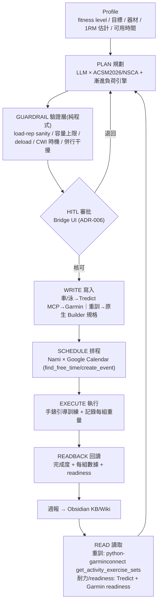

# Zoro 數位健身教練 — 實作計畫 (v0.1，送審版)

**Status:** Draft v0.1 — 送 4 路 sub-agent panel review
**Date:** 2026-06-29
**Author:** Claude (Opus 4.8)
**Repository:** nakama (E:\nakama)
**Builds on:** [`2026-06-29-garmin-fitness-coach-zoro-research.md`](2026-06-29-garmin-fitness-coach-zoro-research.md)（兩輪 deep-research）
**模式:** P9 規劃（輸出為計畫 + 六要素 task prompt，非 code）
**送審目的:** 找出此計畫在運動科學、軟體架構、API 可行性、產品範疇四面向的缺陷、風險與遺漏。

---

## 1. 目標與範圍

**一句話目標：** 讓 Zoro 成為與 Garmin 連動的數位健身教練——依使用者 fitness level 與訓練紀錄規劃每日/每週課表（重訓 + 室內單車 + 25m 泳池），把課表寫入手錶執行，**自動監控訓練量並科學化漸進負荷**，安排冥想/冰浴等恢復行程，並由 Nami 在問過空檔後寫進 Google Calendar；每週日晚於 Bridge 自動產出整合「工作 + 運動」的 Weekly Plan。

**In scope（本計畫涵蓋）：**

- 重訓「讀回 + 漸進負荷監控」引擎（**最高優先**）
- 重訓課表生成（ACSM 2026 / NSCA）+ 寫入（Garmin 原生 Strength Builder 規格輸出）
- 耐力課表（室內單車 %FTP、泳池 CSS/FTPa）+ 經 Tredict 寫入手錶
- 恢復規劃（冥想、冰浴）含時機安全檢查
- Nami × Google Calendar 排程
- Bridge 週日晚 Weekly Plan（scheduled task）
- HITL 審批（重用 ADR-006）、進度週報（寫 Obsidian `KB/Wiki/`）

**Out of scope（MVP 不做，列為未來）：**

- 跑步（夏季暫緩，使用者主動轉室內車/泳）
- 逆向 cloud API 自動寫重訓（hacky，先用原生 Builder）
- 開放水域游泳（Garmin Training API 不支援自動上傳）
- 營養 / 補水規劃
- 完整自動週期化（macro 自動排）、readiness 全自動改課表（Phase 3 才做）

---

## 2. 鎖定的決策（前兩輪已拍板，不再重議）

| # | 決策 | 選定 |
|---|---|---|
| 1 | Garmin 耐力寫入 | **Tredict MCP**（官方 Training API） |
| 2 | 重訓寫入 | **Garmin 原生 Strength Builder**（Zoro 出規格、使用者一鍵建；支援 target weight + 引導） |
| 3 | 重訓監控 | **python-garminconnect** `get_activity_exercise_sets`（讀回每組 reps/weight/rest） |
| 4 | 行事曆 | **Google Calendar MCP**（Nami 用 `find_free_time` + `create_event`） |
| 5 | 排程觸發 | **Bridge 週日晚** scheduled task（cron `0 20 * * 0`） |
| 6 | 夏季耐力模式 | **室內單車 + 25m 泳池**（一起練） |
| 7 | 課表科學依據 | **ACSM 2026 阻力訓練 position stand + NSCA** |
| 8 | 安全關卡 | **HITL**（Bridge UI / Nami），寫入前必審 |

---

## 3. 成功指標（Definition of Done）

1. **讀回**：能列出過去 ≥8 週重訓活動，逐組取得 exercise/reps/weight/rest，缺值（未輸入重量）能偵測並標記。
2. **監控**：能算出每週 volume-load、每肌群每週 hard sets、各主要動作 E1RM 趨勢，並以圖/表呈現「有沒有進步」。
3. **漸進**：能依 double progression + NSCA 2-for-2 產出「下次該加重/加 reps」建議，且 100% 通過 load–rep sanity check（無不可能配對）。
4. **耐力**：車/泳結構化課表能經 Tredict 推到手錶，完成後回讀完成度。
5. **恢復**：冰浴排程 0 次違反「重訓後 6–8h 內」鐵則；冥想每日 anchor。
6. **排程**：每週日晚自動產出整合 Weekly Plan，經核可後寫進 Google Calendar，無重疊衝突。
7. **安全**：任何寫入（Garmin / 行事曆）前都有 HITL 審批紀錄；醫療禁忌可被攔下。

---

## 4. 架構

### 4.1 系統閉環

### 4.2 模組分解與在 Nakama 的定位

- 新增 agent module：建議 `agents/zoro_coach/`（或 Zoro 既有模組下的 sub-domain），獨立 `CONTEXT.md`。Zoro 既有角色見 `docs/decisions/ADR-001-agent-role-assignments.md`——本案是健身領域擴充，需評估是否與既有 Zoro 職責衝突，或應為新 persona。
- HITL：重用 `docs/decisions/ADR-006-hitl-approval-queue.md` 的審批佇列。
- 寫 Obsidian：遵守 vault 規則（`KB/Wiki/` 可寫、`Journals/` 禁寫、`KB/index.md` 同步、繁中內文/英文 key）。
- 開發紀律：依 CLAUDE.md 開 sibling worktree（如 `E:\nakama-zoro-coach`），勿在主倉動工；memory 走專屬 worktree。
- 部署：VPS（既有），需解決 python-garminconnect 認證在無頭環境的維持（見 §9 開放問題）。

### 4.3 資料模型（草案）

- **`StrengthSet`**：`date, activityId, exercise_category, exercise_name, set_index, reps, weight_kg, set_type(ACTIVE/REST), rest_sec, rpe?(可選手動)`
- **`SessionVolume`**：`date, exercise, sets, volume_load(Σreps×weight), e1rm(top set), muscle_group`
- **`Profile`**：`fitness_level, goals(strength/hypertrophy/endurance), equipment, available_slots, injury_flags, current_1rm_estimates, weekly_set_targets(MEV/MAV/MRV per muscle)`
- **`PlannedWorkout`**：`modality(strength/bike/swim), date, steps[], targets, source(zoro), approval_status, written_to(garmin/tredict/calendar)`
- **`RecoveryBlock`**：`type(meditation/cwi), date, time, constraints(避開重訓後 6–8h)`

### 4.4 抽象層（關鍵設計）

為對抗非官方函式庫脆弱性（garth 已於 2026/3 失效之鑑），所有 Garmin 存取走 **adapter interface**：

- `GarminReadPort`（讀重訓 set / readiness）→ 實作 A：python-garminconnect；備援 B：Tredict 讀。
- `WorkoutWritePort`（寫課表）→ 耐力實作：Tredict MCP；重訓實作：原生 Builder 規格產生器（未來可換逆向 cloud API）。
- `CalendarPort` → Google Calendar MCP。
- token 自癒 + 失敗告警（Slack）；任一 port 壞掉不應拖垮其他模組。

---

## 5. 元件規格（P9 六要素 Task Prompt）

> MVP 核心三項（WP1–WP3）給完整六要素；其餘給濃縮版（目標/輸出/驗收/邊界），dispatch 前再展開。

### WP1 — Garmin 讀取 adapter + 重訓 set 讀回 ★MVP

- **目標**：穩定讀回使用者重訓每一組的 exercise/reps/weight/rest，寫入本地資料庫。
- **範圍**：`agents/zoro_coach/garmin_read.py`、`adapters/garmin_port.py`、`db/strength_sets`（schema §4.3）。
- **輸入**：python-garminconnect 認證 token；`get_activities_by_date(start,end,"strength_training")` → `get_activity_exercise_sets(activityId)`。
- **輸出**：`StrengthSet` 紀錄 + 缺值（weight=null）標記；CLI `zoro sync-strength --since 8w`。
- **驗收**：對真實帳號近 8 週重訓，逐組 reps/weight/rest 正確落地；REST set 正確解析；單元測試覆蓋換算（公克→公斤）與缺值處理。
- **邊界**：不碰寫入；不改 Garmin 端資料；token 只本地存。

### WP2 — 漸進負荷引擎 ★MVP（最高價值）

- **目標**：依讀回數據算訓練量與進步，產出科學化加負荷建議。
- **範圍**：`agents/zoro_coach/progression.py`（純函式，可單元測）。
- **輸入**：`StrengthSet` 歷史 + `Profile`（目標、MEV/MAV/MRV）。
- **輸出**：每動作 volume-load 趨勢、E1RM（Epley+Brzycki 平均）、每肌群每週 hard sets、下次負荷建議（double progression + 2-for-2，增幅 2.5–10%）、deload 觸發旗標（E1RM 同/高 RPE 下掉 ≥5% 或連 2–3 週停滯）。
- **驗收**：對合成資料，2-for-2 與 double progression 邏輯正確；E1RM 在 2–10 reps 誤差合理；deload 觸發條件有單元測；所有建議通過 load–rep sanity check。
- **邊界**：只算與建議，不直接寫課表；不下醫療判斷。

### WP3 — 課表生成器（重訓）+ Guardrail ★MVP

- **目標**：以 ACSM 2026 / NSCA 為準，依 Profile + WP2 建議生成重訓課表。
- **範圍**：`agents/zoro_coach/planner_strength.py` + system prompt + `guardrail.py`（純程式驗證層）。
- **輸入**：Profile、WP2 建議、ACSM2026/NSCA 規則（力量 ≥80%1RM/2–3組/≥2×週；肥大 ≥10 組/肌群/週、30–100%1RM 近力竭；2–3 RIR）。
- **輸出**：結構化重訓課表（動作/組/reps/休息/目標重量）+ 對應的「Garmin 原生 Builder 一鍵建立規格」。
- **驗收**：guardrail 攔下不可能 load–rep 配對、過量容量、缺 deload；輸出可被 WP5 轉成 Builder 規格；同 prompt 重跑輸出穩定（reproducibility 檢查）。
- **邊界**：不自動寫入手錶（交 HITL + WP5）；醫療禁忌標記轉介。

### WP4 — Tredict 耐力整合（車/泳）

- **目標**：把 Zoro 規劃的室內車（%FTP）、泳池（CSS/FTPa）課表經 Tredict MCP 建立並同步 Garmin。
- **輸出**：Tredict 計畫 + 推送流程（含「使用者手動套用到行事曆才上錶」此關卡的處理）。
- **驗收**：車/泳結構化課表出現在手錶；完成後回讀。
- **邊界**：不處理重訓（Tredict 不適用）；開放水域不做。

### WP5 — 重訓寫入（原生 Builder 規格輸出）

- **目標**：把 WP3 課表轉成 Garmin Connect Strength Builder 可一鍵建立的清楚規格（動作、組、reps、休息、target weight）。
- **輸出**：步驟化建立指引（或半自動腳本，若逆向路成熟）。
- **驗收**：依規格在 GC 建立後，手錶能引導且顯示目標重量。
- **邊界**：MVP 不做逆向自動寫入（風險見研究 §11.2）。

### WP6 — 恢復規劃（冥想 + CWI 時機）

- **目標**：排冥想（每日 anchor）與冰浴，並強制安全時機。
- **輸出**：恢復 block + 時機檢查函式。
- **驗收**：冰浴一律不落在重訓後 6–8h 內（單元測）；耐力日後/分開日才排冰浴；冥想每日。
- **邊界**：不宣稱醫療療效；非強制。

### WP7 — Nami × Google Calendar 排程

- **目標**：問空檔後把訓練/恢復 block 寫進 Google Calendar。
- **輸出**：`find_free_time` 讀空檔 → 經核可 → `create_event`（含類型/時長/Obsidian 課表連結）。
- **驗收**：事件正確建立、無重疊；恢復 block 套 §WP6 時機。
- **邊界**：Nami 只在核可後寫；不刪除使用者既有非運動事件。

### WP8 — Bridge Weekly Plan（週日晚）

- **目標**：每週日 20:00 自動產出整合「工作 + 運動」的下週計畫，於 Bridge 呈現待審。
- **輸出**：scheduled task（cron `0 20 * * 0`）串 WP1→WP2→WP3→WP4→WP6→WP7；Bridge UI weekly plan 視圖。
- **驗收**：週日晚自動觸發、產出可審計畫；核可後一鍵落地行事曆。
- **邊界**：不自動寫入（先待審）；UI 遵守 design-system.md。

### WP9 — HITL 審批（重用 ADR-006）

- **目標**：所有 Garmin/行事曆寫入前經審批。
- **驗收**：無「未審即寫」路徑；審批紀錄可追溯。
- **邊界**：不繞過；不自動核可高風險變更。

### WP10 — 進度週報 → Obsidian

- **目標**：每週輸出訓練量/進步/恢復遵從度週報到 `KB/Wiki/`。
- **驗收**：含 volume-load 趨勢、E1RM、計畫 vs 實際；更新 `KB/index.md`。
- **邊界**：遵守 vault 規則；不寫 `Journals/`。

---

## 6. 路線圖

| 階段 | 內容 | 估時 | 出場順序理由 |
|---|---|---|---|
| **Phase 0 — 驗證 spike** | 親測：① Tredict 推車/泳到你的錶；② python-garminconnect 讀得到你輸入的 weight/rest；③ 原生 Builder 設 target weight 上錶引導 | ~3 天 | 計畫多項假設需先用你的真實帳號/手錶證實，否則後面白做 |
| **Phase 1 — MVP** | WP1 + WP2（重訓監控引擎）+ WP3 重訓課表 + WP5 + WP9 HITL；行事曆先手動 | ~2–3 週 | 直攻你最想要、最穩、最有差異化的「監控訓練量 + 科學加負荷」 |
| **Phase 2** | WP4 Tredict 耐力（車/泳）+ WP6 恢復 + WP7 Nami×GCal + WP10 週報 | ~2–3 週 | 補齊耐力與自動排程，形成完整週流程 |
| **Phase 3** | WP8 Bridge 週日晚自動化 + readiness 自動調整 + 多模式週期化 | ~3–4 週 | 全自動化與智慧調整，建立在前面穩定基礎上 |

---

## 7. 風險與緩解

| 風險 | 等級 | 緩解 |
|---|---|---|
| 非官方函式庫因 Garmin 改版失效（garth 已死） | 高 | adapter 層 + token 自癒 + 失敗告警；耐力以 Tredict 官方路為主 |
| python-garminconnect 在 VPS 無頭環境的認證/MFA 維持 | 高 | Phase 0 驗證；必要時改本機排程或半互動登入（見 §9） |
| ToS 灰色（逆向讀取） | 中 | 個人自用；不商用；重要寫入走官方/Tredict |
| 重訓 weight 資料品質（漏輸入） | 中 | 缺值偵測 + 提醒；漸進建議在缺值時 gating |
| LLM 課表不安全/不穩 | 中 | guardrail 純程式驗證 + HITL + disclaimer |
| 併行訓練干擾（夏季同時練重訓 + 耐力） | 中 | 排程分離強度/耐力 session、依目標排序（送審重點之一） |
| 健康資料隱私 | 中 | token/資料本機自管、不外流；Tredict 走官方 + GDPR |
| Cold-start（readiness/HRV 前 3–4 週不可靠） | 低 | 保守 default + 收集 baseline |
| 與 Zoro 既有職責衝突（ADR-001） | 低 | 審視角色定位，必要時新 persona/module |

---

## 8. 測試與驗證

- **單元**：E1RM 公式、2-for-2 與 double progression、CWI 時機檢查、volume-load 計算、缺值處理。
- **整合**：Garmin 讀回（真實帳號）、Tredict round-trip、Google Calendar 建立/衝突。
- **安全**：guardrail 攔截不可能 load–rep、過量、缺 deload；HITL 無繞過路徑。
- **對抗式**：本次 4 路 panel review；每個 WP 完工走 P7 三問自審。

---

## 9. 開放問題（送審 + 待使用者確認）

1. **VPS 認證**：python-garminconnect 在無頭 VPS 如何維持登入（MFA、token 過期）？是否部分流程改本機跑？
2. **Bridge UI 現況**：能否承載 weekly plan widget？需新元件嗎（受 design-system.md 約束）？
3. **重訓動作庫**：用 Garmin 內建 exercise enum，還是自管對照表？影響 WP5 寫入與 WP1 動作名稱對齊。
4. **Zoro 角色定位**：健身教練與 ADR-001 既有 Zoro 職責是否衝突？新 module 還是擴充？
5. **Codex 協作**：是否涉及 `memory/shared/**`（bilingual）？需 Codex 介入嗎？
6. **併行訓練週結構**：夏季重訓 + 車 + 泳，每週幾次、如何分配以降低干擾？（需運動科學意見）
7. **量測起點**：是否先做一次 1RM 測試（或用 E1RM 推估）建立 Profile 基線？

---

*本計畫為 v0.1 送審版。下一步：4 路 sub-agent（運動科學 / 軟體架構與 Nakama 整合 / API 可行性與風險 / 產品範疇與 UX）對抗式 review → 整合為 v2。*

