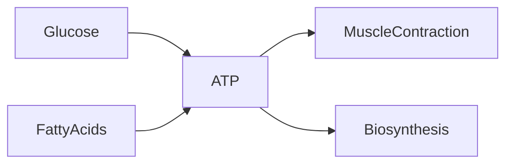
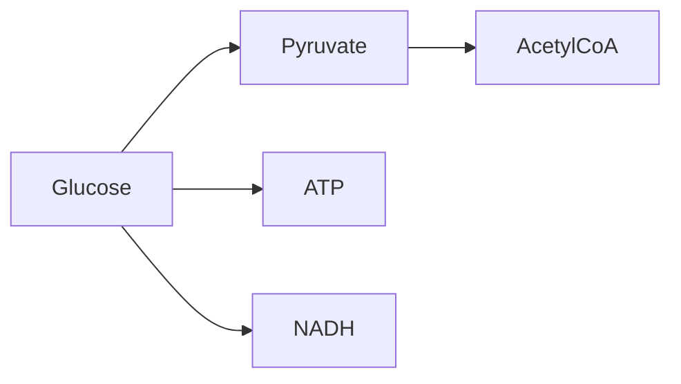
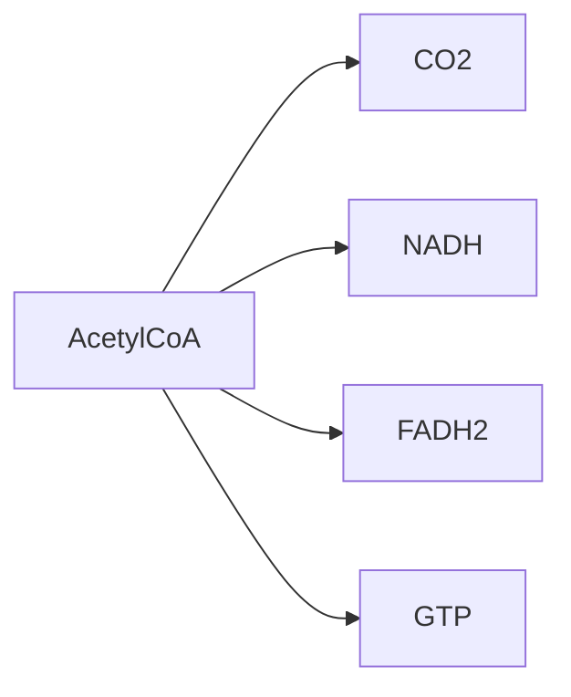

# 3 Energy Systems and Metabolism

## Energy Sources and ATP

The primary energy currency of the cell is adenosine triphosphate (ATP). All biological
work requires the hydrolysis of ATP to ADP and inorganic phosphate, releasing energy that
drives processes such as muscle contraction, biosynthesis, and active transport.

The ATP molecule consists of a purine base (adenine) attached to a ribose sugar and three
phosphate groups linked by high-energy phosphoanhydride bonds. Hydrolysis of the terminal
phosphate releases approximately 30.5 kJ/mol under standard conditions.

## Glycolysis

Glycolysis is the anaerobic breakdown of glucose to pyruvate, yielding a net gain of 2 ATP
per glucose molecule. The pathway occurs in the cytoplasm and does not require oxygen.

The ten-step pathway is divided into an energy-investment phase (steps 1–5) that consumes 2
ATP and an energy-payoff phase (steps 6–10) that generates 4 ATP and 2 NADH. The net yield
is therefore 2 ATP and 2 NADH per glucose.

## The Krebs Cycle

The Krebs cycle (citric acid cycle) is a series of eight chemical reactions used by aerobic
organisms to generate energy through the oxidation of acetyl-CoA derived from carbohydrates,
fats, and proteins.

Each turn of the cycle produces 3 NADH, 1 FADH2, 1 GTP (equivalent to 1 ATP), and 2 CO2.
Because two acetyl-CoA molecules are produced per glucose, the full Krebs cycle contributes
6 NADH, 2 FADH2, and 2 GTP per glucose.

---

## Section Concept Maps

### Energy Sources and ATP

### Glycolysis

### The Krebs Cycle

## Wikilinks Introduced

- [[atp]]
- [[glycolysis]]
- [[krebs-cycle]]

## Aliases Recorded

- Energy Systems
