# 3 Biochemical Concepts

---

## Learning Outcomes

After studying this chapter, you should be able to:

* identify the main chemical elements in the human body;
* describe and draw basic atomic structure;
* identify the differences between atoms, ions, molecules and compounds;
* distinguish the difference between ionic and covalent bonds;
* define a chemical reaction and identify the difference between an endergonic and exergonic reaction;
* define energy and the units of energy;
* describe the role of ATP within the cell;
* describe the common forms of chemical reactions including synthesis, decomposition, reversible, exchange, phosphorylation/dephosphorylation and oxidation/reduction reactions;
* outline the functions of water and the chemical property underpinning water’s ability to act as a solvent;
* define the terms mole, molar and molarity;
* define the terms acid, base and salt;
* draw and define the pH scale and describe what is meant by the terms acidic and alkaline;
* describe basic cell structure with particular emphasis to the plasma membrane, nucleus, cytoplasm and mitochondria.

---

### keywords

atoms and atomic structure

macronutrients

chemical bonds

chemical reactions

cell structure

buffers

## 3.1 Organization of Matter

### 3.1.1 Matter and Elements

All things, living and non-living, consist of *matter*, defined as anything that occupies space and has mass. Matter, in turn, is made up of chemical building blocks known as *elements* – substances which cannot be split into simpler substances by ordinary chemical means. There are 112 known chemical elements, 92 of which occur naturally on Earth. Of these 92 elements, there are 26 which occur normally in our bodies. Each element can be symbolized using a one- or two-letter abbreviation which, in the following paragraphs, we include in brackets after stating the name of the element in question.

The most abundant elements which make up our bodies (constituting approximately 96% of our body’s mass) are oxygen (O), carbon (C), hydrogen (H) and nitrogen (N).

Eight other elements make up 3.8% of our body’s mass. These include calcium (Ca), phosphorous (P), potassium (K), sulphur (S), sodium (Na), chlorine (Cl), magnesium (Mg) and iron (Fe).

The remaining 0.8% of the body’s store of elements consists of 14 elements known as the *trace elements*. These include aluminium (Al), boron (B), chromium (Cr), cobalt (Co), copper (Cu), fluorine (F), iodine (I), manganese (Mn), molybdenum (Mo), selenium (Se), silicon (Si), tin (Sn), vanadium (V) and zinc (Zn).

Elements are important for human life. They are components of the energy sources of carbohydrates, fats and proteins, and they also provide us with water and important vitamins and minerals that are needed to sustain healthy living. An overview of the main chemical elements within the human body is shown in Table 3.1.

### 3.1.2 Atoms and Atomic Structure

Each element is made from *atoms*, which are the smallest units of matter. Atoms are extremely small and are impossible for us to see with the naked eye. In fact, approximately 200,000 atoms could fit on the end of a pencil! Atoms are made from the special arrangement of subatomic particles known as *protons, neutrons* and *electrons*. The basic structure of an atom consists of a central core known as the *nucleus* in which exist positively charged protons (p+) and uncharged neutrons (n0). Negatively charged electrons (e−) orbit regions around the nucleus known as *electron shells*, the number of which depends on the specific element.

This basic structure of an atom is shown in Figure 3.1. For ease of understanding, electron shells are depicted diagrammatically as ‘circles’ around the nucleus, although it should be noted that, in reality, electrons do not follow a fixed path or spherical orbits but form negatively charged clouds, which surround the nucleus in ‘shells’. Each electron shell can only hold a specific number of electrons. For example, the first shell (closest to the nucleus) can only ever hold 2 electrons, while the second can hold 8, the third can hold a maximum of 18 and so on. It is important to note that the number of electrons and protons in an atom of an element are always equal. For this reason, the overall charge of an atom is zero.

**Table 3.1** An overview of the body’s main chemical elements and some of their known functions.

| Chemical element (symbol) | Percentage abundance in the human body | Function |
| --- | --- | --- |
| Oxygen (O) | 65 | Used to generate energy using aerobic processes and also part of water and energy sources such as carbohydrates, fats and proteins. |
| Carbon (C) | 18.5 | Important component of organic (i.e. carboncontaining) molecules such as carbohydrates, fats, proteins and deoxyribonucleic acids (DNA – a cell’s genetic material). |
| Hydrogen (H) | 9.5 | Component of water and most organic molecules. |
| Nitrogen (N) | 3.2 | Component of all proteins and DNA. |
| Calcium (Ca) | 1.5 | Important component for maintenance of bones and teeth; also involved in regulatory processes such as hormone release, muscle contraction and enzyme activation. |
| Phosphorous (P) | 1 | Component of ATP (the immediate energy supply for muscle contraction) and DNA. |
| Potassium (K) | 0.35 | Important component of intracellular fluid and needed to generate the action potential required for muscle contraction. |
| Sulphur (S) | 0.25 | Component of vitamins and many proteins. |
| Sodium (Na) | 0.2 | Component of extracellular fluid; essential for maintaining water balance and also needed to generate the action potential required for muscle contraction. |
| Chlorine (Cl) | 0.2 | Component of extracellular fluid and essential for maintaining water balance. |
| Magnesium (Mg) | 0.1 | Important component of many specialized proteins known as enzymes. |
| Iron (Fe) | 0.005 | Important component of red blood cells and many enzymes. |

![[Attachments/Books/biochemistry-for-sport-and-exercise-maclaren/c03f001.png]]
*A diagram depicts an atom as the basic unit of matter, and it consists of three main subatomic particles. The atom’s nucleus contains six protons and six neutrons, and there are also six electrons in the orbit. The nucleus represents the central core of the atom, and contains protons and neutrons. The outer circle represents the second electron cell and the second inner cell represents the first electron cell.*

**Figure 3.1** Basic diagrammatic representation of an atom. In this example, the atom’s nucleus contains six protons and six neutrons, and there are also six electrons in the orbit. As always, the first electron shell holds two electrons and, in this case, the second shell holds four.

### 3.1.3 Atomic Number and Mass Number

What makes the atoms of one element different from another is the number of protons present in the nucleus. This is called the *atomic number*. For example, atoms of hydrogen, oxygen, carbon, nitrogen and so on are primarily different because they each contain different numbers of protons.

The *mass number* of an atom is the sum of its protons and neutrons. Atoms of elements will always have the same atomic number (i.e. number of protons), but in some cases they may have different numbers of neutrons and hence different mass numbers (see Figure 3.2 for examples). Such atoms are referred to as *isotopes*. In most cases, these are *stable isotopes* because their nuclear structure does not change over time. Atoms of the common elements of carbon, nitrogen and oxygen, for example, can exist as stable isotopes. Although isotopes of an element have different numbers of neutrons, they each have identical chemical properties because they all contain the same number of electrons. Progressing from what you learned from Figure 3.1, Figure 3.2 shows how the atomic structure of specific atoms differ from one another on the basis of the number of protons they have.

### 3.1.4 Atomic Mass

The *atomic mass* (often referred to as *atomic weight*) of an element is the average mass of all its naturally occurring isotopes. The standard unit for atomic mass (*atomic mass unit*, *abbreviated as ‘amu’*) is the *dalton*, which is symbolized as Da. The mass of a neutron is 1.008 Da, the mass of a proton is 1.007 Da and the mass of an electron is 0.0005 Da. In its purest sense, the Da can be defined as one-twelfth of the mass of a carbon 12C atom and therefore equates to the extremely small mass of 1.66 × 10−24 g! When rounded to the nearest whole number, the atomic mass of an element typically coincides with the mass number of the predominant isotope of that element (see Figure 3.2).

![[Attachments/Books/biochemistry-for-sport-and-exercise-maclaren/c03f002.png]]
*A set of eight diagrams depicts a basic diagrammatic representation of the atomic structure of several stable atoms. These atoms consist of even smaller subatomic particles: protons, neutrons, and electrons. a. A first electron shell represents the innermost shell where electrons reside. b. A second electron shell represents the shell surrounding the first electron shell. c. It represents Nitrogen, Atomic number = 7, mass number = 14 or 15, atomic mass = 14.01. d. It represents oxygen, atomic number = 8, mass number = 16, 17, or 18, and atomic mass = 16.00. e. A third electron represents the shell surrounding the second electron shell. It represents sodium, atomic number = 11, mass number = 23, atomic mass = 22.99. f. It represents chlorine, atomic number = 17, mass number = 35 or 37, and atomic mass = 35.45. g. A fourth electron shell surrounds the third electron shell. Only Sodium and Chlorine have a fourth shell in the image. h. A fifth electron shell is the outermost shell for Potassium.*

**Figure 3.2** Basic diagrammatic representation of the atomic structure of several stable atoms. Note the difference in atomic structures between atoms. You should also note that because these atoms can exist as stable isotopes, the mass number can differ because they can differ in the number of neutrons present in the nucleus

(Tortora and Derrickson., (2009) / John Wiley & Sons.).

### 3.1.5 Ions, Molecules, Compounds and Macronutrients

As stated previously, the electrical charge of an atom is neutral because the number of positively charged protons is equal to the number of negatively charged electrons. However, atoms have a characteristic way of becoming charged by gaining or losing one or more electrons. When an atom undergoes this process (called *ionization*), it now becomes known as an *ion*. More specifically, it will be either an *anion* (a negatively charged ion because it has gained an electron) or a *cation* (a positively charged ion because it has lost an electron). We can symbolize the ion by writing the chemical symbol of the atom in question followed by the number of positive or negative charges in superscript. For example, Ca2+ designates a calcium ion with two positive charges because it has lost two electrons. Similarly, Cl− designates a chlorine atom (now known as a chloride ion) with a negative charge because it has gained one electron.

![[Attachments/Books/biochemistry-for-sport-and-exercise-maclaren/c03f003.png]]
*A structure depicts the basic flow of matter. Atoms are the building blocks of elements. They consist of protons, neutrons, and electrons. Isotopes are variants of an element with the same number of protons but different numbers of neutrons. Arrows indicate that atoms can gain or lose neutrons and protons, however this typically creates a different element. The main elements in biomolecules are carbon, hydrogen, oxygen, and nitrogen. The biomolecules are categorized into carbohydrates, fats, and proteins.*

**Figure 3.3** The basic flow of matter. Atoms of elements such as oxygen, carbon, hydrogen and nitrogen ultimately combine to make biomolecules, examples of which include the foodstuffs and fluids that we eat and drink in order to fuel our muscles during exercise and, more importantly, to sustain daily life.

Within our bodies, atoms not only exist in free form by themselves but can also join together with other atoms of the same element, or atoms of other elements, to form molecules. A *molecule* exists when two or more atoms join together. For example, when two oxygen atoms join together, they form an oxygen molecule which is symbolized as O2.

A *compound* is a substance which has molecules comprising atoms of two or more different elements. For example, water is a compound because it consists of two hydrogen atoms joined together with an oxygen atom, and it is thus symbolized as H2O. It is important to note that while *all compounds are molecules, not all molecules are compounds*.

Most of the chemical elements in our bodies exist in the form of compounds which can be further classified as *inorganic compounds* (lacking carbon) or *organic compounds* (containing carbon). Some of the most important organic compounds that are relevant to sport and exercise metabolism include carbohydrates, fats and proteins. Collectively, these compounds are called the *macronutrients*, and it is through the action of specific biochemical processes (i.e. chemical reactions) that our bodies utilize these food sources to provide our muscles with the energy to exercise. Figure 3.3 shows the general flow of chemical organization from atom to macronutrient.

## 3.2 Chemical Bonding

Atoms join together to make molecules or compounds through the process of *chemical bonding*. There are two main types of chemical bonds (*ionic and covalent*) by which atoms can join together, though both bonds involve the use of electrons in the outermost shell (i.e. the *valence shell*) to form the chemical bond. The valence shells of most atoms in elements are not typically stable with even numbers of electrons. However, if the conditions are appropriate, two or more atoms can interact by either sharing electrons or donating electrons to one another so that each atom can obtain a stable valence shell.

### 3.2.1 Ionic Bonds

We have seen above how atoms can become ions by losing or gaining an electron, which ultimately results in a positively or negatively charged ion, respectively. If you have two atoms that can achieve a stable valence shell by either donating or gaining an electron, the result is a force of attraction which can bond the oppositely charged atoms together via an *ionic bond*. This is most simply illustrated through the bonding of sodium (Na) and chlorine (Cl) atoms to make the compound sodium chloride (NaCl), which is the chemical name for common table salt (see Figure 3.4). It is important to remember that whenever atoms bond via ionic bonds, the net charge of the newly formed compound is always zero.

![[Attachments/Books/biochemistry-for-sport-and-exercise-maclaren/c03f004.png]]
*a. A diagram is a process of sodium chloride Na Cl formation through ionic bonding. It represents Sodium Na has one valence electron in its outermost shell. It displays a neutral sodium atom. b. A diagram depicts that Chlorine Cl has seven valence electrons. A sodium atom donates its valence electron to a chlorine atom. c. A diagram depicts an ionic bond in sodium chloride (NaCl). Na power + and Cl power - ions attract each other due to opposite charges. They arrange themselves in a crystal lattice structure. Each Na power + ion is surrounded by six Cl power - ions. d. A diagram depicts the packing of ions in a crystal of sodium chloride. The repeating pattern of Na power + and Cl power - ions in a 3D arrangement.*

**Figure 3.4** Ionic bond formation. In this example, sodium forms an ionic bond with chlorine by donating an electron to the chlorine atom. The sodium atom now becomes positively charged and the chlorine atom now becomes negatively charged

(Tortora and Derrickson., (2009) / John Wiley & Sons.).

![[Attachments/Books/biochemistry-for-sport-and-exercise-maclaren/c03f005.png]]
*A diagram illustrates the process of covalent bond formation. It features an oxygen O atom and two hydrogen H atoms. Oxygen has six valence electrons, while hydrogen has only one. The oxygen atom shares two of its valence electrons with each hydrogen atom. The result is a water H subscript 2 O molecule.*

**Figure 3.5** Covalent bond formation. In this example, electrons are shared equally between oxygen and hydrogen atoms. This bond is referred to as a polar covalent bond because the oxygen atoms attract the electrons more strongly. As such, the oxygen end of the water molecule has a partial negative charge (δ−) and the hydrogen ends have a partial positive charge (δ+). This polar covalent bond makes water an excellent solvent, as discussed later in this chapter

(Tortora and Derrickson., (2009) / John Wiley & Sons.).

### 3.2.2 Covalent Bonds

In contrast to ionic bonds, *covalent bonds* (the strongest of all chemical bonds) work on the principle of atoms *sharing* electrons. Atoms can form covalent bonds by sharing one, two or three pairs of their valence electrons to make a *single*, *double* or *triple* covalent bond, respectively (see Figure 3.5). The larger the number of electron pairs shared, the stronger the covalent bond.

Covalent bonds can be further classified as *non-polar* or *polar*. In non-polar covalent bonds, the atoms share the electrons equally, meaning that one atom does not attract the shared electrons more than the other. When two or more atoms of the same element form a covalent bond, it is always non-polar.

In contrast, a polar covalent bond is one where the sharing of electrons between atoms is unequal, so that one atom attracts the shared electrons more than the other. An important example of polar covalent bond is a water molecule (H2O); here, it is the oxygen atom which has the greater power to attract electrons to itself (greater *electronegativity*) from the two hydrogen atoms.

### 3.2.3 Molecular Formulae and Structures

In briefly recapping what we have covered so far, you should now appreciate that atoms from elements can combine together, largely through the action of ionic or covalent bonds, to make molecules and compounds. In biochemistry, we can depict the atoms which form the molecule or compound through writing its *molecular formula*, which involves writing the chemical symbols of the atoms involved and moreover, the number of atoms of each element involved.

For example, one molecule of glucose (a vital energy source for exercise) contains 6 carbon atoms, 12 hydrogen atoms and 6 oxygen atoms and can therefore be written as C6H12O6. From the molecular formula, we can also calculate the *molecular weight* of the molecule, i.e. the sum of the atomic masses of the elements that make up the molecule. Note that we begin this process by multiplying the atomic mass of the element by the number of atoms present in the compound. For example, since glucose contains 6 carbon atoms, 12 hydrogen atoms and 6 oxygen atoms and the atomic masses of each element are 12, 1 and 16 respectively, the molecular weight can be calculated as follows:

![[Attachments/Books/biochemistry-for-sport-and-exercise-maclaren/c03-math-0001.png]]
*normal upper C 6 normal upper H 12 normal upper O 6 equals left-parenthesis 12 times 6 right-parenthesis plus left-parenthesis 1 times 12 right-parenthesis plus left-parenthesis 16 times 6 right-parenthesis equals 180*

In addition to molecular formula, we are also interested in knowing the molecular structure (i.e. *constitutional formula*) of the compound – the structural arrangement by which the atoms have bonded to form the compound.

Figure 3.6a shows the molecular structure of a glucose molecule. A single line symbolizes a single covalent bond between atoms and a double line symbolizes a double covalent bond. Similarly, if there were a triple covalent bond between atoms present in this molecule, it would be symbolized by a triple line. In this example, the structure of glucose is shown in an open chain format which appears to exist as a two-dimensional structure. However, it is important to note that in reality, molecules and compounds exist as three-dimensional structures. Furthermore, many compounds are also formed in special structural shapes. For example, the majority of glucose molecules in our bodies are stored in a ring-like structure comprising a ring-shaped ‘carbon skeleton’ with hydroxyl groups attached (hydroxyl groups consist of an oxygen and carbon atom joined by a single covalent bond) (see Figure 3.6b). Given that organic molecules and compounds are often relatively big, we sometimes draw their constitutional formula using shorthand methods (see Figure 3.6c).

![[Attachments/Books/biochemistry-for-sport-and-exercise-maclaren/c03f006.png]]
*a. A molecular structure of glucose molecule. b. A molecular structure of glucose. c. A molecular structure of glucose.*

**Figure 3.6** (a) Molecular structure of a glucose molecule. Note that the single and double lines represent a single or double covalent bond, respectively. (b) Molecular structure of glucose as shown as a ring like structure. (c) Molecular structure of glucose as written in shorthand method. In this example, carbon atoms are understood to be at locations where two bond lines interact and single hydrogen atoms are not shown.

**Table 3.2** Common functional groups found within biological compounds. R denotes carbon skeleton to which the functional group is attached to.

| Name | Shorthand notation | Bond structure |
| --- | --- | --- |
| Carboxyl | –COOH | A chemical structure of carboxyl. |
| Hydroxyl | –OH | A chemical structure of a hydroxyl. |
| Amino | –NH2 | A chemical structure of a amino. |
| Phosphate | –PO4 | A chemical structure of a phosphate. |
| Carbonyl | –CO | A chemical structure of a carbonyl. |
| Sulphydryl | –SH | A chemical structure of a sulphydryl. |

In understanding molecular formulae and structures, it is important to note that some compounds can have the same molecular formula (i.e. the same number and type of atoms) but can differ in constitutional formula because the atoms have bonded in a different structural arrangement. Such molecules are called *isomers*, and one example is that of glucose and fructose, which both have a formula of C6H12O6. We will re-visit these compounds in Chapter 5.

### 3.2.4 Functional Groups

Since we have now covered the basic processes of chemical bonding, it is also important to note that many atoms can bond repeatedly within compounds in certain combinations to yield specific *functional groups*. Indeed, during chemical reactions (see Section 3.3) the atoms contained within these functional groups tend to move between compounds as a *unit* rather than as individual atoms. Much of these functional groups can bond to a carbon atom (or to a chain of carbon atoms known as a carbon skeleton) via a single covalent bond to form ring-like structures or straight or branched chains. Some of the most important functional groups are shown in Table 3.2, where we also show the shorthand notation and bond structure.

## 3.3 Chemical Reactions, ATP and Energy

Within our bodies, there are thousands of *chemical reactions* occurring which underpin all of the body’s essential processes. A chemical reaction occurs when the bonds between atoms are broken or when new bonds are formed between atoms. it is the interactions of electrons in the valence shell of atoms which form the basis of all chemical reactions. In simple terms, a chemical reaction consists of a substance or substances known as the *reactants*, which subsequently react to form the product or *products*. This is shown in Figure 3.7, which also uses the example of the reaction between hydrogen and oxygen molecules to produce water. The arrow in the equation represents the direction of the reaction, although, as will be explained later, some reactions are reversible – they can occur in both directions.

![[Attachments/Books/biochemistry-for-sport-and-exercise-maclaren/c03f007.png]]
*A diagram of a chemical bond between two chlorine atoms forming a chlorine molecule. It illustrates the chemical reaction where hydrogen gas H subscript 2 reacts with oxygen gas O subscript 2 to form water H subscript 2 O. This process is an example of a chemical reaction involving energy transformation.*

**Figure 3.7** Chemical reactions between two hydrogen molecules and one oxygen molecule to form two molecules of water, as formed by the breaking of old bonds and linking of new ones.

Notice that in this reaction, two molecules of hydrogen are required. This is due to the *Law of Conservation of Mass*, which states that the total mass of the reactants equals the total mass of the products (i.e. the number of atoms of each element is the same before and after the reaction). Although the total number of atoms is the same, the structural arrangements of the atoms have been changed, and it is for this reason that the newly formed products have different chemical properties.

The term *metabolism* refers to all of the chemical reactions which occur in our bodies. As sport and exercise scientists, we are interested in the study of *exercise metabolism*, which is primarily concerned with the chemical reactions that provide our muscles with the energy to exercise.

### 3.3.1 Energy

Every chemical reaction involves changes in *energy*, which is defined as the capacity to do work. *Chemical energy* is a form of *potential energy* (i.e. energy stored by matter due to its position) that is stored in the bonds of molecules and compounds. When bonds are broken, energy is released. The energy released from single, double or triple covalent bonds is approximately 330, 630 and 840 kJ/mol, respectively. For example, the chemical energy stored in the bonds of carbohydrates, fats and proteins can be converted to *kinetic energy* (i.e. energy associated with matter in motion) thus providing us with the *mechanical* energy needed to exercise.

According to the *Law of Conservation of Energy*, energy cannot be created or destroyed but it can be converted from one form to another. For instance, in the previous example, energy stored in the food we eat was converted to kinetic (mechanical) energy to provide us with the energy to exercise. Conversion of energy from one form to another also releases *heat* energy, which is why our bodies can get very hot during exercise. Both muscle and body (core) temperature can rise by 5 and 3°C, respectively, during intense exercise (Drust *et al*., 2005).

The chemical reactions which take place in our bodies are of two main types:

1. **Exergonic reactions**: These are often referred to as *energy-producing* reactions as they release more energy than they absorb, i.e. the energy released when new bonds form is greater than the energy needed to break old bonds. Good examples of exergonic reactions are those that occur when we break down the bonds contained in carbohydrates, fats and proteins. In such circumstances, the energy produced can be subsequently stored inside the covalent bonds of a compound known as adenosine triphosphate (ATP).
2. **Endergonic reactions**: These are often referred to as *energy-consuming* reactions as they absorb more energy than they release, i.e. the energy released when new bonds form is less than the energy needed to break old bonds. A good example of an endergonic reaction is the process of muscle contraction, which requires the energy released from the breakdown of the covalent bonds of ATP to allow contraction to occur.

### 3.3.2 ATP

An important aspect of metabolism is the coupling between exergonic and endergonic reactions (see Figure 3.8). For example, the food we eat can be broken down to provide energy (an exergonic reaction), which can be subsequently used to make ATP (an endergonic reaction). In turn, the ATP can be broken down to provide energy (an exergonic reaction), which can be subsequently used for energy-consuming reactions such as allowing muscles to contract (an endergonic reaction).

![[Attachments/Books/biochemistry-for-sport-and-exercise-maclaren/c03f008.png]]
*A flowchart illustrates the heart of this process lies food, which includes carbohydrates, fats, and proteins. ATP is used to power various cellular activities, such as muscle contraction, active transport, and synthesis of molecules.*

**Figure 3.8** Schematic illustration of the coupling between exergonic (energy-liberating) and endergonic (energy-consuming) chemical reactions.

ATP is often referred to as the *energy currency* of the cell, as it functions to transfer the energy produced in exergonic reactions to cellular activities that require energy (endergonic reactions) such as exercise, movement of substances within and between cells, synthesis of larger molecules from smaller ones, etc. Indeed, ATP is the only form of chemical energy that can be converted to other forms of energy used by living cells.

The structure of an ATP molecule is shown in Figure 3.9a and essentially comprises an adenosine molecule (adenine and ribose) with three phosphate groups attached. ATP can provide energy, as shown by the equation outlined in Figure 3.9b. Although we use the energy derived from ATP hydrolysis to fuel various cellular activities, a cell’s ATP store is small (usually 20–30 mmol/kg dry muscle) and would be completely depleted within seconds of maximal exercise! However, we can regenerate ATP so as to sustain exercise for a longer period of time, so muscle ATP stores are never depleted by more than 20–40% even during exhaustive exercise (Spriet *et al*., 1989).

![[Attachments/Books/biochemistry-for-sport-and-exercise-maclaren/c03f009.png]]
*a. A chemical structure of Adenine, Ribose, and Phosphate groups. The three structures are commonly labeled as Adenosine triphosphate A T P.  b. An equation depicts ATP hydrolysis. c. An equation depicts the resynthesis of ATP.*

**Figure 3.9** (a) The structure of ATP. (b) ATP hydrolysis to produce energy to fuel cellular activities, as catalysed by the enzyme ATPase. (c) The resynthesis of ATP, as catalysed by the enzyme ATP synthase. In this case, the energy is provided from breaking the bonds contained in compounds such as carbohydrates, fats and proteins. The importance of enzymes in facilitating chemical reactions is covered in Chapter 4.

The fundamental aim of this book, therefore, is to highlight how muscle cells can extract energy from compounds such as carbohydrates, fats and proteins, so as to replenish ATP stores and sustain exercise capacity and performance. Chapters 4–6 will outline the biochemical pathways involved in these processes, while the chapters in Part 3 will specifically examine the regulation of the utilization of these pathways during different types of exercise.

### 3.3.3 Units of Energy

Free energy changes are measured in units known as *calories*, one calorie being defined as the amount of heat required to raise the temperature of 1 g of water by 1°C. We can measure the energy content of food using a ‘bomb calorimeter’, which is essentially a sealed chamber filled with oxygen that is enclosed in a water tank. By completely burning the food (*oxidation*), the chemical bonds in the structure are broken, thus releasing heat energy which subsequently heats the water. From measuring the rise in water temperature, the energy content of the food can then be calculated.

Given that the calorie is a relatively small unit, the terms *kilocalorie* (kcal) or *Calorie* (Cal, note the spelling with an upper case C) is more often used to measure energy. A kcal is equal to 1000 calories and refers to the amount of heat required to raise 1 kg of water by 1°C. Thus, if we say that a slice of bread contains 80 Calories, we are actually referring to 80 kcal. In this situation, the 80 kcal in the slice of bread would therefore contain enough energy to raise the temperature of 80 kg of water by 1°C. From studies using the bomb calorimeter and after accounting for the process of digestion, the energy available from carbohydrate, protein and fat equates to 4, 9 and 4 kcal/1 g of substrate.

In addition to the kilocalorie, the standard international units for measuring energy are the *joule* (J) and the *kilojoule* (kJ). To convert from kilocalories to kilojoules, we must multiply the kcal value by 4.184. Thus in the above example, the energy value of a slice of bread is 80 kcal or 334.7 kJ. In order to avoid working with large numbers, we also use the term *megajoule* (MJ), which is equivalent to a 1000 kJ.

Most healthy adults consume in the region of 2000–3000 kcal/d (or 8.4–12.6 MJ). Due to the intense energy demands of training and competition, elite athletes need to consume more; for example, Tour de France cyclists have been reported to consume up to 35 MJ/d during competition when they can be riding for 8 hours daily (Saris *et al*., 1989). For sports nutrition professionals, a thorough understanding of an athlete’s energy expenditure is therefore crucial in order to optimize nutritional programmes for energy provision and recovery from training and competition.

Energy expenditure can be measured directly by having an athlete exercise in a specially designed bomb calorimeter and subsequently measuring the heat produced during exercise. However, because such methods are expensive and technically challenging, we can indirectly measure energy expenditure by measuring oxygen consumption (VO2), owing to the fact that VO2 increases with exercise intensity, thus providing an indirect measure of heat production. As a general rule of thumb, approximately 5 kcal of energy is produced for every 1 L of oxygen consumed, although the precise amount of energy produced depends on the proportion of carbohydrate and fat oxidized.

### 3.3.4 Types of Chemical Reactions

When a chemical reaction occurs, the atoms in a newly formed product are arranged structurally different from how they were arranged when present as reactants. As a result, the newly formed product is likely to have different chemical properties. The chemical reactions which occur in our bodies can be classified as specific types of reaction, according to how the products have been formed. The common reactions which occur in our bodies are summarized below.

#### 3.3.4.1 Synthesis Reactions

When two or more atoms, ions, molecules or compounds combine to make larger molecules, the reaction is known as a *synthesis* reaction. This can be summarized as follows, where A and B join together to make a larger compound known as AB.

![[Attachments/Books/biochemistry-for-sport-and-exercise-maclaren/c03-math-0002.png]]
*normal upper A plus normal upper B right-arrow upper A upper B*

Synthesis reactions are also known as *anabolic* reactions and are usually endergonic, as energy is required in order for A and B to combine. In some cases, synthesis reactions can also be referred to as *condensation* reactions, as water is produced as a by-product of the reaction. A good example of a synthesis reaction which involves condensation is when amino acids join together through peptide bonds and a water molecule is produced. We will cover this issue in more detail in Chapter 4.

#### 3.3.4.2 Decomposition Reactions

When molecules or compounds split into smaller atoms, ions or molecules, the reaction is known as a *decomposition reaction*. For example, in the reaction below, molecule AB has been split into molecules A and B.

![[Attachments/Books/biochemistry-for-sport-and-exercise-maclaren/c03-math-0003.png]]
*upper A upper B right-arrow normal upper A plus normal upper B*

Decomposition reactions are also known as *catabolic* reactions and are usually exergonic, because they release more energy than they absorb. In some cases, decomposition reactions involve *hydrolysis* (i.e. splitting with water), as water reacts with the molecule or compound, causing the breakage of the bonds. For example, when our muscles break down ATP to provide energy for muscle contraction (as shown in Figure 3.9b), it does so via the addition of a water molecule.

#### 3.3.4.3 Reversible Reactions

In the above examples, you should notice that the direction of the arrow was from left to right only. This means that the reaction can only proceed in this direction and it is said to be *irreversible*. However, there are also many chemical reactions which are said to be *reversible*, meaning that the products from one reaction can also be converted to their original reactants. We can symbolize reversible reactions using an arrow which points in both directions:

![[Attachments/Books/biochemistry-for-sport-and-exercise-maclaren/c03-math-0004.png]]
*upper A upper B left-right-arrow normal upper A plus normal upper B*

#### 3.3.4.4 Phosphorylation and Dephosphorylation Reactions

Many metabolic reactions occurring in the body, especially during exercise, involve the addition or removal of a phosphate group to or from a compound, respectively. For example, in the below reaction, molecule A has had a phosphate group attached (abbreviated as P*i* for inorganic phosphate) and is now said to have been *phosphorylated*.

![[Attachments/Books/biochemistry-for-sport-and-exercise-maclaren/c03-math-0005.png]]
*normal upper A plus normal upper P Subscript i Baseline right-arrow upper A upper P Subscript i*

Removal of a phosphate group is known as *dephosphorylation* and can be written as follows:

![[Attachments/Books/biochemistry-for-sport-and-exercise-maclaren/c03-math-0006.png]]
*upper A upper P Subscript i Baseline right-arrow normal upper A plus normal upper P Subscript i*

As we will see in Chapter 4, many enzymes (proteins which assist in accelerating metabolic reactions to take place) exist in both dephosphorylated and phosphorylated forms. Usually (but not always), the enzymes are inactive when in their dephosphorylated form but, upon becoming phosphorylated, they become active and gain function. This switching between phosphorylation state has been likened to the turning on (phosphorylation) and off (dephosphorylation) of a light switch (Houston, 2006) in that it induces a rapid change in activation.

#### 3.3.4.5 Exchange Reactions

Many reactions occurring in our bodies are also known as *exchange* reactions and they consist of both synthesis and decomposition reactions. In exchange reactions, atoms or ions which exist in a larger molecule or compound can be transferred to another molecule or compound and vice versa. For example, in the following reaction, the bonds between A and B and between C and D have been broken (decomposition), thus allowing new bonds to form between A and C and B and D (synthesis).

![[Attachments/Books/biochemistry-for-sport-and-exercise-maclaren/c03-math-0007.png]]
*upper A upper B plus upper C upper D right-arrow upper A upper C plus upper B upper D*

#### 3.3.4.6 Oxidation–reduction Reactions

*Oxidation* reactions involve the removal of electrons from an ion, molecule or compound, whereas *reduction* reactions involve the addition of electrons to the relevant molecular structure. A simple way to remember these reactions is through the use of the acronym OIL RIG (Oxidation Is Loss, Reduction is Gain). Where a molecule has undergone oxidation or reduction, it is said to have been *oxidized* or *reduced*, respectively.

Oxidation and reduction reactions are always coupled, meaning that every time a molecule has been oxidized, another molecule has simultaneously been reduced. Such reactions are also frequently referred to as *redox* reactions. Given that redox reactions involve the transfer of electrons from one molecule to another, they can also be considered as a form of exchange reaction as outlined below. For example, in this reaction, ion A has become reduced because it has gained an electron (thus lowering its positive charge), while molecule B has been oxidized as it has lost an electron to ion A (thus increasing its positive charge).

![[Attachments/Books/biochemistry-for-sport-and-exercise-maclaren/c03-math-0008.png]]
*normal upper A Superscript 3 plus Baseline plus normal upper B Superscript plus Baseline right-arrow normal upper A Superscript 2 plus Baseline plus normal upper B Superscript 2 plus*

Although, strictly speaking, redox reactions involve the transfer of electrons, the most common form of redox reaction involves the exchange of hydrogen atoms between molecules (where the molecule has been oxidized, the reaction can therefore be further classified as a *dehydrogenation* reaction). In such cases, the reaction is still an example of a redox reaction because, every time a hydrogen atom leaves a molecule, it does so with an electron attached. For this reason, hydrogen atoms are often referred to as *reducing equivalents*, because they are equivalent to electrons (recall from Figure 3.1 that hydrogen atoms have a single proton and electron).

Redox reactions involving the transfer of hydrogen atoms are essentially the underpinning basis for exercise metabolism during endurance-type exercise, because it is the transfer of hydrogen atoms from the food we eat to oxygen molecules (to produce water) which produces the energy store (ATP) to fuel our muscles during exercise. In such circumstances, oxygen is said to be the final *electron acceptor*, as it undergoes a four-electron reduction (by accepting four hydrogen atoms) to produce water. Collectively, this process is known as *oxidative phosphorylation* and we will cover this in detail in Chapter 5.

Oxidation reactions are usually exergonic reactions as they involve the loss of hydrogen atoms from energy-rich reduced compounds (containing many hydrogen atoms) to lower energy compounds. In the case of oxidation of food such as carbohydrates, some of the energy released through the breakage of bonds (i.e. removal of hydrogen atoms) is used to phosphorylate adenosine diphosphate (ADP) to ATP (i.e. *substrate phosphorylation*). The energy has therefore been transferred and stored in ATP molecules so that it can later be used to drive energy-consuming processes such as exercise.

---

## Misconception

Because of the name of *oxidation* reactions, it is a common misconception that oxidation reactions always involve oxygen atoms. In reality, many biological compounds which do not contain oxygen can be oxidized, providing they have lost an electron (or a hydrogen atom).

---

## 3.4 Water

Water (H2O) is the most important abundant inorganic (i.e. lacking carbon) compound in the body, and it is essential to the maintenance of life. Whereas we might be able to live for weeks without food, we can die without water in days. Indeed, athletes involved in weight-making sports such as wrestling and boxing often rely on dehydration to ‘make the weight’ and, in extremes cases of intended dehydration, this has led to death (Centers for Disease Control and Prevention, 1998). The adult human body is about 60% water by weight, and the water content also varies among different tissues. For example, blood is about 90% water, muscle 75%, bone 25% and adipose tissue 5%. Approximately two-thirds of body water is found inside our body cells and exists as *intracellular fluid*, and one-third exists outside our cells as *extracellular fluid*.

### 3.4.1 General Functions of Water

Water serves many important functions, such as *transportation* (via the blood) of nutrients and oxygen to different tissues (e.g. our muscles), and it also serves to remove waste products (e.g. carbon dioxide) from tissues. The transportation function of water is therefore very important to exercise. Water in urine removes other waste products such as urea, excess salt and ketones from the body. Water also has *protective* functions such as *cleansing* (e.g. tears can lubricate our eyes and wash away dirt), *lubrication* (e.g. saliva lubricates the mouth and helps us to chew and swallow our food) and *cushioning* (e.g. water inside the brain, eyes and spinal fluid can help cushion against shock). One other important function of water for exercise metabolism is related to chemical reactions, as water serves as the medium for most chemical reactions in the body (e.g. ATP hydrolysis) and also participates as a reactant or product in certain reactions (e.g. the formation of peptide bonds in protein synthesis).

As we saw in Section 3.3, the breakage of the bonds contained within our food during exercise also releases heat energy. In order, therefore, to prevent us from overheating during exercise, water can help to regulate body temperature via increased sweating. As the sweat evaporates, heat is then removed from the body surface. It is important to note, however, that unless body water is replaced at appropriate times and in appropriate amounts, we may become dehydrated, which can subsequently impair exercise performance. In fact, decrements in exercise performance are associated with dehydration equivalent to as little as 2% of body mass loss (Armstrong *et al*., 1985).

### 3.4.2 Water as a Solvent

Another important function of water is to act as a *solvent* which can dissolve another substance called the *solute* to make a *solution*. For example, in the common commercially available sports drinks, water acts as a solvent for glucose and electrolytes such as sodium.

It is water’s property as a polar compound which makes it an excellent solvent. As seen in Section 3.3, a water molecule is formed through a polar covalent bond, where the oxygen atom is slightly negatively charged and the hydrogen atoms are slightly positively charged. This makes water an excellent solvent for other ionic or polar substances (solutes), as the slightly negatively charged oxygen atoms and the slightly positively charged hydrogen atoms are attracted to other charged substances.

Solutes that contain polar covalent bonds are referred to as *hydrophilic* (meaning they are ‘water-loving’) and they dissolve easily in water; examples include sugar and salt. Solutes that mainly contain non-polar covalent bonds are referred to as *hydrophobic* (‘water-fearing’) and they are not soluble in water. A common hydrophobic compound is household vegetable oil, which, if placed in a saucepan of water, will not dissolve at all. It is water’s ability to act as a solvent which makes it an excellent medium for many of the body’s metabolic reactions and to also carry out its transportation roles.

## 3.5 Solutions and Concentrations

When a solute is dissolved in a substance to make a solution, it is useful to know the *concentration* of the subsequent solution, i.e. just how much of the solute is actually present in the solvent. A common way to express concentration is in *moles per litre* (abbreviated as mol/L or mol·L−1), which refers to the number of molecules in a litre solution.

An understanding of the ‘mole’ is a must for all aspects of chemistry and biology. A *mole* of substance is always equal to the atomic mass in grams of the substance, and contains 6.023 × 1023 atoms of that substance. This latter number is known as *Avogadro’s number* and it is used the same way we use the term a dozen. For example, if we put a dozen baked beans into a bathtub, there are 12 baked beans present. If we put one mole of baked beans in the bathtub, it means there are 6.023 × 1023 baked beans present in the tub. It is important to note that whereas a mole refers to the amount of a substance, the *molarity* of a substance refers to its concentration, i.e. the number of moles of a substance in a given volume. A *1 molar* (1 M) solution contains one mole of a substance in one litre of solution.

A simpler way to understand the mole (especially in relation to making solutions with specific concentrations) is to refer to the atomic mass of the substance. For example, as outlined earlier, one mole is equal to the atomic mass in grams of the substance. In other words, as the atomic mass of glucose is 180, then 1 mole of glucose is equal to 180 g of glucose, which contains 6.023 × 1023 molecules of glucose. Similarly, the atomic mass of water is 18, meaning that 1 mole of water is the equivalent to 18 g of water, which is the equivalent of 6.023 × 1023 molecules of water. We can now use our understanding of moles to solve problems and make specific concentrations of solutions (see box: Laboratory focus: making concentrated solutions).

---

## Laboratory Focus – Making Concentrated Solutions

For a laboratory experiment, a researcher is required to make 10 ml of a 5 mM glucose solution.

* **Step 1:** Calculate the atomic mass (i.e. molecular weight) of glucose as this provides the amount in grams of 1 mole of glucose:

  ![[Attachments/Books/biochemistry-for-sport-and-exercise-maclaren/c03-math-0009.png]]
*Molecular formula of glucose equals normal upper C 6 normal upper H 12 normal upper O 6*

  ![[Attachments/Books/biochemistry-for-sport-and-exercise-maclaren/c03-math-0010.png]]
*Atomic mass of glucose equals left-parenthesis 12 times 6 right-parenthesis plus left-parenthesis 1 times 12 right-parenthesis plus left-parenthesis 16 times 6 right-parenthesis equals 180*

  ![[Attachments/Books/biochemistry-for-sport-and-exercise-maclaren/c03-math-0011.png]]
*1 molar left-parenthesis upper M right-parenthesis glucose solution therefore equals 180 normal g slash normal upper L*
* **Step 2:** Convert units to mM and mg:

  ![[Attachments/Books/biochemistry-for-sport-and-exercise-maclaren/c03-math-0012.png]]
*1 normal upper M equals 180 normal g slash normal upper L*

  ![[Attachments/Books/biochemistry-for-sport-and-exercise-maclaren/c03-math-0013.png]]
*1 m upper M equals 180 m g slash normal upper L*
* **Step 3:** Multiply up (in this case by a factor of 5) for required concentration:

  ![[Attachments/Books/biochemistry-for-sport-and-exercise-maclaren/c03-math-0014.png]]
*5 m upper M equals 900 m g slash normal upper L italic or*

  ![[Attachments/Books/biochemistry-for-sport-and-exercise-maclaren/c03-math-0015.png]]
*900 m g in 1000 m upper L*
* **Step 4:** Scale down from a 1 L solution to a 10 mL solution:

  ![[Attachments/Books/biochemistry-for-sport-and-exercise-maclaren/c03-math-0016.png]]
*5 m upper M in 1 normal upper L equals 900 m g in 1000 m upper L*

  ![[Attachments/Books/biochemistry-for-sport-and-exercise-maclaren/c03-math-0017.png]]
*5 m upper M in 10 m upper L equals left-parenthesis 900 slash 1000 right-parenthesis times 10 equals 9 m g*

  Answer: to make a 5 mM 10 mL glucose solution, dissolve 9 mg of glucose in 10 mL of the required solvent.

  A simple formula to use for making concentrations is as follows:

  Molecular weight of substance × required volume (L) × required concentration (M) = required mass of substance (g)

  In the above example, this would read as follows:

  180 × 0.01 L × 0.005 M = 0.009 g, thus equating to 9 mg.

---

In addition to making solutions according to molarity, we can also make solutions according to a percentage concentration that is equivalent to mass per volume. For example, many of the common sports drinks are referred to as 6% solutions, meaning they contain 6 g of glucose per 100 mL of water.

## 3.6 Acid–Base Balance

### 3.6.1 Acids, Bases and Salts

An *acid* is a compound that, when dissolved in water, is able to donate a hydrogen ion (H+). Given that H+ is a single proton with one positive charge, acids are also commonly referred to as *proton donors*. Examples of acids in our bodies include hydrochloric acid (HCl), carbonic acid (H2CO3) and lactic acid (C3H6O3), the latter of which we produce in our muscles during high-intensity exercise (Karlsson & Saltin, 1970).

In contrast, a *base* is a compound that is able to accept hydrogen ions. For this reason, a base is therefore commonly referred to as a *proton acceptor*. Common bases include hydroxyl ions (OH−) and bicarbonate ions (HCO3−).

Acids and bases can chemically react together via exchange reactions to form compounds known as *salts*. For example, in the below equation, hydrochloric acid reacts with the base potassium hydroxide (KOH) to form the salt potassium chloride (KCl) and water:

![[Attachments/Books/biochemistry-for-sport-and-exercise-maclaren/c03-math-0018.png]]
*upper H upper C l plus upper K upper O upper H right-arrow normal upper H Superscript plus Baseline plus upper C l Superscript minus Baseline plus normal upper K Superscript plus Baseline plus upper O upper H Superscript minus Baseline right-arrow upper K upper C l plus normal upper H 2 normal upper O*

---

## Misconception: Lactic Acid and Lactate Are Not the Same Thing!

The terms ‘lactic acid’ and ‘lactate’ are often used interchangeably. Consequently, many people assume they are the same thing. However, when lactic acid is produced, it is quickly ionized by releasing a hydrogen ion. It was traditionally assumed that the remaining lactate was a dead-end waste product, but we now know that the carbon skeleton contained in this compound can be shuttled within and between other tissues to provide an additional source of energy. This concept is discussed in Chapters 5 and 11. The molecular structures of lactic acid and lactate are shown below:

![[Attachments/Books/biochemistry-for-sport-and-exercise-maclaren/c03g001.png]]
*A chemical structure of lactic acid, lactate.*

---

### 3.6.2 pH Scale

In order to maintain homeostasis of body fluids (i.e. maintain their volume and composition), there must be almost balanced quantities of acids and bases. When acids are dissolved in a solution, they dissociate into one or more H+ ions and one or more anions. For example, in the case of hydrochloric acid, the acid dissociates into H+ ions and chloride ions (Cl−). Bases, in contrast, dissociate into one or more OH− ions and one or more cations. The more H+ ions that are dissolved in the solution, the more *acidic* the solution becomes; the more OH− ions dissolved in the solution, the more *alkaline* the solution becomes.

We can quantify the acidity or alkalinity of the solution on the basis of the *pH scale*, which is essentially a logarithmic scale ranging from 0 to 14 that is based on the concentration of H+ ions in moles per litre. The pH of a solution is defined as the negative decimal logarithm of the free H+ concentration and can be expressed according to the following equation, where [H+] is the hydrogen ion concentration:

![[Attachments/Books/biochemistry-for-sport-and-exercise-maclaren/c03-math-0019.png]]
*p upper H equals log left-brace 1 slash left-bracket normal upper H Superscript plus Baseline right-bracket right-brace equals minus log left-bracket normal upper H Superscript plus Baseline right-bracket*

The midpoint of the pH scale is 7, and it is at this point that the concentration of H+ and OH− are equal. A solution with a pH of 7 is referred to as *neutral*, and the common example is pure water. If a solution has a neutral pH, this means that it contains 1 × 10−7 moles of hydrogen ions per litre. Where the solution has more H+ ions than OH− ions, the solution is referred to as an acidic solution and it therefore has a pH below 7. Conversely, where the solution has more OH− ions than H+ ions, the solution is referred to as an alkaline solution and has a pH greater than 7.

Because the pH scale is logarithmic, it is important to note that a change in one whole number on the scale represents a 10-fold difference in H+ concentration. For example, a pH of 6 (1 × 10−6 moles of hydrogen ions per litre) denotes 10 times more H+ ions than a pH of 7. Similarly, a pH of 8 (1 × 10−8 moles of hydrogen ions per litre) denotes 10 times fewer H+ ions than a pH of 7. The pH scale is shown in Figure 3.10.

![[Attachments/Books/biochemistry-for-sport-and-exercise-maclaren/c03f010.png]]
*A drawing depicts the pH scale. The pH scale ranges from 0 to 14. A pH of 7.0 is considered neutral neither acidic nor alkaline. Acidic substances have a pH below 7.0. Alkaline or basic substances have a pH above 7.0. The scale is color-coded such as acidic levels are in dark shades, and alkaline levels are in light shades.*

**Figure 3.10** The pH scale. Note that a pH of 7.0 is referred to as neutral. The normal resting pH of arterial blood is 7.4 and that of muscle is 7.1. When the pH increases or decreases from these values, the cells are said to be alkaline or acidic respectively.

As will be seen in subsequent chapters, the pH of the intracellular fluid in skeletal muscle cells can become reduced due to the H+ ions which are produced in muscle as a result of the chemical reactions that occur to provide ATP during high-intensity exercise. In turn, these H+ ions can diffuse into the blood thus lowering the pH of the blood also. This increased acidity can impair important biochemical processes required for exercise by lowering the activity (or causing complete inhibition) of enzymes involved in exercise metabolism or by directly interfering with the proteins involved in the process of muscle contraction itself.

### 3.6.3 Buffers

Most bodily fluids are reasonably well maintained around the neutral pH of 7. Indeed, even in the face of the severe metabolic acidosis caused by maximal intensity exercise (such as a 30-second maximal sprint), muscle pH does not fall below 6.5 (Bogdanis *et al*., 1995). The body’s ability to regulate pH is underpinned by *buffers*, defined as compounds that can convert strong acids or bases into weaker respective compounds. The carbonic acid-bicarbonate buffer system is one such system that can help regulate pH, especially in extracellular fluids. For example, in acidic conditions HCO3− ions can function as a weak base and remove H+ ions, as shown below:

![[Attachments/Books/biochemistry-for-sport-and-exercise-maclaren/c03-math-0020.png]]
*normal upper H Superscript plus Baseline plus upper H upper C upper O 3 Superscript minus Baseline right-arrow normal upper H 2 upper C upper O 3 right-arrow normal upper H 2 normal upper O plus upper C upper O 2*

Similarly, in alkaline conditions, carbonic acid (H2CO3) can function as a weak acid and provide H+ ions that are needed to reduce the pH towards the appropriate physiological range as follows:

![[Attachments/Books/biochemistry-for-sport-and-exercise-maclaren/c03-math-0021.png]]
*normal upper H 2 upper C upper O 3 right-arrow normal upper H Superscript plus Baseline plus upper H upper C upper O 3 Superscript minus*

Important intracellular buffers in skeletal muscle include *carnosine, phosphocreatine* and *phosphates*, which collectively help to minimize the fall in muscle pH that can occur during high-intensity exercise as a result of increased lactic acid production and the associated increase in H+ ion concentration. The increased H+ ions subsequently diffuse into the blood, which also be buffered by bicarbonate in plasma and *haemoglobin* in red blood cells. We will cover the issue of metabolic acidosis further in subsequent chapters.

## 3.7 Cell Structure

The previous parts of this chapter have focused on the chemical level of organization outlining how atoms of elements can bond to make molecules and compounds. Molecules, in turn, combine to make *cells*, the basic structural and functional unit of an organism. Humans are considered as *multicellular* organisms, as there are about 200 different types of cells in our bodies, such as muscle cells, blood cells, skin cells and brain cells.

Cells then combine to make *tissues*, defined as groups of cells that work together to perform a particular function. There are four basic types of tissues in our bodies: *epithelial, connective, nervous* and *muscle* (further classified as skeletal, cardiac and smooth).

When two or more tissues combine, the result is an organ (e.g. the stomach) which, in turn, can also work together to make a *system* (e.g. the digestive system, comprising the stomach, small and large intestines, liver, etc.). Ultimately, when all of the systems (e.g. the digestive, nervous, cardiovascular, musculoskeletal etc.) are in place and in operation together, the result is a living organism – for example, the person reading this book!

It is important to note that not all cells are the same. Nevertheless, the average human cell is 10–20 μm in diameter and our bodies contain approximately 1014 cells. Most cells are 70–80% water and have many structural features in common. The basic structure of a cell is shown in Figure 3.11.

![[Attachments/Books/biochemistry-for-sport-and-exercise-maclaren/c03f011.png]]
*A basic structure of body cells is labeled as flagellum, cilium, proteasome, chromatin, nuclear pore, glycogen granules, nucleolus, rough endoplasmic reticulum, ribosome, Golgi complex, and microfilament. The cytoskeleton consists of microtubules, microfilaments, Intermediate filaments, and microvilli. The centrosome consists of pericentriolar material, Centrioles, Secretory vesicles, lysosome, smooth endoplasmic reticulum, peroxisome, mitochondrion, and microtubule.*

**Figure 3.11** The basic structure of body cells

(Tortora and Derrickson., (2009) / John Wiley & Sons.).

### 3.7.1 The Plasma Membrane

The boundary of cells is known as the *plasma membrane*, which is essentially a sturdy but flexible barrier that encloses the cell (see Figure 3.12).

The membrane itself consists of lipids and proteins (to which carbohydrates may be attached), where the basic structural framework is the *lipid bilayer*. Membrane lipids include *phospholipids* (lipids with a phosphate group attached), *cholesterol* (a steroid with a hydroxyl group attached) and *glycolipids* (lipids with carbohydrate groups attached).

Proteins in the plasma membrane are divided into two categories – *integral proteins* or *peripheral proteins*. Most integral proteins are also referred to as *transmembrane proteins*, meaning they span right across the lipid bilayer and are in contact with both the intracellular and extracellular fluid. In contrast, peripheral proteins tend to associate with membrane lipids or integral proteins at either the inner or outer surface of the membrane. Membrane proteins have a variety of functions which are essential for maintaining cell viability.

![[Attachments/Books/biochemistry-for-sport-and-exercise-maclaren/c03f012.png]]
*A basic structure of the plasma membrane diagram parts are labeled as integral (transmembrane) proteins, peripheral proteins, cholesterol, pore, channel protein, and peripheral protein, Phospholipids are polar heads, fatty acid tails, and polar heads.*

**Figure 3.12** Basic structure of the plasma membrane

(Tortora and Derrickson., (2009) / John Wiley & Sons.).

These include operating as *ion channels* (i.e. proteins with pores through which ions can pass into and out of the cell via the process of *diffusion*), *transporter proteins* (i.e. proteins which actively transport substances into and out of the cell via *facilitated transport*) and *receptor proteins* (i.e. proteins which recognize an extracellular signal, usually via the binding of hormones, which in turn then alters intracellular functions).

### 3.7.2 The Nucleus

The *nucleus* is an oval-shaped structure which contains the genetic material within our *genes*. Genes are arranged in single file along *chromosomes*. Human cells contain 46 chromosomes, of which we inherit 23 from each of our parents. Each chromosome is a long molecule of deoxyribonucleic acid (abbreviated as *DNA*) that is coiled together with proteins known as *histones*. Encoded within the DNA is the essential genetic information that is required for making new proteins (protein synthesis). We will cover DNA structure and the process of protein synthesis in Chapter 4.

Similar to the plasma membrane, a lipid bilayer membrane known as the *nuclear envelope* separates the nucleus from the rest of the cell. Embedded within the nuclear envelope are *nuclear pores* which allow selective movement of molecules between the nucleus and cytoplasm. Inside the nucleus is a structure known as the *nucleolus*, which is responsible for making ribosomes – organelles which function in making new proteins. It is important to note that, while most cell types contain a single nucleus, some (such as red blood cells) contain none. In contrast, skeletal muscle cells contain many nuclei and are thus referred to as *multinucleated cells*.

### 3.7.3 Cytoplasm and Organelles

The *cytoplasm* is the term used to refer to everything inside the cell except the nucleus. The cytoplasm, in turn, can be further divided as the *cytosol* (i.e. the water component of the cell or intracellular fluid, which constitutes about 55% of total cell volume) and the *organelles*. The cytosol also contains many components such as ions and the energy sources of glycogen, lipids, proteins, ATP and all of the necessary enzymes needed to maintain important cellular processes. The organelles are structures made up of biomolecules which carry out specific cellular functions.

Let’s look more closely at some of the most important cellular organelles.

#### 3.7.3.1 Endoplasmic Reticulum

The *endoplasmic reticulum* is an extensive network of membranes which extends from the nuclear envelope (to which it is attached) throughout the cytoplasm. It is divided into two distinctive forms known as the *rough endoplasmic reticulum* and *smooth endoplasmic reticulum*, which differ in appearance (when examined under a microscope) and function.

The rough endoplasmic reticulum is so called because of its granular-like appearance, which is due to organelles known as *ribosomes* that are attached to its external surface. Ribosomes are the cellular organelles responsible for protein synthesis and consist of proteins and ribosomal ribonucleic acid (abbreviated as rRNA).

In contrast, the smooth endoplasmic reticulum has no ribosomes attached to it and is considered to have a ‘smooth’ appearance. It extends from its rough counterpart and is responsible for the synthesis of lipids and various steroids. In certain cells, the smooth endoplasmic reticulum is specialized to perform a variety of functions. For example, as seen in Chapter 2, calcium ions responsible for muscle contraction are released from the *sarcoplasmic reticulum*, a form of smooth endoplasmic reticulum unique to skeletal muscle.

#### 3.7.3.2 Golgi Apparatus

Whereas the ribosomes are the sites responsible for protein synthesis, the *golgi apparatus* (or *golgi complex*) is the organelle responsible for transporting these newly made proteins to their correct intra- or extra-cellular location. It consists of a series of cuplike membranous sacs known as *Golgi cisternae*. The golgi apparatus is closely associated with the rough endoplasmic reticulum on one side (called the *cis face*) and with the plasma membrane on the other (called the *trans face*).

Proteins made in the ribosomes enter the golgi apparatus on the cis face via transport vesicles. Once inside the golgi apparatus, the proteins can be further modified (via the addition of carbohydrates or lipids to form glycoproteins and lipoproteins, respectively) and are then transported to exit the golgi apparatus on the trans face side via *secretory, membrane* or *transport* vesicles. Secretory vesicles deliver proteins to the plasma membrane, where they are then discharged to the extracellular fluid for subsequent transport to other cells. Membrane vesicles deliver proteins to the plasma membrane for incorporation into the membrane itself. Transport vesicles deliver the proteins to other relevant intracellular locations.

#### 3.7.3.3 Mitochondria

Mitochondria are oval-shaped structures that are often referred to as the *aerobic powerhouse* of the cell, as they generate the most ATP. Cells which are highly active, such as muscle, kidney and liver cells, etc. contain many mitochondria. An increase in the number and size of mitochondria in skeletal muscle that occurs with endurance training is one of the most important adaptations to training which improves endurance performance (Holloszy & Coyle, 1984).

Mitochondria contain both an outer *mitochondrial membrane* and *inner mitochondrial membrane*, with a small fluid filled space between them. The inner membrane is folded into tubules called *cristae*, which substantially increase the surface area for the electron transport chain. The large, fluid-filled cavity enclosed by the inner membrane is known as the *mitochondrial matrix*. Similar to the nucleus, mitochondria also contain their own special DNA (which we inherit from our mothers), which can make 13 proteins that are needed to make other important proteins for the mitochondria. As mitochondria can also make their own proteins, ribosomes (i.e. the protein-making factories) are present in the mitochondrial matrix.

#### 3.7.3.4 Cytoskeleton

The *cytoskeleton* is a flexible network of fibrous proteins (referred to as *filaments*) which gives the cell structure and support, similar to how the skeleton provides support within our bodies. However, the cytoskeleton is not a rigid, fixed structure but rather undergoes continual reorganization as it disassembles and reassembles when necessary. Three types of protein filaments constitute the cytoskeleton, and these are named according to their size (increasing diameter): *microfilaments, intermediate filaments* and *microtubules*.

Microfilaments have the smallest diameter and have two general functions of helping to generate movement and providing mechanical support. One important microfilament is the protein actin, which is involved in the process of muscle contraction.

Intermediate filaments are exceptionally strong proteins that have a diameter between that of microfilaments and microtubules. In skeletal muscle cells, an important intermediate filament is myosin, which works with actin to produce contraction. The intermediate filament desmin is also important as it helps to ‘anchor’ the contractile proteins, and organelles such as the mitochondria and the nucleus in position.

The largest cytoskeletal proteins are known as microtubules and are mainly composed of the protein tubulin. Microtubules help to determine cell shape and also assist in the movement of organelles and chromosomes during cell division.

## 3.8 Key Points

* Matter is made up of elements, the most important of which to living organisms are oxygen (O), carbon (C), hydrogen (H) and nitrogen (N).
* Elements are made from atoms, which consist of a nucleus (containing protons and neutrons) and electrons (which orbit the nucleus in electron shells).
* Isotopes are atoms of the same element which have different numbers of neutrons.
* An atom that gains or loses an electron becomes an anion or a cation, respectively.
* When two or more atoms combine, they form a molecule.
* When different elements combine, they form compounds.
* Inorganic compounds lack carbon atoms, whereas organic compounds contain carbon.
* Atoms join via chemical bonds to make molecules.
* Chemical bonds form by sharing electrons or by losing or gaining electrons in the valence shell.
* Ionic bonds form when atoms lose or gain electrons.
* Covalent bonds form when atoms share pairs of electrons.
* Polar covalent bonds form when one atom attracts the shared electrons more than the other.
* Non-polar covalent bonds form when both atoms attract the shared electrons equally.
* Isomers are compounds with the same molecular formula which have different molecular structures.
* Chemical reactions occur when bonds break or new bonds form.
* Endergonic reactions consume energy and exergonic reactions release energy.
* Units of energy are the kilocalorie (kcal) and the kilojoule (kJ).
* ATP is the cell’s main form of chemical energy which can be transferred to other forms of energy.
* Synthesis reactions occur when elements or compounds combine to make larger or more complex molecules.
* Decomposition reactions occur when large molecules are broken down into smaller molecules or individual atoms.
* Exchange reactions involve the exchange of atoms between reactant molecules to produce new products.
* In oxidation reactions, the reactant molecule loses at least one electron, whereas in reduction reactions, the reactant molecules gain at least one electron.
* Some reactions are reversible, meaning they can proceed in either direction.
* Acids are compounds which are able to donate hydrogen ions.
* Bases are compounds that are able to accept hydrogen ions.
* Acids and bases can react together to form salts.
* The more hydrogen ions dissolved in a solution, the more acidic the solution.
* The more hydroxide ions dissolved in a solution, the more alkaline the solution.
* The acidity and alkalinity of a solution can be expressed on the logarithmic pH scale.
* A neutral solution has a pH of 7.0.
* Cells contain biochemical buffers to protect against a fall or rise in pH.
* Cells are the basic structural and functional units of an organism.
* The three common features to most cells include the plasma membrane, the nucleus and the cytoplasm.
* The plasma membrane is a bilayer of lipids and proteins which surrounds the cytoplasm of the cell.
* The cytoplasm is the cellular contents between the plasma membrane and the nucleus and is further divided into the cytosol (the watery portion of the cell) and the organelles (special structures which perform key cellular functions).
* The nucleus is an oval-shaped structure which contains all of the genetic material of the cell.

## References

1. Armstrong, L.E., Costill, D.L. & Fink, W.J. (1985) Influence of diuretic-induced dehydration on competitive running performance. *Medicine and Science in Sports and Exercise* 17, 456–461.
2. Bogdanis, G.C., Nevill, M.E., Boobis, L.H., Lakomy, H.K. & Nevill, A.M. (1995) Recovery of power output and muscle metabolites following 30 s of maximal sprint cycling in man. *Journal of Physiology* 482, 467–480.
3. Centers for Disease Control and Prevention (1998) Hyperthermia and dehydration related deaths associated with intentional rapid weight loss in three collegiate wrestlers. Journal of the American Medical Association 279, 824–825.
4. Drust, B., Rasmussen, P., Mohr, M., Nielsen, B. & Nybo, L. (2005) Elevations in muscle temperature impairs sprint performance. Acta Physiologica 183, 181–190.
5. Holloszy, J.O. & Coyle, E.F. (1984) Adaptations of skeletal muscle to endurance exercise and their metabolic consequences. *Journal of Applied Physiology* 56, 831–838.
6. Houston, M.E. (2006) Biochemistry Primer for Exercise Science. Human Kinetics, Champaign, IL.
7. Karlsson, J. & Saltin. B. (1970) Lactate, ATP and CP in working muscles during exhaustive exercise in man. *Journal of Applied Physiology* 29, 596–602.
8. Saris, W.H.M., van Erp-Baart, M.A., Brouns, F., Westerterp, K.R. & ten Hoor, F. (1989) Study on food intake and energy expenditure during extreme sustained exercise: the Tour de France. International Journal of Sports Medicine 10, S26–S31.
9. Spriet, L.L., Lindinger, M.I., McKelvie, R.S., Heigenhauser, G.J.F. & Jones, N.L. (1989) Muscle glycogenolysis and H+ concentration during maximal intermittent cycling. *Journal of Applied Physiology* 66, 8–13.
10. Tortora GJ and Derrickson BH (2009), Principles of Anatomy and Physiology, Twelfth Edition, John Wiley & Sons Inc.

---

## Section Concept Maps

### Learning Outcomes

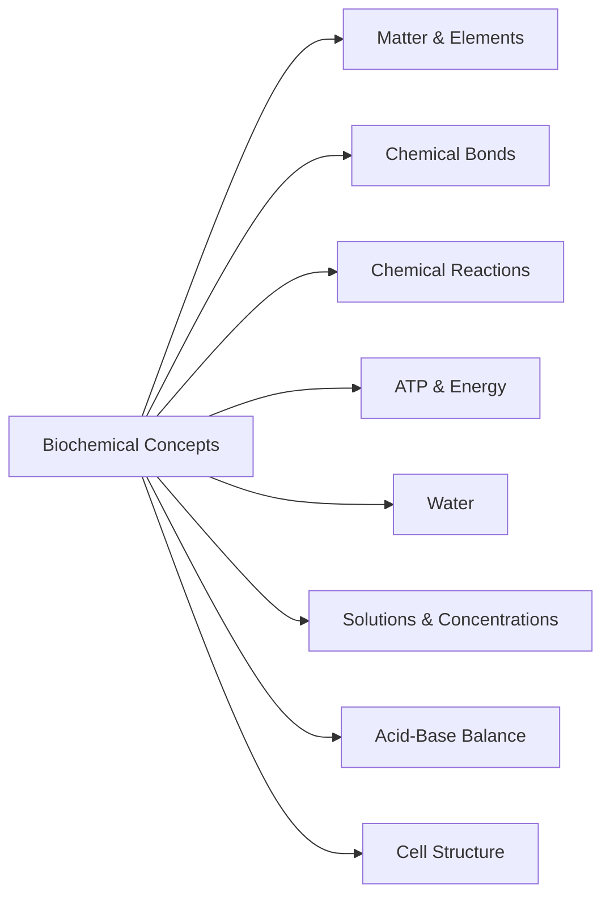

### 3.1 Organization of Matter

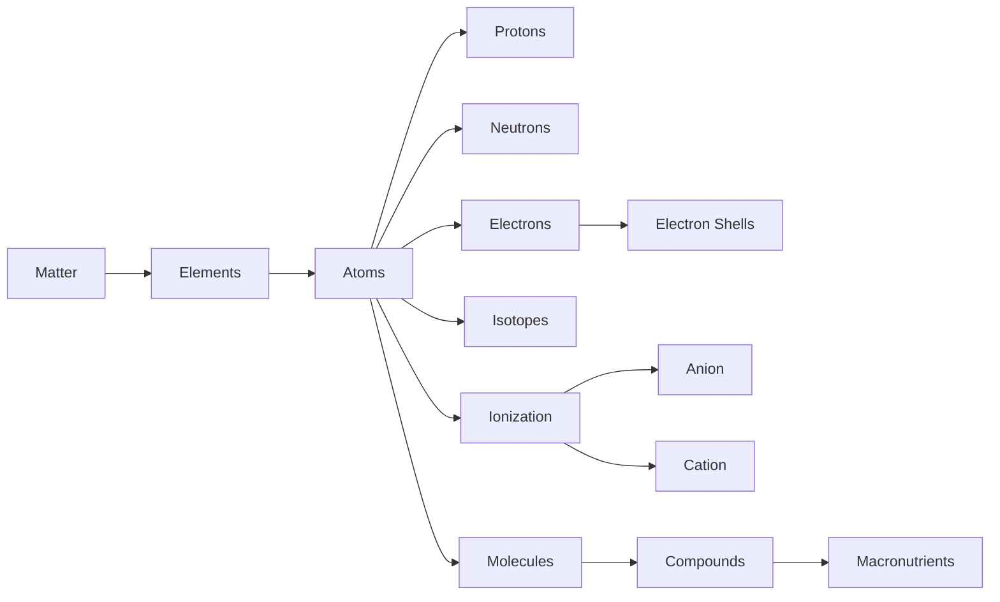

### 3.2 Chemical Bonding

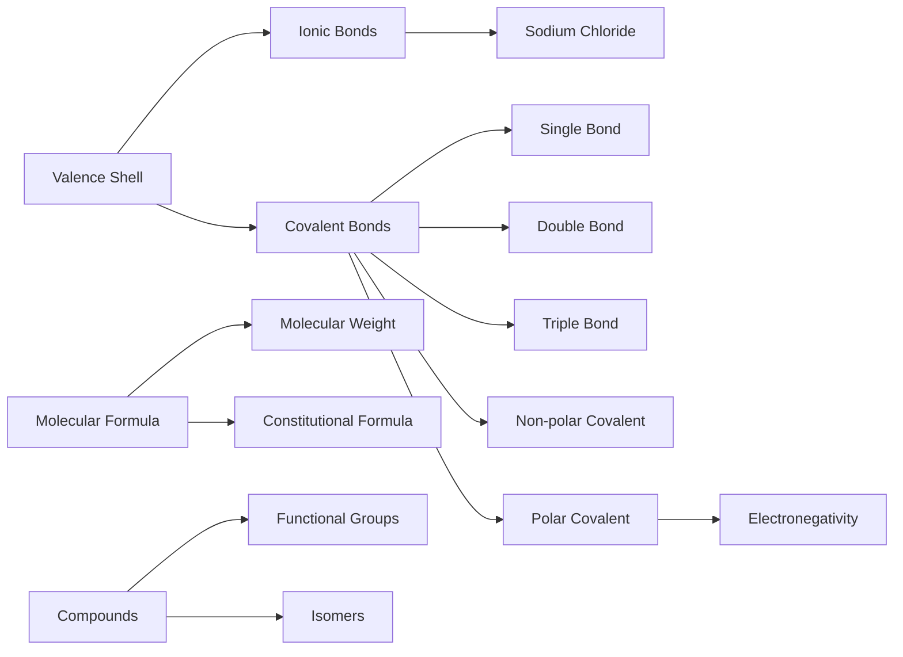

### 3.3 Chemical Reactions, ATP and Energy

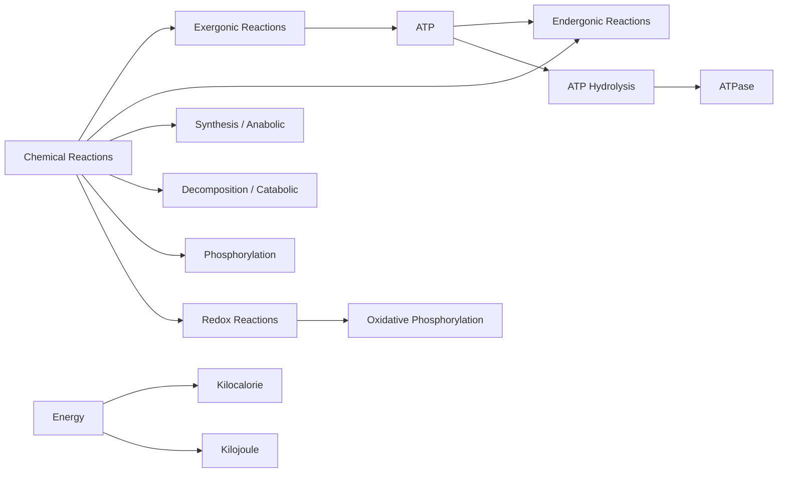

### Misconception

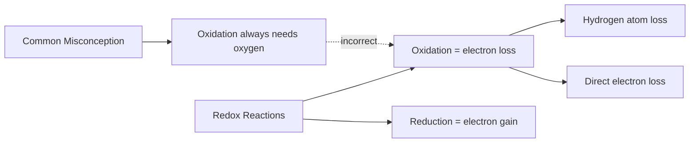

### 3.4 Water

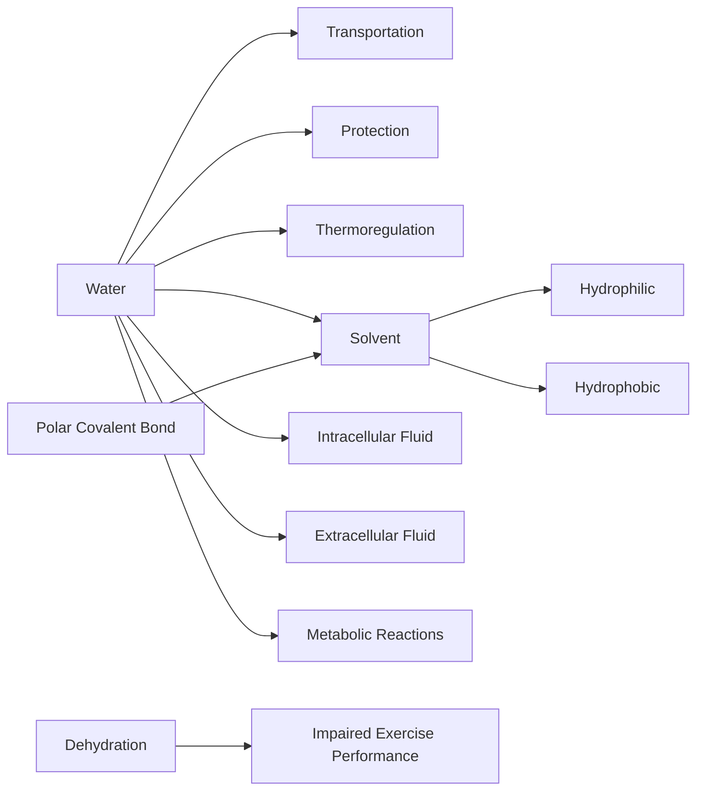

### 3.5 Solutions and Concentrations

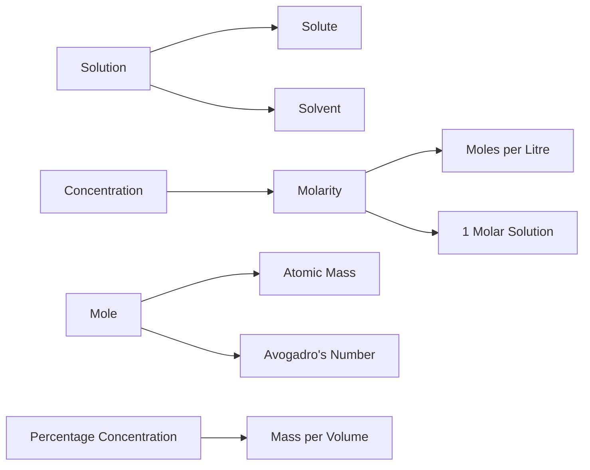

### Laboratory Focus – Making Concentrated Solutions

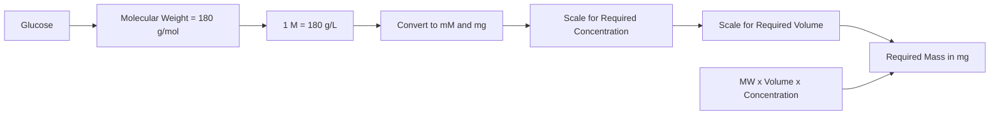

### 3.6 Acid–Base Balance

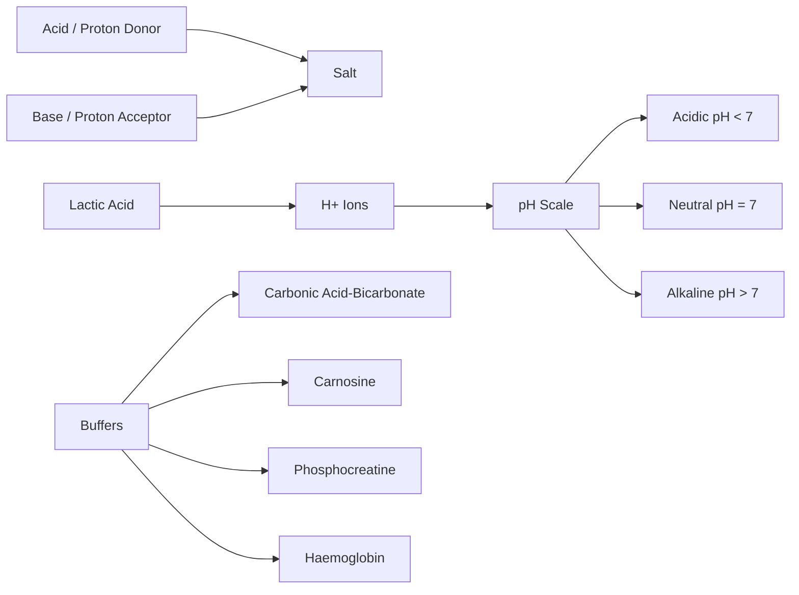

### Misconception: Lactic Acid and Lactate Are Not the Same Thing!

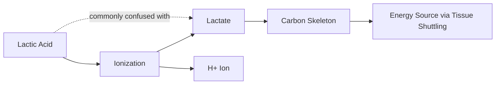

### 3.7 Cell Structure

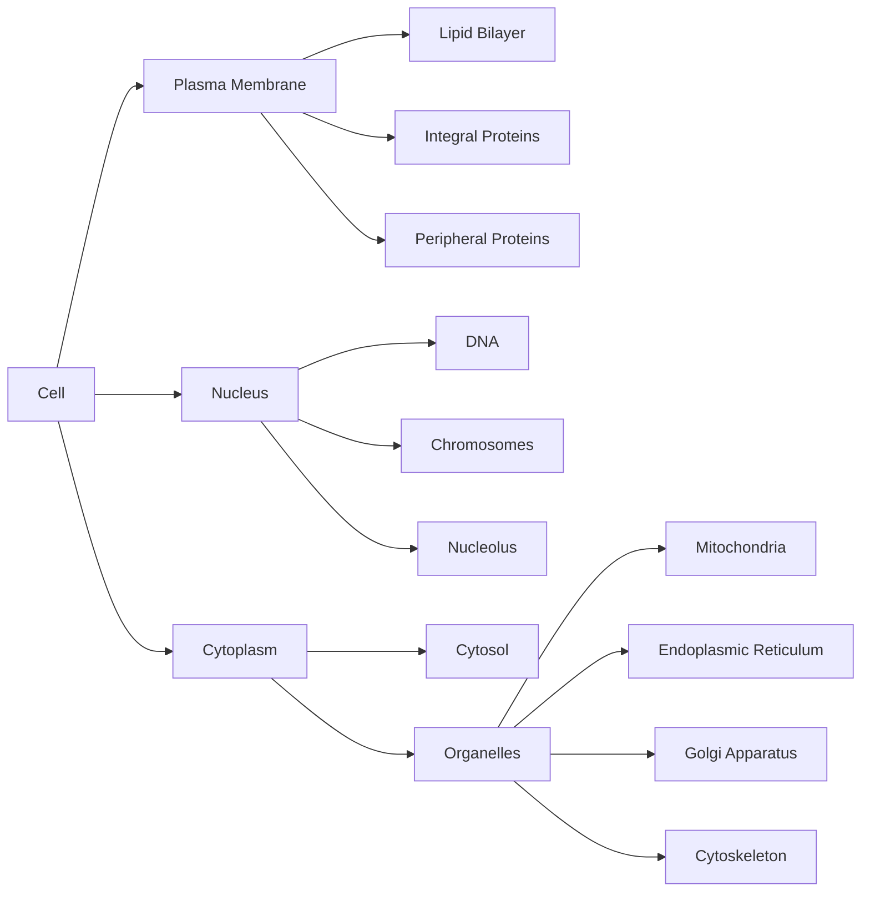

### 3.8 Key Points

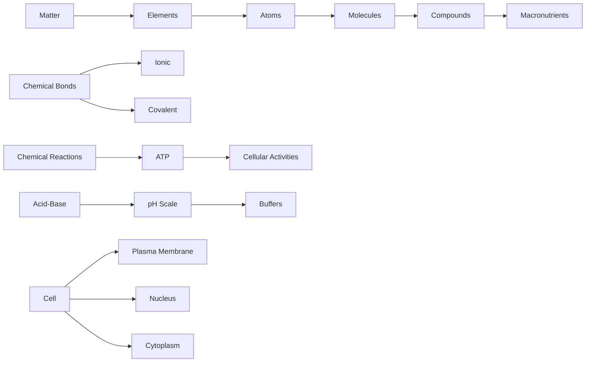

### References

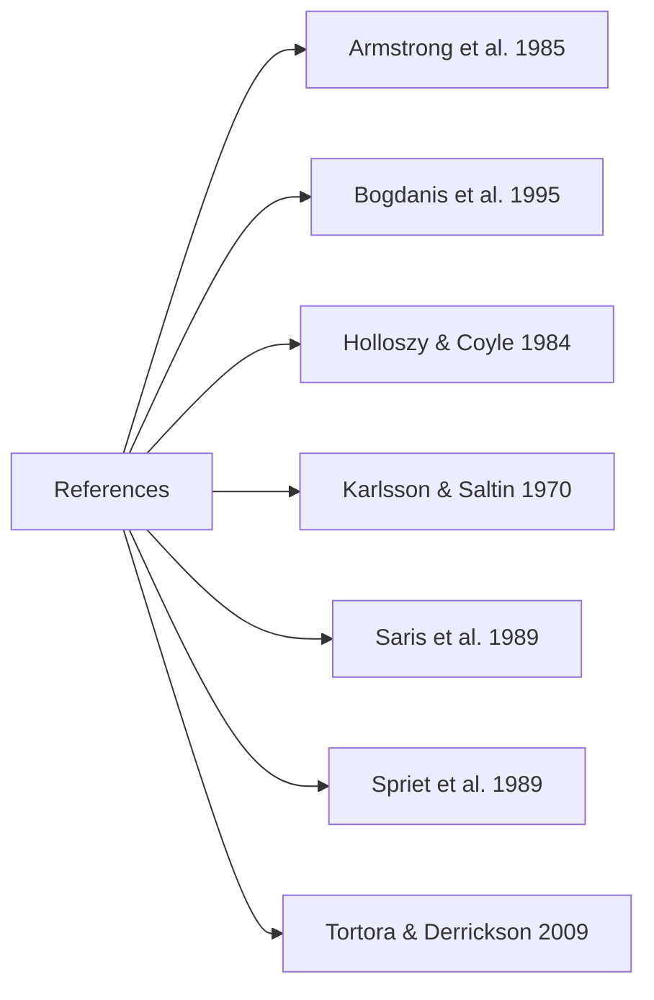

## Wikilinks Introduced

- [[matter]]
- [[element]]
- [[atom]]
- [[proton]]
- [[neutron]]
- [[electron]]
- [[nucleus]]
- [[electron shell]]
- [[atomic number]]
- [[mass number]]
- [[isotope]]
- [[atomic mass]]
- [[dalton]]
- [[ionization]]
- [[ion]]
- [[anion]]
- [[cation]]
- [[molecule]]
- [[compound]]
- [[macronutrient]]
- [[trace element]]
- [[inorganic compound]]
- [[organic compound]]
- [[chemical bonding]]
- [[ionic bond]]
- [[covalent bond]]
- [[valence shell]]
- [[polar covalent bond]]
- [[non-polar covalent bond]]
- [[electronegativity]]
- [[molecular formula]]
- [[molecular weight]]
- [[constitutional formula]]
- [[functional group]]
- [[isomer]]
- [[chemical reaction]]
- [[reactant]]
- [[product]]
- [[metabolism]]
- [[exercise metabolism]]
- [[energy]]
- [[chemical energy]]
- [[potential energy]]
- [[kinetic energy]]
- [[exergonic reaction]]
- [[endergonic reaction]]
- [[law of conservation of mass]]
- [[law of conservation of energy]]
- [[atp]]
- [[atp hydrolysis]]
- [[kilocalorie]]
- [[kilojoule]]
- [[calorie]]
- [[megajoule]]
- [[synthesis reaction]]
- [[decomposition reaction]]
- [[hydrolysis]]
- [[reversible reaction]]
- [[phosphorylation]]
- [[dephosphorylation]]
- [[exchange reaction]]
- [[oxidation]]
- [[reduction]]
- [[oxidative phosphorylation]]
- [[substrate phosphorylation]]
- [[dehydrogenation]]
- [[reducing equivalent]]
- [[water]]
- [[intracellular fluid]]
- [[extracellular fluid]]
- [[hydrophilic]]
- [[hydrophobic]]
- [[solvent]]
- [[solute]]
- [[solution]]
- [[dehydration]]
- [[mole]]
- [[molarity]]
- [[acid]]
- [[base]]
- [[salt]]
- [[ph scale]]
- [[buffer]]
- [[lactate]]
- [[carbonic acid]]
- [[haemoglobin]]
- [[plasma membrane]]
- [[lipid bilayer]]
- [[phospholipid]]
- [[cholesterol]]
- [[glycolipid]]
- [[integral protein]]
- [[peripheral protein]]
- [[transmembrane protein]]
- [[ion channel]]
- [[transporter protein]]
- [[receptor protein]]
- [[dna]]
- [[gene]]
- [[chromosome]]
- [[histone]]
- [[nuclear envelope]]
- [[nuclear pore]]
- [[nucleolus]]
- [[ribosome]]
- [[cytoplasm]]
- [[cytosol]]
- [[organelle]]
- [[endoplasmic reticulum]]
- [[rough endoplasmic reticulum]]
- [[smooth endoplasmic reticulum]]
- [[sarcoplasmic reticulum]]
- [[golgi apparatus]]
- [[mitochondria]]
- [[cristae]]
- [[mitochondrial matrix]]
- [[cytoskeleton]]
- [[microfilament]]
- [[intermediate filament]]
- [[microtubule]]
- [[glucose]]
- [[carbohydrate]]

## Aliases Recorded

- ADP
- ATPase
- ATP synthase
- anabolic reactions
- condensation reactions
- catabolic reactions
- redox reactions
- Avogadro's number
- bicarbonate ions
- carbonic acid-bicarbonate buffer system
- carnosine
- phosphocreatine
- actin
- myosin
- tubulin
- desmin
- sodium chloride
